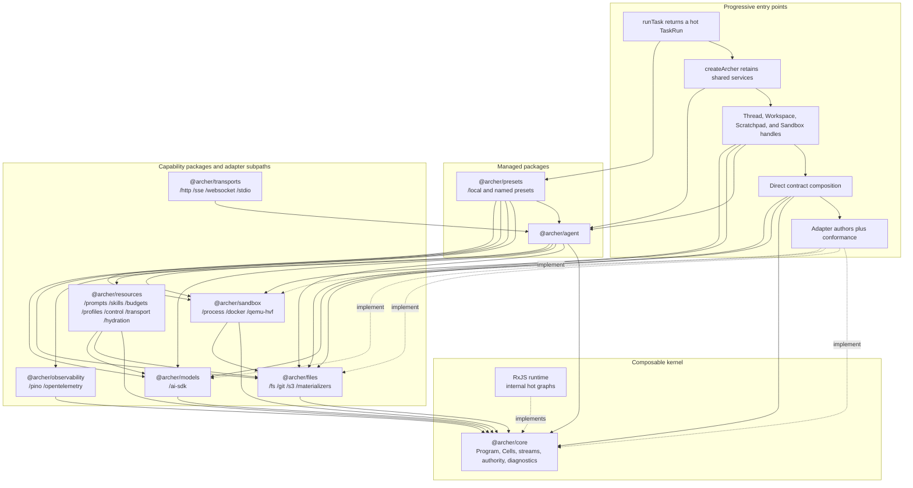
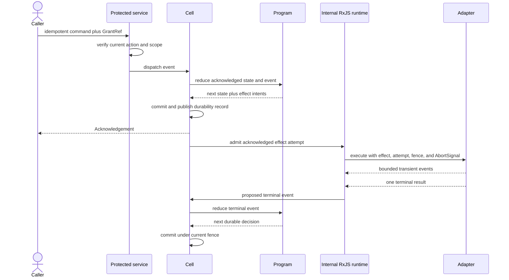
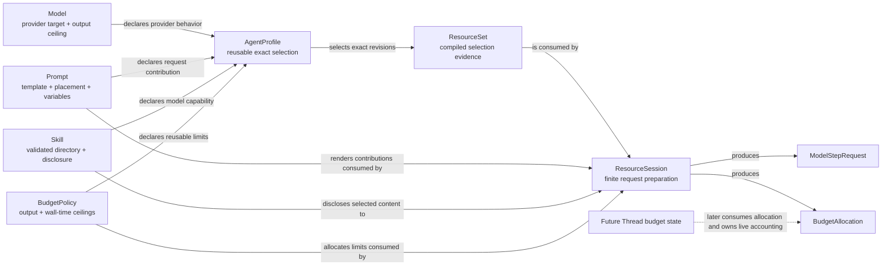
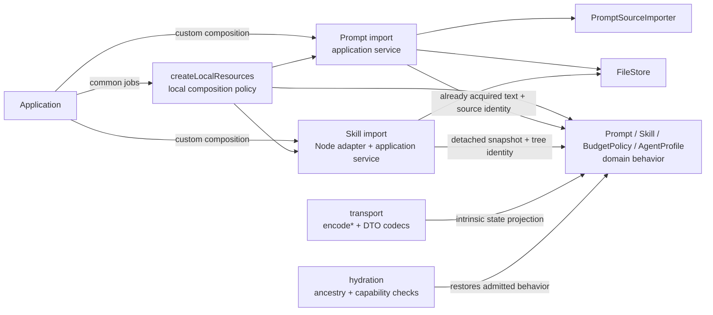

# Archer architecture

Status: v1 construction contract

This document defines the shape Archer is intended to build. It is normative
about ownership, dependency direction, guarantees, and the public work those
guarantees make possible. Conceptual TypeScript APIs may change when a runnable
application exposes friction or a misplaced responsibility. That discovery is
an architectural correction, not cosmetic cleanup. It may improve the API
without weakening the stated behavior or guarantee.

## Purpose

Archer is a family of TypeScript libraries for running agent tasks without
making a model SDK, sandbox vendor, storage product, Git host, transport, or
logging framework the owner of the application.

It serves four users:

- a developer who wants to run one task with safe, visible defaults;
- an application author who retains tasks, Threads, Workspaces, or sandboxes;
- an infrastructure author who implements one replaceable boundary;
- an Archer maintainer who must preserve durability, authority, isolation,
  budget, and recovery guarantees.

The short path and the composed path use the same contracts. Convenience may
select declared defaults, create local control records, and own cleanup. It may
not begin unacknowledged work, invent permission, weaken an isolation request,
hide a retry, or publish a private change.

## Core hypothesis

An agent harness is easier to trust and compose when durable decisions and live
work have different owners:

1. A pure `Program` decides what an event means and describes external work as
   effect intents.
2. A Cell durably records accepted order, state, effect identity, attempts,
   fencing, wakes, and recovery before an effect begins.
3. Internal RxJS graphs perform acknowledged live work and manage cancellation,
   concurrency, timers, and fan-out.
4. Public contracts expose immutable current state, subscriptions, commands,
   bounded event delivery, outcomes, and lifecycle without exposing RxJS or a
   product SDK.

The coding harness is one Program. A Thread contains Turns and ordered Items.
It performs one model step, records the terminal response, binds raw tool
proposals to the exact acknowledged catalogue, gives every proposal a terminal
result, and only then admits the next model step.

The remaining layers exist because their claims are independent. A model
response is not a durable acknowledgement. A sandbox handle is not execution
permission. A writable disk is not a Workspace. A Workspace snapshot is not a
canonical publication. A TypeScript value shaped like a grant, digest, or
attestation is not proof.

Archer's open-source premise follows from that separation. Each infrastructure
category has a small public protocol, public construction and validation paths,
and a conformance suite another implementation can run. Products compete at
the adapters instead of expanding one privileged harness package.

## Philosophy

Archer is a reactive agent framework, not a function that eventually returns an
answer. A task, Thread, Cell attachment, Workspace, Scratchpad, or sandbox can
change while its caller does nothing. Its public handle therefore exposes one
immutable current snapshot and subsequent updates from the moment the owner is
retained. Ordered durable facts and transient presentation updates remain
separate streams. One finite attempt exposes progress, active abort, and one
terminal result. A Promise is useful for construction, commands, and waiting.
It is not a living owner.

There are no reactivity cliffs. The one-call path, retained composition, direct
handles, framework bindings, SSE, WebSocket, and stdio all project the same
running graph. Dropping to a lower layer does not force an application to poll,
fold an endless event log, build another reducer, or accept a callback-only
version of a managed object. Moving across a process boundary does not create a
second agent loop.

RxJS is the internal temporal engine. Archer uses it because cancellation,
concurrency, fan-out, superseding work, time, and failure are the problem, not
incidental plumbing. Consumers should get those benefits without learning
RxJS. Public contracts expose a small standard-JavaScript bridge that works in
a script, a server, or a browser framework and does not leak an RxJS type.

Reactive does not mean turning every value into a stream. Immutable evidence,
pure decisions, point-in-time authority checks, and one-shot commands stay
values or Promises. Archer classifies time by ownership. Retained owners expose
current state, ordered histories declare whether they replay or gap, and
bounded attempts use one finite operation contract. That classification is
part of the API, not an implementation convention.

Composability is law. Every managed default is built from the same public
contracts available to an application or a competing implementation. There is
no privileged agent loop behind `runTask`, no private adapter protocol, and no
required all-in-one runtime. A developer may replace one model, store,
sandbox, prompt compiler, logger, transport, or policy. They may also take the
Program, Cell, stream, and diagnostic core and build a different agent product.

Convenience should remove assembly, not truth. The shortest path supplies
opinionated prompts, skills, tools, lifecycle, diagnostics, and local storage.
It still names the model and exact sandbox guarantee, exposes the running work,
and returns the same evidence as direct composition.

Rigor is an implementation burden Archer accepts, not an entrance exam for its
users. The ordinary path begins with a job an application developer already
recognizes. Compare-and-swap, fencing, admission receipts, canonical trees, and
stream retention remain visible when the caller needs to select or replace
those guarantees; they do not become mandatory ceremony merely because the
implementation depends on them. If a realistic example must teach Archer's
internal control plane before it can perform useful work, the public API is not
finished.

Optimization should be cheap. A consumer starts with working defaults and
replaces only the part that matters. First-party capabilities ship in a small
set of packages with explicit subpath exports. Root modules have no import-time
effects, unused adapters do not initialize, and provider-specific dependencies
do not enter contract declarations. Internal module boundaries remain strict
without turning every interface into another package to install, version, and
discover.

Logging is part of the runtime. Logs begin as a bounded diagnostic stream, not
as ambient calls scattered through domain code. Effect attempts and adapter
operations open explicit spans, accumulate context, and emit one terminal wide
record. Instantaneous lifecycle and recovery observations use standalone
events only when no duration exists. Managed Node presets attach a redacted
Pino projection by default. Applications can subscribe directly, change
filters, add sinks, or replace the logger without changing durable behavior.
An observable core with invisible operation would be unfinished.

Archer is for the people who run it and the people who want to change it. The
public protocols, codecs, source modules, defaults, and conformance suites are
the implementation seam. Fork it, compose it, publish another adapter, or use
the core to build your own Codex. No Archer package gets special authority by
being first-party.

## Design rules

The following rules apply at every entry point:

1. **Return living owners.** A retained owner whose state can change without a
   caller method exposes hot current state. One finite admitted attempt returns
   a `LiveOperation`. No managed task API reduces a run to a final Promise, and
   no direct handle makes a caller reconstruct current state from events.
2. **Use one graph.** First-party temporal behavior uses one shared RxJS graph
   per live source. Managed objects, direct handles, log projections, framework
   bindings, and transports derive from it. Subscriber count never starts,
   repeats, pauses, or cancels the work.
3. **Keep RxJS internal, not optional.** Public declarations expose Archer's
   snapshot, atomic attachment, replayable stream, transient stream,
   finite-operation, and owned lifecycle contracts. They never expose an RxJS
   type or maintain a second callback implementation of the same lifecycle.
4. **Name the delivery guarantee.** Durable streams use branded cursors and
   resume. Transient streams use exact gaps or detachment. A merged convenience
   view cannot erase those different guarantees.
5. **Make transport faithful.** A remote attachment starts from one atomic
   snapshot, version, and cursor seed obtained through the handle's public
   bridge. SSE, WebSocket, and stdio preserve the same state, stream, command,
   settlement, and close semantics without polling or privileged internals.
6. **Make operation visible.** Concrete process-local work opens an explicit,
   bounded DiagnosticSpan, accumulates namespaced context, and emits one
   terminal wide record. Point events are reserved for observations without a
   useful duration. Diagnostics and their log projections remain bounded,
   redacted, non-authoritative streams. Managed Node construction includes
   replaceable structured Pino output.
7. **Make composition exact.** Every default, preset, adapter, and extension
   uses public contracts. Direct composition may replace any component without
   entering an internal API or weakening another component's guarantees.
8. **Keep opt-in costs local.** Capability families use side-effect-free roots
   and explicit adapter subpaths. Heavy provider dependencies load only when
   their adapter is selected. Source modules preserve dependency direction
   without forcing one npm package per contract.
9. **Acknowledge before acting.** External work begins only after the causing
   event, state, and effect intent satisfy the selected Cell durability
   contract.
10. **Keep durable meaning pure.** Reducers perform no I/O, read no clock, emit
    no diagnostic, and obtain no permission. Relevant external facts return as
    events.
11. **Preserve exact guarantees.** Broad labels such as `model`, `sandbox`, or
    `vm` enable shared behavior but never erase provider controls or backend
    facts.
12. **Verify authority at the action.** A Principal is attribution and a
    `GrantRef` is a lookup reference. The service about to act verifies current
    subject, action, scope, target, expiry, and revocation.
13. **Pin causality.** A model request and every tool call it causes retain the
    exact ResourceSet, resource revisions, request digest, effect, and attempt.
14. **Keep work private.** Tasks produce private Workspace snapshots and may
    produce ChangeSets. Promotion is a separate authorized compare-and-swap.
15. **Separate logical files from physical views.** Immutable trees own content
    identity, Workspaces and Scratchpads own mutable use, and Materializers own
    hydration and ingestion.
16. **Make live delivery bounded.** Every live queue has an item or byte bound.
    Loss, resume, detachment, abort, and terminal settlement are explicit.
17. **Observe without controlling.** Logs, metrics, traces, presentation deltas,
    and diagnostic subscribers cannot change durable outcomes.
18. **Make convenience honest.** Managed calls compile defaults into the same
    profiles, resources, grants, handles, and evidence used by direct
    composition.
19. **Make domain names earn their meaning.** A schema, codec, immutable record,
    digest, and round-trip test do not make a behavioral domain concept. A
    `Skill`, `Prompt`, `Policy`, profile, or similar public owner exposes the
    legal creation and useful operations its name promises. Transport decoding
    and hydration remain separate capabilities and cannot manufacture an earned
    transition through the ordinary application API.
20. **Ship proof with the port.** A replaceable contract is incomplete without
    codecs, required failure cases, and a versioned conformance suite.
21. **Ship a real application with the layer.** Every new or materially changed
    workflow adds or updates a root `examples/<layer>/<scenario>` application. A
    contained contract slice that cannot yet support useful work may ship a
    public conformance suite instead; its first real consumer must use it in that
    consumer's example. Examples import only public package entry points and run
    in the repository's normal build, test, and lint pipeline. Their executable
    path performs the named job through the real framework or service boundary.
    Deterministic tests may inject dependency-owned test implementations, but may
    not replace the executable with contract evidence or bypass framework-owned
    dispatch. `examples/README.md` owns the complete delivery policy.

## Public values, interfaces, and classes

The detailed decision guide is
[Archer ownership model and composition philosophy](ownership-and-composition.md).
It defines the Consumer and Maintainer entry depths, effect boundaries,
transport ownership, and substitution tests used by this architecture.

Durable and transferable facts are readonly objects and discriminated unions.
This includes Thread Items, results, failures, resource revisions, grants,
sandbox requirements, attestations, file references, Workspace snapshots,
ChangeSets, cleanup evidence, and conformance reports. They are intended to be
serialized, validated, hashed, and restored without process identity.

Named domain values are not DTOs with prestigious names. Their owning package
controls legal creation and exposes the operations and invariants the name
promises. Archer normally represents immutable domain state as a class with
closed construction or a branded readonly value with cohesive factories and
pure modifiers. Neither representation excuses callers from having to
reconstruct the domain rules themselves.

The ordinary application barrel exposes legal creation and behavior. Public
transport subpaths expose codecs and JSON-safe DTOs for untrusted boundaries.
Explicit hydration capabilities restore complete existing state for adapters;
they validate but do not create, approve, activate, or otherwise earn that
state. A matching object literal, successful schema parse, digest, or cast is
never proof that a behavior occurred.

Pure domain behavior takes every relevant fact as input and returns a new value,
an exact `Result`, and any facts forced by the change. It performs no file,
database, network, logging, clock, or publication I/O. Application services
obtain those external facts, invoke the domain owner, and coordinate effects
without restating its rules.

Replaceable effectful behavior is exposed as interfaces. Programs, stores,
brokers, compilers, adapters, services, and retained handles use these ports.
Public factories validate configuration, establish ownership, and return the
interface rather than exposing an implementation class.

Domain objects do not own wire projection. Transport entry points expose
explicit `encode*` functions, DTOs, and codecs; hydration entry points restore
behavior after ancestry and capability checks. This keeps a change to a wire
version out of `Prompt`, `Skill`, `BudgetPolicy`, `AgentProfile`, and other
behavior owners. A matching object literal, successful codec parse, or cast
remains detached data rather than admitted behavior.

Implementations use proper classes where an object owns a database, lease,
process, queue, transport, physical view, or close sequence. Those classes are
implementation details. V1 does not require consumers to construct an
implementation class or extend a base class. When a domain class is selected,
its constructor remains closed; a class made only of DTO getters is still an
anemic model.

`TaskRun` is the central behavioral object. A first-party class owns its hot
state projection, subscriptions, attachments, commands, and close sequence,
while applications program against the `TaskRun` interface returned by a
factory. `TaskRunSnapshot` and `TaskOutcome` are readonly discriminated values.
The run is not a result object with optional callback fields.

Expected operational outcomes are tagged values. Invalid restored input,
construction failure, or a broken adapter protocol may throw before a managed
operation exists. There is no public exception hierarchy for ordinary task,
provider, policy, or tool outcomes.

## Layers and opt-in use

Arrows in this diagram mean "depends on." Dashed arrows mean "implements" or
"projects." Consumers can stop at any entry point that meets their needs.



An npm package is a distribution and dependency decision, not an architecture
boundary. Each capability package keeps contract source modules at its root and
first-party implementations behind explicit subpaths. Contract modules never
import adapter modules. Export maps and declaration checks enforce that
direction even when both ship in one package.

Root imports perform no registration, discovery, logging, environment reads,
or adapter construction. Adapter-only dependencies may ship with the
capability package or remain optional peers, but they load only when their
factory is selected. Importing `@archer/sandbox` does not initialize Docker,
while importing `@archer/sandbox/docker` gives one supported factory and its
exact types. A third-party adapter remains an ordinary independent package that
implements the same root contract and runs the same conformance suite.

## Durable execution

### Programs and Cells

A `Program<State, Event, Effect>` is deterministic. Given the same state and
event, it returns the same next state and effect intents. Time, randomness,
policy decisions, adapter output, and extension output enter as explicit
events when they matter.

A Cell owns one ordered Program instance. Its acknowledgement means the event,
new state, effect intents, wake, sequence, and fence satisfied that Cell host's
published durability contract.

The embedded host acknowledges after its SQLite transaction. The direct S3 host
first publishes one immutable storage-neutral revision and acknowledges only
after replacing the Cell's small head object under the exact current ETag. A
lost race may leave an unreachable immutable orphan; it cannot acknowledge or
become canonical. Neither host may acknowledge merely because local work or an
immutable upload completed.

Effect identity is deterministic from the causing sequence and effect
position. An activation claims a new attempt under the current fence. A late,
cancelled, duplicate, or fenced completion cannot commit a terminal event.
External effects remain at least once unless the destination honors Archer's
effect or invocation identity.

Cell acquisition, renewal, restore, wake, fencing, and release use the same
storage-neutral record mechanics. The embedded adapter runs Node's synchronous
SQLite connection in an owned worker. The S3 adapter stores canonical bytes,
receipts, attempts, leases, wakes, and observations directly in immutable
revisions; it does not conceal a SQLite database inside an object-store host.
Both reuse one RxJS-backed activation runtime behind the standard public stream
contracts.

The S3 host performs a live conditional-object probe before it serves. The
probe proves absence-conditioned create, current-token replacement, rejection
of a retired token, and exact readback. ETags remain opaque versions; Archer
never treats them as content hashes. The mandatory probe object is retained
under an explicit prefix so operators can inspect it and apply bucket lifecycle
policy.

S3 credentials and signing belong to AWS SDK v3. Managed construction uses the
SDK's standard Node credential chain, including environment credentials, AWS
SSO and shared profiles, web identity, and workload roles. Advanced callers may
inject an existing `S3Client` with explicit borrowed or owned lifecycle.
Credentials never enter Cell state, immutable revisions, observations,
diagnostics, errors, examples, or fixtures.

The durable Cell aggregate remains a pure value. Its retained activation
handle is reactive because acknowledgement, renewal, effect settlement, wake,
and fencing can occur without a caller method:

```ts
export type CellHandleSnapshot<StateView> = Readonly<{
  cellId: CellId;
  acknowledged: Readonly<{
    sequence: CellSequence;
    cursor: CellCursor;
    fence: FenceEpoch;
    state: StateView;
  }>;
  lifecycle:
    | Readonly<{ status: 'active'; leaseExpiresAt: Timestamp }>
    | Readonly<{ status: 'fenced'; fence: FenceEpoch }>
    | Readonly<{ status: 'released' }>;
}>;

export interface CellHandle<StateView, Event, Progress extends JsonValue = JsonValue>
  extends
    LiveState<CellHandleSnapshot<StateView>>,
    AtomicLiveAttachmentSource<
      CellHandleSnapshot<StateView>,
      'cell',
      CellCursor,
      CellObservation<Event>,
      Readonly<{ activity: CellActivityEvent<Progress> }>
    >,
    OwnedHandle<CellReleaseEvidence> {
  readonly durableEvents: ReplayableEventStream<CellObservation<Event>, CellCursor>;
  readonly activityEvents: TransientEventStream<CellActivityEvent<Progress>>;
  dispatch(command: CellCommand<Event>, grant: GrantRef<CellDispatchAction>): Promise<CellDispatchOutcome>;
}
```

`StateView` is a bounded, immutable, codec-backed projection of acknowledged
Program state. A Cell protocol selects its pure projection explicitly; a
generic host does not assume every complete aggregate is suitable for a UI or
remote snapshot. Full canonical state remains available through the Cell's
authorized durable query or replay contract. The snapshot never presents an
unacknowledged reducer result as canonical.

Closing releases this activation or attachment and preserves recovery
evidence. It does not delete Cell state or manufacture a domain cancellation.
Direct Cell users receive the same hot projection that managed Thread and
TaskRun paths consume.

A non-agent Program connects acknowledged effect intents to replaceable live
work through the same finite contract used by Archer's built-in domains:

```ts
export interface CellEffectAdapter<Effect, Event, Progress extends JsonValue = JsonValue> {
  start(
    attempt: AcknowledgedEffectAttempt<Effect>,
  ): Promise<LiveOperation<Progress, CellEffectResult<Event>, CellEffectAttemptCloseEvidence>>;
}
```

The Cell runtime calls `start()` only after it claims the acknowledged intent
under the current fence. The outer Promise validates and constructs an
already-running attempt. Its terminal result proposes an event; only the Cell's
subsequent acknowledgement can make that event durable. Subscribing to progress
never claims or retries an effect. Domain adapters such as models, tools, and
sandboxes refine this shape with their exact request and result types.

The replaceable host also owns the public construction and restoration port:

```ts
export type CellProtocol<State, StateView, Event, Effect> = Readonly<{
  protocolRevision: CellProtocolRevision;
  programRevision: ProgramRevision;
  projectionRevision: StateProjectionRevision;
  durability: CellDurabilityRequirement;
  program: Program<State, Event, Effect>;
  projectState(state: State): StateView;
  projectWake?: (state: State) => CellWake<Event> | undefined;
  codecs: Readonly<{
    state: CellCodec<State>;
    stateView: CellCodec<StateView>;
    event: CellCodec<Event>;
    effect: CellCodec<Effect>;
  }>;
}>;

export type CellCreateRequest<State, StateView, Event, Effect, Progress extends JsonValue = JsonValue> = Readonly<{
  cellId: CellId;
  subject: PrincipalId;
  initialState: State;
  protocol: CellProtocol<State, StateView, Event, Effect>;
  activation?: CellActivationOptions<Effect, Event, Progress>;
  idempotencyKey: IdempotencyKey;
}>;

export type CellAttachRequest<State, StateView, Event, Effect, Progress extends JsonValue = JsonValue> = Readonly<{
  cellId: CellId;
  subject: PrincipalId;
  protocol: CellProtocol<State, StateView, Event, Effect>;
  activation?: CellActivationOptions<Effect, Event, Progress>;
}>;

export type CellStateReadRequest<State> = Readonly<{
  cellId: CellId;
  subject: PrincipalId;
  protocolRevision: CellProtocolRevision;
  stateCodec: CellCodec<State>;
  at?: CellSequence;
}>;

export type CellStateReadOutcome<State> =
  | Readonly<{ kind: 'found'; sequence: CellSequence; state: State }>
  | Readonly<{ kind: 'not-found'; cellId: CellId }>
  | Readonly<{ kind: 'restore-refused'; refusal: CellRestoreRefusal }>
  | Readonly<{ kind: 'authority-refused'; refusal: AuthorityRefusal<CellReadAction> }>
  | Readonly<{ kind: 'unavailable'; failure: PublicError }>;

export type OpenedCell<StateView, Event, Progress extends JsonValue = JsonValue> = Readonly<{
  kind: 'opened';
  handle: CellHandle<StateView, Event, Progress>;
}>;

export type CellCreateOutcome<StateView, Event, Progress extends JsonValue = JsonValue> =
  | OpenedCell<StateView, Event, Progress>
  | Readonly<{ kind: 'already-exists'; cellId: CellId }>
  | Readonly<{ kind: 'authority-refused'; refusal: AuthorityRefusal<CellCreateAction> }>
  | Readonly<{ kind: 'unavailable'; failure: PublicError }>;

export type CellAttachOutcome<StateView, Event, Progress extends JsonValue = JsonValue> =
  | OpenedCell<StateView, Event, Progress>
  | Readonly<{ kind: 'not-found'; cellId: CellId }>
  | Readonly<{ kind: 'restore-refused'; refusal: CellRestoreRefusal }>
  | Readonly<{ kind: 'active-elsewhere'; retryAfter: Timestamp }>
  | Readonly<{ kind: 'authority-refused'; refusal: AuthorityRefusal<CellAttachAction> }>
  | Readonly<{ kind: 'unavailable'; failure: PublicError }>;

export interface CellHost extends OwnedHandle<CellHostCloseEvidence> {
  create<State, StateView, Event, Effect, Progress extends JsonValue = JsonValue>(
    request: CellCreateRequest<State, StateView, Event, Effect, Progress>,
    grant: GrantRef<CellCreateAction>,
  ): Promise<CellCreateOutcome<StateView, Event, Progress>>;
  attach<State, StateView, Event, Effect, Progress extends JsonValue = JsonValue>(
    request: CellAttachRequest<State, StateView, Event, Effect, Progress>,
    grant: GrantRef<CellAttachAction>,
  ): Promise<CellAttachOutcome<StateView, Event, Progress>>;
  readState<State>(
    request: CellStateReadRequest<State>,
    grant: GrantRef<CellReadAction>,
  ): Promise<CellStateReadOutcome<State>>;
}
```

The raw protocol keeps every migration boundary independent. Most JSON-backed
applications do not need to repeat that wiring. `defineJsonCellProtocol()`
accepts one application revision, product-neutral state, event, and effect
codecs, a Program, a durability requirement, and an optional public projection.
It derives inspectable `/program`, `/projection`, `/state`, `/state-view`,
`/event`, and `/effect` bindings. A caller moves to the raw `CellProtocol` when
those pieces need separate migration schedules. The convenience does not weaken
or erase any stored compatibility check.

A trusted single-service process can use `createCellServiceAuthority({ hostId })`
to create one real in-memory Authority ledger, one service Principal, and the
five host-wide Cell grant references. The CellHost still verifies every
operation. Multi-tenant applications, externally issued grants, and durable
revocation provide their own `AuthorityBroker<CellAction>` and narrower grants.
AWS credentials remain transport credentials and never become Cell authority.

The primary trusted-service path binds that policy once in a `CellService`.
Its `create`, `attach`, `readState`, `dispatch`, and optional recovery methods
do not repeat a subject and action grant, while the underlying CellHost still
checks them immediately before protected work. `s3Cells()` constructs and owns
this composition, including cleanup. `s3CasCells()` remains the lower S3 host
for per-request identity, narrower grants, durable revocation, or independent
component ownership. Convenience removes wiring; it does not collapse the
authority boundary.

Create binds Cell identity and idempotency to exact Program, projection, codec,
and durability revisions. Attach validates those revisions against stored
state before returning the hot handle and processes an overdue durable wake as
part of its recovery barrier. Missing state, incompatible restore,
unavailability, active ownership, and duplicate creation are tagged outcomes
that cannot expose a partially restored handle. A broken host protocol or
invalid local construction may reject before a handle exists. Creation,
attachment, full state reads, dispatch, and S3 recovery discovery each verify
their exact current authority. The full state query is finite and does not turn
an unbounded aggregate into live UI state.

An S3 service process periodically calls the bounded, authorized
`discoverRecoverable()` operator surface. It receives only Cell IDs whose lease
expired while a wake is due or effect work remains unfinished. The application
still supplies the exact protocol and effect adapter. A raw CellHost call also
supplies the subject and grant; a CellService supplies the identity bound at
composition. Bucket listing cannot fabricate code or authority. A claimed
attempt under an expired fence is redriven with the same deterministic effect
ID and a higher attempt number. External delivery remains at least once unless
the destination honors that ID.

### Thread, Turn, and Item

A Thread is durable agent history. V1 permits one active Turn per Thread. A
Turn is one user-directed unit of work. Items are ordered transcript facts,
including user input, acknowledged model request, terminal assistant response,
approval, tool result, repair, and compaction.

The Thread Program owns this loop:

1. Compile one request from the acknowledged transcript, exact ResourceSet,
   prompt contributions, context policy, and remaining budget.
2. Commit the request Item and provider effect intent.
3. Perform exactly one provider step with SDK retries disabled.
4. Commit ordered provider output and raw local tool proposals.
5. Bind each raw proposal to the catalogue recorded on the acknowledged
   request. The provider cannot assign Archer resource identity.
6. Record approval or denial, invoke admitted tools, and give every proposal a
   terminal result.
7. Compile the next request or finish the Turn.

Assistant text, reasoning, hosted tool activity, and raw local calls form one
ordered response union. Provider-neutral transcript values belong to Archer,
not the provider SDK. Compaction records its source digest, covered sequence,
pinned summarizer, request, summary, and usage. Repair records why a missing or
orphan tool result was synthesized.

Budgets are durable Thread state. They cover model steps, tool invocations,
input and output tokens, optional cost, deadlines, live output, and Workspace
or Scratchpad quotas. Metrics report those facts but do not enforce them.

A Turn remains durable state inside its Thread. V1 does not create a second
Turn owner, reducer, or callback graph. `ThreadHandle` exposes the current Turn,
replayable Items, transient activity, commands, and a finite wait projected
from the same graph:

```ts
export type TurnState =
  | Readonly<{ status: 'starting'; turnId: TurnId }>
  | Readonly<{ status: 'running'; turnId: TurnId; activity: TurnActivity }>
  | Readonly<{
      status: 'awaiting-approval';
      turnId: TurnId;
      approvals: readonly [ApprovalRequest, ...ApprovalRequest[]];
    }>
  | Readonly<{ status: 'recovering'; turnId: TurnId; recovery: TurnRecoveryState }>
  | Readonly<{ status: 'cancelling'; turnId: TurnId; reason: string }>
  | Readonly<{ status: 'completed'; turnId: TurnId; outcome: CompletedTurnOutcome }>
  | Readonly<{ status: 'failed'; turnId: TurnId; outcome: FailedTurnOutcome }>
  | Readonly<{ status: 'cancelled'; turnId: TurnId; outcome: CancelledTurnOutcome }>;

export type ThreadSnapshot = Readonly<{
  threadId: ThreadId;
  workspaceId: WorkspaceId;
  revision: ThreadRevision;
  transcript: Readonly<{ lastSequence: ItemSequence; cursor: ThreadCursor }>;
  budget: ThreadBudgetState;
  activeResourceSet: ResourceSetRef;
  turn: Readonly<{ status: 'idle' }> | TurnState;
}>;

export type TurnWaitSettlement =
  Readonly<{ kind: 'outcome'; outcome: TurnOutcome }> | Readonly<{ kind: 'detached'; evidence: ThreadCloseEvidence }>;

export type TurnStartCommand = Readonly<{
  input: TurnInput;
  expectedRevision: ThreadRevision;
  idempotencyKey: IdempotencyKey;
}>;

export interface ThreadHandle
  extends
    LiveState<ThreadSnapshot>,
    AtomicLiveAttachmentSource<
      ThreadSnapshot,
      'thread',
      ThreadCursor,
      ThreadEvent,
      Readonly<{ presentation: ThreadPresentationEvent }>
    >,
    OwnedHandle<ThreadCloseEvidence> {
  readonly durableEvents: ReplayableEventStream<ThreadEvent, ThreadCursor>;
  readonly presentationEvents: TransientEventStream<ThreadPresentationEvent>;
  startTurn(command: TurnStartCommand, grant: GrantRef<TurnStartAction>): Promise<TurnStartReceipt>;
  waitForTurn(turnId: TurnId): Promise<TurnWaitSettlement>;
  decideApproval(command: ApprovalDecisionCommand, grant: GrantRef<ToolApprovalAction>): Promise<ApprovalReceipt>;
  cancelTurn(command: TurnCancellationCommand, grant: GrantRef<TurnCancelAction>): Promise<CancellationReceipt>;
}
```

Historical Turns and Items are readonly values. `waitForTurn()` is a waiting
facet over the Thread graph, not another live owner. It resolves detached if
the Thread attachment closes first. `TaskRun` projects the task-specific view
from these exact Cell and Thread sources. It does not fold a parallel event
stream or maintain a managed-only reducer.

### Acknowledgement sequence



If an owner dies after acknowledgement, a replacement may redrive the intent.
If it dies before acknowledgement, the unacknowledged transition is not
restored. Observers never participate in this commit path.

## Public asynchronous boundary

RxJS owns live activation, state projection, finite composition, superseding
lanes, cancellation, timers, and fan-out. Every first-party live source has one
shared hot graph. A subscriber observes existing work. It never causes another
provider call, effect attempt, reducer, file import, or sandbox process.

RxJS is not part of the public programming model. No contract declaration may
import or name an RxJS type. Archer owns four standard-JavaScript temporal
contracts. A retained owner uses `LiveState`. Durable history uses
`ReplayableEventStream`. Presentation and diagnostics use
`TransientEventStream`. One finite attempt uses `LiveOperation`.

### Current state

```ts
export type Unsubscribe = () => void;

export interface LiveState<State> {
  getSnapshot(): State;
  subscribe(listener: (snapshot: State) => void): Unsubscribe;
}
```

`getSnapshot()` returns the same immutable object identity until state changes.
`subscribe()` establishes observation synchronously and returns synchronous,
idempotent detachment. Notifications run outside the reducer and effect commit
stack. Each subscriber has one latest-state slot, so rapid transitions may
coalesce rather than create an unbounded callback queue. Consumers that require
every transition use the handle's ordered stream.

Applications subscribe and then read the snapshot to close the setup race.
Framework adapters can map this contract to React `useSyncExternalStore`, Vue,
Svelte, or Solid without an Archer-specific runtime. The runtime does not await
a listener. A listener failure is isolated; managed hosts report it through
diagnostics, while callers constructing the low-level source supply
`onListenerError` explicitly. The failure cannot fail the source or another
listener. Code that blocks the entire JavaScript thread can still stall its
host process. Applications that require process isolation consume the same
state through a transport or worker.

V1 ships `@archer/core/react` with a generic `useLiveState(source)` binding over
`useSyncExternalStore`. It keeps no Archer domain state and works for TaskRun,
Thread, Cell, Workspace, Scratchpad, and sandbox handles. Other framework
bindings can implement the same tiny contract without importing RxJS.

The final snapshot remains readable after its handle closes. A state
subscription created after close is inert and returns an idempotent no-op
detacher. `closed` settles only after the implementation has stopped future
state callbacks for that handle.

### Ordered delivery

A bare `AsyncIterable` is too weak because it does not state buffer bounds,
fan-out, replay, loss, terminal behavior, or ownership. Archer therefore owns
a bounded event bridge whose source capability is visible in the type:

```ts
declare const streamCursorSource: unique symbol;

export type StreamCursor<Source extends string> = string & {
  readonly [streamCursorSource]: Source;
};

export type CellCursor = StreamCursor<'cell'>;
export type ThreadCursor = StreamCursor<'thread'>;
export type TaskCursor = StreamCursor<'task'>;
export type WorkspaceCursor = StreamCursor<'workspace'>;
export type ScratchpadCursor = StreamCursor<'scratchpad-checkpoint'>;
export type ResourceLifecycleCursor = StreamCursor<'resource-lifecycle'>;

export type DeliveryBounds = Readonly<{
  capacityItems?: number;
  capacityBytes?: number;
}>;

export type DeliveryLimits = Readonly<{
  capacityItems: number;
  capacityBytes: number;
}>;

export type EventEncoding<Event> = Readonly<{
  revision: string;
  normalize(event: Event): Event;
  measure(event: Event): number;
}>;

export type ReplayDeliveryOptions<Cursor extends StreamCursor<string>> = DeliveryBounds &
  Readonly<{
    after?: Cursor;
    overflow?: 'resume-required' | 'detach';
  }>;

export type TransientDeliveryOptions = DeliveryBounds &
  Readonly<{
    overflow?: 'gap' | 'detach';
  }>;

export type DeliveryGap = Readonly<{
  kind: 'gap';
  source: string;
  epoch: string;
  lostItems: CanonicalDecimal;
  lostBytes: CanonicalDecimal;
}>;

export type TransientEventDelivery<Event> = Readonly<{
  kind: 'event';
  value: Event;
}>;

export type TransientDelivery<Event> = TransientEventDelivery<Event> | DeliveryGap;

export type ReplayableEvent<Event, Cursor extends StreamCursor<string>> = Readonly<{
  cursor: Cursor;
  value: Event;
}>;

export type ReplayStreamClose<Cursor extends StreamCursor<string>> =
  | Readonly<{ kind: 'completed'; after?: Cursor }>
  | Readonly<{ kind: 'detached'; after?: Cursor }>
  | Readonly<{ kind: 'resume-required'; after: Cursor }>
  | Readonly<{
      kind: 'reseed-required';
      reason: 'cursor-expired' | 'source-replaced';
    }>
  | Readonly<{ kind: 'failed'; failure: ProtocolFailure }>;

export type TransientStreamClose =
  | Readonly<{ kind: 'completed' }>
  | Readonly<{ kind: 'detached' }>
  | Readonly<{ kind: 'failed'; failure: ProtocolFailure }>;

export interface EventSubscription<Event, Close, Overflow extends string>
  extends AsyncIterable<Event>, AsyncDisposable {
  readonly delivery: Readonly<{
    capacityItems: number;
    capacityBytes: number;
    overflow: Overflow;
  }>;
  readonly closed: Promise<Close>;
  close(): Promise<Close>;
}

export interface ReplayableEventStream<Event, Cursor extends StreamCursor<string>> {
  readonly kind: 'replayable';
  subscribe(
    options?: ReplayDeliveryOptions<Cursor>,
  ): EventSubscription<ReplayableEvent<Event, Cursor>, ReplayStreamClose<Cursor>, 'resume-required' | 'detach'>;
}

export interface TransientEventStream<Event> {
  readonly kind: 'transient';
  subscribe(
    options?: TransientDeliveryOptions,
  ): EventSubscription<TransientDelivery<Event>, TransientStreamClose, 'gap' | 'detach'>;
}

declare const stateVersionBrand: unique symbol;

export type StateVersion = string & {
  readonly [stateVersionBrand]: true;
};

export type VersionedSnapshot<State> = Readonly<{
  source: string;
  epoch: string;
  version: StateVersion;
  snapshot: State;
}>;

export type StateUpdateClose =
  | Readonly<{ kind: 'completed'; epoch: string; version: StateVersion }>
  | Readonly<{ kind: 'detached'; epoch: string; version: StateVersion }>
  | Readonly<{ kind: 'failed'; failure: ProtocolFailure }>;

export interface StateUpdateSubscription<State> extends AsyncIterable<VersionedSnapshot<State>>, AsyncDisposable {
  readonly closed: Promise<StateUpdateClose>;
  close(): Promise<StateUpdateClose>;
}

export type LiveStateSeed<
  State,
  Source extends string,
  Cursor extends StreamCursor<Source>,
  Transient extends Readonly<Record<string, unknown>>,
> = Readonly<{
  state: VersionedSnapshot<State>;
  durable?: Readonly<{ source: Source; at: Cursor }>;
  transient: Readonly<{
    [Plane in keyof Transient]: Readonly<{ source: string; epoch: string }>;
  }>;
}>;

export type LiveAttachmentOptions<
  Cursor extends StreamCursor<string>,
  Transient extends Readonly<Record<string, unknown>>,
  Planes extends keyof Transient = keyof Transient,
> = Readonly<{
  durable?: [Cursor] extends [never] ? never : ReplayDeliveryOptions<Cursor>;
  transient?: Readonly<Record<Planes, TransientDeliveryOptions>>;
}>;

export interface AtomicLiveAttachment<
  State,
  Source extends string,
  Cursor extends StreamCursor<Source>,
  DurableEvent,
  Transient extends Readonly<Record<string, unknown>>,
> extends OwnedHandle<LiveAttachmentCloseEvidence> {
  readonly seed: LiveStateSeed<State, Source, Cursor, Transient>;
  readonly stateUpdates: StateUpdateSubscription<State>;
  readonly durable: [Cursor] extends [never]
    ? undefined
    : EventSubscription<ReplayableEvent<DurableEvent, Cursor>, ReplayStreamClose<Cursor>, 'resume-required' | 'detach'>;
  readonly transient: Readonly<{
    [Plane in keyof Transient]: EventSubscription<
      TransientDelivery<Transient[Plane]>,
      TransientStreamClose,
      'gap' | 'detach'
    >;
  }>;
}

export interface AtomicLiveAttachmentSource<
  State,
  Source extends string,
  Cursor extends StreamCursor<Source>,
  DurableEvent,
  Transient extends Readonly<Record<string, unknown>>,
> {
  attachLive<const Planes extends keyof Transient = keyof Transient>(
    options?: LiveAttachmentOptions<Cursor, Transient, Planes>,
  ): Promise<AtomicLiveAttachment<State, Source, Cursor, DurableEvent, Pick<Transient, Planes>>>;
}

export type AttemptAbortCommand = Readonly<{
  reason: string;
  idempotencyKey: IdempotencyKey;
}>;

export type AttemptAbortDisposition =
  | Readonly<{
      kind: 'attempt-settled';
      outcome: 'aborted' | 'completed';
    }>
  | Readonly<{
      kind: 'cleanup-unproved';
      failure: PublicError;
    }>;

export type AttemptAbortEvidence =
  | (AttemptAbortDisposition & Readonly<{ idempotencyKey: IdempotencyKey }>)
  | Readonly<{
      kind: 'already-settled';
      idempotencyKey: IdempotencyKey;
    }>;

export interface LiveOperation<Event, Result, CloseEvidence> extends OwnedHandle<CloseEvidence> {
  readonly events: TransientEventStream<Event>;
  readonly result: Promise<Result>;
  abort(command: AttemptAbortCommand): Promise<AttemptAbortEvidence>;
}
```

`StateVersion` uses a versioned codec for a monotonic non-negative integer
within one state source and epoch and does not rely on JavaScript safe-integer
range. `StateUpdateSubscription` owns one latest-state slot. Coalescing versions
loses no current-state meaning; a consumer that needs every transition uses the
corresponding ordered stream. A changed source or epoch requires a new atomic
seed rather than comparing unrelated versions.

`attachLive()` is the public transport and worker bridge. The source attaches
all requested queues to the existing graph, captures one state version,
durable cursor, and set of transient epochs from that point, and only then
releases updates. It owns no reducer and starts no work. Every hot handle below
implements its typed specialization. Ordinary in-process applications use
`LiveState` and named streams directly; adapter authors use `attachLive()` when
the setup must cross an asynchronous boundary without a race.

`seed.durable.at` is the cursor consistent with the seeded snapshot. With no
requested `after`, the durable subscription begins strictly after that cursor.
With `after`, it replays from the requested retained cursor, crosses the seed
barrier once, and continues live without duplication or loss. Durable events
are observations, not inputs to a hidden client state reducer.
Closing the atomic attachment detaches its state and event subscriptions as one
owned bridge. It does not close the source handle or cancel its work.

Each source publishes safe default bounds. Infrastructure callers may narrow or
raise them within source-declared limits. The selected policy is inspectable on
the subscription. Item bounds count accepted values. Byte bounds use the
source protocol's versioned codec over the event's canonical UTF-8 or binary
encoding. The same measurement function runs in process and across transports.
Low-level publishers therefore require an `EventEncoding`; they never infer
wire size with an unversioned serialization heuristic. Its normalizer validates,
copies, and freezes caller input into the source-owned value measured, retained,
and delivered. Durable cursors carry that encoding revision. Invalid or failed
normalization or measurement rejects admission before cursor, retention, or
queue state changes.

The delivery semantics are deliberate:

- A subscription owns only its bounded queue and attachment. Closing it always
  detaches. It never cancels a Turn, provider step, process, or shared source.
- Replayable observations use source-branded cursors. They are not discarded. A lagging
  subscriber closes with `resume-required` and can reopen from its last safe
  cursor.
- Transient deltas and diagnostics use an outer `event` frame for application
  data and may use `gap` for source-owned control evidence. The gap identifies
  the source epoch and exact canonical-decimal items and bytes lost. No cursor
  or resume option exists on that type.
- A cursor codec validates source identity, tenant or scope, epoch, and protocol
  revision. Source cursor admission then validates the current retention window.
  A cursor from another task, Thread, or signal plane is rejected.
- Every subscriber and diagnostic sink has an independent queue. A slow UI,
  logger, or remote client cannot pressure the shared graph or another
  subscriber.
- Source-to-runtime pressure is separate. Provider sockets and process pipes
  may pause only under a central source bound and only when their protocol says
  pausing is safe. No subscriber controls that decision.
- Expected failure is a tagged `Result`. Rejection is reserved for construction
  failure or an adapter protocol violation.

Each replayable envelope cursor resumes strictly after that envelope. Close
evidence reports the last cursor returned by the iterator, never merely queued.
A transient subscription reserves delivery for its coalesced gap marker, so
continued overflow cannot silently lose the fact that events were lost.
Subscribing after a handle-owned source has closed returns an already-completed
subscription and emits nothing. Durable history remains available by
reattaching through its directory or store. An expired or replaced replay
source closes with `reseed-required`; a cursor for a structurally different
source is a protocol failure.

A `LiveOperation` owns one finite admitted attempt. `abort()` is the only
operation method that requests termination. It resolves after the attempt
reaches a tagged aborted result or produces evidence that cleanup could not be
proved. `close()` never aliases `abort()`. Closing an active operation waits
for its result, so managed shutdown explicitly aborts first when it intends to
stop the attempt.

Terminal order is exact. The source first stops accepting progress and seals
each subscription queue, then settles `result`, then settles the operation's
immutable `closed` evidence when close is requested or parent ownership ends.
An existing subscription may still pull progress accepted before the seal; it
receives those values in FIFO order and then its stream close. `result` and the
operation's close never wait for a slow subscriber. No progress is accepted
after `result`, and a new subscription after the seal is already completed.
Natural completion, abort, protocol failure, and concurrent close all produce
one result and one immutable close record. A parent may retain the underlying
durable effect, but it does not retain this attempt handle.

A `TaskRun` is not a `LiveOperation`. It represents durable work that may
survive the current process. Its cancellation method records an authorized
durable command. Closing the handle releases the caller's attachment and may
settle that attachment as detached without cancelling the task.

Prompt file import is finite and asynchronous because it acquires external
facts. Once imported, Prompt rendering and contribution composition are pure,
synchronous `Result` operations; they do not need a public stream. Immutable
values, pure compilation, authority verification, command receipts, and
promotion remain finite. Model steps, tool invocations, sandbox acquisition and
execution, source ingestion, materialization, and file ingestion use
`LiveOperation` when they have meaningful progress or active cancellation.

`@archer/core/stream` supplies the public bridge, bounded queue implementation,
and conformance helpers. First-party runtime code adapts internal Observables
at that boundary. Declaration checks reject accidental `rxjs` imports, and
stream conformance covers snapshot identity, hot sharing, atomic attachment,
subscriber isolation, source-owned event normalization, reserved delivery
frames, byte and item limits, cursor source validation, retention, resume, exact
gap accounting beyond safe-integer aggregates, iterator `return()`, abort and
close races, single finite-operation result, and no post-close delivery.

### Comparison evidence

Archer does not need another private streaming vocabulary. At Grok Build commit
`19d42e35c07a9c9244f03f6df0c4c353f970d4f9`, the reanalysis found typed sampling
updates, one-shot result and cancellation, coalescing, event identity, and
flush barriers, but also shared unbounded channels, hidden retries, and paths
where buffered and direct delivery can disagree about order. Those mechanisms
fit its actor and CLI boundary; they do not state Archer's replay, gap,
subscriber, or attempt guarantees.

At Codex commit `2151d3a5b78ca93128496b26333bc30187385a5f`, the reanalysis found
bounded submissions, unbounded event broadcast, agent-status watches,
app-server Thread and Turn watches, JSON-RPC notifications, durable rollout
history, and a TypeScript JSONL iterator that folds events into a result. Each
is reasonable at its local Rust, Tokio, or product boundary. Together they show
the cost of leaving the temporal classes implicit: current state and living
work are reconstructed in the core, app-server, rollout, SDK, and client
layers.

Archer has a clean TypeScript boundary and has already selected RxJS. It will
encode the four temporal classes once and project them everywhere. The lesson
is not that the comparison systems chose the wrong implementation technology.
It is that Archer should not repeat their boundary duplication when its own
premise gives it a direct alternative.

## Files as a first-party domain

Archer does not begin with a sandbox filesystem. It begins with logical file
identity, then grants private mutable use, then creates a backend-specific
physical view. This is the same useful separation found in infrastructure that
distinguishes durable storage identity, a workload's claim, and the driver that
makes storage usable.

Archer does not copy Kubernetes APIs, and it does not expose a universal
mutable `VirtualFileSystem`. The analogy is about ownership:

| Concern                   | Archer owner                       |
| ------------------------- | ---------------------------------- |
| Content identity          | Blob and immutable tree references |
| Private mutable use       | Workspace or Scratchpad            |
| Physical execution view   | Materializer                       |
| Process containment       | Sandbox                            |
| Proposed canonical change | ChangeSet                          |
| Canonical publication     | Promotion service                  |

These distinctions let a QEMU disk overlay, Docker volume, temporary directory,
or remote upload realize the same logical content without becoming its
authority.

### Immutable trees

`@archer/files` owns logical paths, `BlobRef`, `TreeRef`, tree entries, blob and
tree stores, codecs, and canonical hashing. Its root contracts and identity
rules have no dependency on Git, sandboxing, Workspace policy, or host paths.

The public construction surface may accept a flat list of complete logical
file paths. That is an ergonomic input, not the identity model. Publication
compiles those paths into a Merkle hierarchy of canonical directory nodes. A
node contains only its directly named regular-file and directory children. A
directory child carries another `TreeRef`; a file child carries a `BlobRef`.
Changing one file therefore replaces its blob and the directory nodes on its
path to the root while unrelated directory references remain identical. Empty
directories have no canonical identity in v1.

The first tree format is intentionally narrow:

- logical paths are relative, slash-separated, case-sensitive Unicode NFC;
- empty segments, `.`, `..`, backslashes, NUL, absolute paths, and reserved
  Archer roots are rejected;
- entries are regular files with portable readable or executable modes;
- directories are derived from paths;
- symlinks, hard links, devices, sockets, FIFOs, ownership, and platform-only
  mode bits are rejected;
- each directory's direct child names sort by normalized UTF-8 bytes;
- an Archer-owned versioned canonical encoding and child blob or tree
  references determine each directory digest;
- a case-insensitive target rejects logical name collisions rather than
  merging or renaming them.

References are immutable values with explicit lengths:

```ts
export type BlobRef = Readonly<{
  digest: `sha256:${string}`; // SHA-256 over raw file bytes
  byteLength: CanonicalDecimal;
}>;

export type TreeRef = Readonly<{
  format: 'archer-tree-v1';
  digest: `sha256:${string}`; // SHA-256 over complete canonical node bytes
  byteLength: CanonicalDecimal;
}>;
```

The `archer-tree-v1` byte grammar is fixed:

| Field                        | Encoding                                                      |
| ---------------------------- | ------------------------------------------------------------- |
| Header                       | ASCII `ARCHER\0TREE\0`, `u8` version `1`, `u32be` entry count |
| Every entry                  | `u8` kind, `u32be` name length, NFC UTF-8 direct child name   |
| File entry, kind `0`         | `u8` mode, `u64be` blob length, raw 32-byte SHA-256 digest    |
| Directory entry, kind `1`    | `u64be` node length, raw 32-byte SHA-256 digest               |
| File mode `0`; file mode `1` | portable readable `0644`; portable executable `0755`          |

No alignment bytes, alternate integer widths, trailing data, repaired UTF-8,
or semantically equivalent serialization are accepted. The decoder checks
magic, version, bounds, UTF-8 validity, NFC spelling, direct-name order,
uniqueness, field values, complete consumption, and byte-for-byte canonical
re-encoding. Permanent golden byte and digest vectors and fixed-seed
property-based tests protect the format across implementations and upgrades.

Blob reads stream and verify their digest and byte length at successful
completion. Tree publication validates the complete path set before consuming
an asynchronous content source or touching a store. Restoration recursively
verifies every node reference and blob's exact presence before returning an
immutable flat projection. A TypeScript brand only records that a validator
ran in the current process. It is not proof after deserialization.

`FileStore` combines product-neutral `BlobStore` and `TreeStore` ports under one
explicit retained lifecycle. The in-memory implementation is a root-package
default for tests and ephemeral composition. `@archer/files/fs` is a durable
local adapter: it stages complete objects, atomically publishes digest-derived
paths, deduplicates concurrent equal writes, verifies reads, survives attachment
closure, and never deletes durable objects merely because a handle closes.
Opening the filesystem adapter is a fallible operation and returns Archer's
ordinary `Result<FileStore, FilesError>`.

`@archer/files` uses Zod 4 to admit runtime values, `@archer/core` for shared
value and lifecycle contracts, and Node primitives for SHA-256 and first-party
local persistence. Zod does not define canonical bytes. `fast-check` is a
development dependency used to prove identity convergence; no VFS or general
serializer enters the runtime identity path.

Prompt, skill, tool, and code resources refer to a `TreeRef` and path rather
than embedding arbitrary mutable source in control records. Small inline text
may remain construction sugar, but the resource compiler publishes it into an
immutable tree before admission.

A VFS remains useful behind a Materializer, Workspace implementation, editor,
or remote storage adapter when it simplifies physical access. It is not the
first-party domain object and cannot define logical paths, tree encoding,
content identity, lineage, or promotion. This indirection is intentional: a
storage implementation, a claim on content, and a workload's physical view are
different responsibilities even when one local preset constructs all three.

The public file layer must also fit applications that never adopt Archer's
agent stack. Wave 4 therefore proves Workspace and Scratchpad handles through
native Vercel AI SDK `tool()` definitions. Those tools speak in familiar
project-file and private-notebook verbs while the host application supplies
storage, current grants, retention, and later physical placement. The model
cannot tell from its tool schema whether a later Materializer realizes the same
logical content in memory, a directory, Docker, or a microVM. That is the point:
examples humanize the contract without erasing the guarantees behind it.

Host-to-Workspace import is also a disclosure boundary, not filesystem sugar.
The code-editor example excludes common credentials, VCS data, dependencies,
and generated trees by default, accepts caller include and additive ignore
policy, and presents the complete admitted path set before invoking a model.
Private Workspace writes protect the source directory; they do not make model
read access private from the selected provider.

### Workspaces and Scratchpads

A Workspace owns private mutable lineage. It starts from one immutable tree,
accepts authorized and preconditioned edits or ingestion receipts, and may
produce new private snapshots. Its interface supports reads, listings, diffs,
preconditioned mutations including rename and delete, ingestion, and
`createChangeSet`. Public command paths are ergonomic strings; the runtime
admits them into Archer's canonical `LogicalPath` grammar before authorization
or storage. Add requires exact absence or generation. Modify, rename, and
delete require an expected blob or Workspace generation, so stale writers are
explicit refusals that preserve current state.

`@archer/files/workspace` publishes the protocol, identity codecs, action
definitions, and process-local reference without importing Materializer or Git
behavior. The reference serializes state-sensitive methods, rechecks current
Authority immediately before the action, enforces complete-tree file and byte
quotas, hashes idempotency input without retaining plaintext in replay maps,
and opens a best-effort wide diagnostic span around each mutation.

`WorkspaceHandle` is a hot projection of acknowledged lineage, not a file
watcher:

```ts
export type WorkspaceSnapshot = Readonly<{
  id: WorkspaceSnapshotId;
  object: 'workspace-snapshot';
  createdAt: Timestamp;
  workspaceId: WorkspaceId;
  lineageId: WorkspaceLineageId;
  tree: TreeRef;
  generation: number;
  evidenceDigest: `sha256:${string}`;
}>;

export type WorkspaceHandleSnapshot = Readonly<{
  workspaceId: WorkspaceId;
  lineageId: WorkspaceLineageId;
  base: TreeRef;
  head: TreeRef;
  generation: number;
  quota: WorkspaceQuotaState;
  lifecycle: 'ready' | 'ingesting' | 'closing' | 'closed' | 'recovery-required';
}>;

export interface WorkspaceHandle
  extends
    LiveState<WorkspaceHandleSnapshot>,
    AtomicLiveAttachmentSource<
      WorkspaceHandleSnapshot,
      'workspace',
      WorkspaceCursor,
      WorkspaceEvent,
      Readonly<Record<never, never>>
    >,
    OwnedHandle<WorkspaceCloseEvidence> {
  readonly workspaceId: WorkspaceId;
  readonly durableEvents: ReplayableEventStream<WorkspaceEvent, WorkspaceCursor>;
  read(request: WorkspaceReadRequest, grant: GrantRef<WorkspaceReadAction>): Promise<WorkspaceReadOutcome>;
  list(request: WorkspaceListRequest, grant: GrantRef<WorkspaceReadAction>): Promise<WorkspaceListOutcome>;
  diff(request: WorkspaceDiffRequest, grant: GrantRef<WorkspaceReadAction>): Promise<WorkspaceDiffOutcome>;
  apply(command: WorkspaceMutation, grant: GrantRef<WorkspaceWriteAction>): Promise<WorkspaceMutationOutcome>;
  acceptIngestion(
    command: WorkspaceIngestionCommand,
    grant: GrantRef<WorkspaceIngestionAcceptAction>,
  ): Promise<WorkspaceIngestionOutcome>;
  createChangeSet(input: ChangeSetRequest, grant: GrantRef<ChangeSetCreateAction>): Promise<ChangeSetOutcome>;
}
```

`WorkspaceSnapshot` is an immutable transferable lineage product.
`WorkspaceHandleSnapshot` is the current projection of one retained handle.
Its base, head, generation, and quota are acknowledged facts. Its `ingesting`,
`closing`, and recovery lifecycle can be live activity and never advances
lineage before receipt acceptance. The handle snapshot lets a late observer
learn that state without polling. It never claims to describe unquiesced bytes
in a physical view.

Each successful mutation returns the prior and resulting generation and tree.
Stale generation, stale entry digest, quota refusal, lineage mismatch, and
authority refusal preserve the prior head and return tagged outcomes. Rejected
add and modify candidates do not publish their unacknowledged bytes into the
Workspace's store.

Mutation outcomes are domain data, not exceptions. Exact idempotent replay
returns the original acknowledged objects with `replayed: true`; reusing a key
for different semantic input is an `idempotency-conflict`. Unexpected schema,
store, or invariant failure remains an `Error`. This keeps Archer's
`Result<T, Error>` rule intact without treating an expected stale writer as an
exception.

A Workspace has no promotion method. `createChangeSet` compares an accepted
private result with the declared base and produces an immutable proposal. The
operation list describes add, modify, delete, and an explicitly submitted
rename. A diff does not infer rename merely because two paths share bytes. The
base tree and result tree remain authoritative; the operation list is a review
aid, not a sandbox's unverified claim. Wave 4 deliberately provides no Git
adapter and no promotion service. Those later layers consume `ChangeSet`
without becoming methods on the Workspace.

A Scratchpad is another private mutable owner with different lifecycle rules.
The public protocol names three retention classes:

- `ephemeral`, released without a recovery promise when its owner closes;
- `checkpointed`, made recoverable only at explicit checkpoint boundaries;
- `thread-durable`, recoverable with the Thread under configured quotas.

The first process-local reference implements `ephemeral` and `checkpointed`.
It does not accept `thread-durable`, because an in-memory replay buffer cannot
prove recovery with a durable Thread. That mode remains a protocol contract for
a later adapter that owns durable checkpoint facts and recovery.

Scratchpads materialize outside the Workspace ingestion root. They never enter
a ChangeSet by accident. A later authorized import operation may copy named
immutable scratch content into a Workspace with normal preconditions. A
Scratchpad has no resource admission or promotion authority. The Wave 4
reference accepts `{ type: 'task' | 'thread' | 'external'; id: UuidV4 }` as its
owner, so an ordinary application session can use the layer before Task and
Thread packages exist.

Every Scratchpad handle exposes hot acknowledged summary state while its owner
is alive. It never emits raw filesystem watcher events. `ephemeral` updates are
transient and disappear when the owning task or Turn ends. `checkpointed` and
`thread-durable` handles additionally expose replayable checkpoint facts:

```ts
export type ScratchpadRetention = 'ephemeral' | 'checkpointed' | 'thread-durable';

export type ScratchpadLifecycle = 'ready' | 'checkpointing' | 'closing' | 'closed' | 'recovery-required';

export type ScratchpadSnapshotBase = Readonly<{
  scratchpadId: ScratchpadId;
  owner: Readonly<{
    type: 'task' | 'thread' | 'external';
    id: UuidV4;
  }>;
  generation: number;
  head: TreeRef;
  quota: ScratchpadQuotaState;
}>;

export type ScratchpadSnapshot<R extends ScratchpadRetention> = R extends 'ephemeral'
  ? Readonly<
      ScratchpadSnapshotBase & {
        retention: 'ephemeral';
        checkpoint?: never;
        lifecycle: Exclude<ScratchpadLifecycle, 'checkpointing'>;
      }
    >
  : Readonly<
      ScratchpadSnapshotBase & {
        retention: R;
        checkpoint?: TreeRef;
        lifecycle: ScratchpadLifecycle;
      }
    >;

export interface ScratchpadHandleBase<R extends ScratchpadRetention>
  extends LiveState<ScratchpadSnapshot<R>>, OwnedHandle<ScratchpadCloseEvidence> {
  readonly retention: R;
  readonly updates: TransientEventStream<ScratchpadUpdate>;
  read(request: ScratchpadReadRequest, grant: GrantRef<ScratchpadReadAction>): Promise<ScratchpadReadOutcome>;
  list(request: ScratchpadListRequest, grant: GrantRef<ScratchpadReadAction>): Promise<ScratchpadListOutcome>;
  apply(command: ScratchpadMutation, grant: GrantRef<ScratchpadWriteAction>): Promise<ScratchpadMutationOutcome>;
}

export interface EphemeralScratchpadHandle
  extends
    ScratchpadHandleBase<'ephemeral'>,
    AtomicLiveAttachmentSource<
      ScratchpadSnapshot<'ephemeral'>,
      never,
      never,
      never,
      Readonly<{ updates: ScratchpadUpdate }>
    > {}

export interface RetainedScratchpadHandle<R extends Exclude<ScratchpadRetention, 'ephemeral'>>
  extends
    ScratchpadHandleBase<R>,
    AtomicLiveAttachmentSource<
      ScratchpadSnapshot<R>,
      'scratchpad-checkpoint',
      ScratchpadCursor,
      ScratchpadCheckpointEvent,
      Readonly<{ updates: ScratchpadUpdate }>
    > {
  readonly checkpointEvents: ReplayableEventStream<ScratchpadCheckpointEvent, ScratchpadCursor>;
  checkpoint(
    command: Readonly<{ expectedGeneration: number; idempotencyKey: IdempotencyKey }>,
    grant: GrantRef<ScratchpadCheckpointAction>,
  ): Promise<ScratchpadCheckpointOutcome>;
}

export type ScratchpadHandle =
  EphemeralScratchpadHandle | RetainedScratchpadHandle<'checkpointed'> | RetainedScratchpadHandle<'thread-durable'>;
```

Closing an attachment never chooses retention. Owner cleanup applies the
declared policy and records whether ephemeral state was released, an explicit
checkpoint remains, or checkpointable work closed without one. Closure does
not claim that content-addressed blobs were physically deleted from a shared
store. The discriminator changes the available commands and replay guarantee
instead of pretending all Scratchpads have the same durability.

`@archer/files/scratchpad` exposes hot acknowledged state and a gap-aware
transient update stream for both memory modes. Only retained handles expose the
replayable checkpoint stream and `checkpoint()` method. The memory reference
composes the proven Workspace reducer internally, but callers see independent
Scratchpad identity, Authority actions, lifecycle, quotas, updates, and close
evidence; internal Workspace identities and grants never escape.

### Materializers

`@archer/files/materializer` owns the contract between logical files and one
physical execution view. A Materializer may manage a directory, volume,
overlay, block image, mount, or remote upload. It does not decide Workspace
lineage or sandbox policy.

The first implementation is the explicit local-directory contract exported by
both `@archer/files/materializer` and
`@archer/files/materializer/directory`. The second subpath is an ergonomic
alias, not another package or implementation:

```ts
export interface DirectoryMaterializer extends OwnedHandle<DirectoryMaterializerCloseEvidence> {
  readonly materializerId: MaterializerId;
  readonly adapterId: 'archer.directory';
  readonly protocolVersion: 1;

  startMaterialization(
    input: DirectoryMaterializationInput,
    grant: GrantRef<FilesMaterializeAction>,
  ): Promise<MaterializationStartOutcome>;
}

export interface DirectoryMaterializedView extends OwnedHandle<DirectoryMaterializedViewCloseEvidence> {
  readonly type: 'directory';
  readonly materializedViewId: MaterializedViewId;
  readonly materializerId: MaterializerId;
  readonly protocolVersion: 1;
  readonly mappingVersion: 1;
  readonly base: TreeRef;
  readonly generation: number;
  readonly paths: Readonly<{
    root: string;
    workspace: string;
    resources: string;
    scratchpads: string;
  }>;

  startIngestion(input: DirectoryIngestionInput, grant: GrantRef<FilesIngestAction>): Promise<IngestionStartOutcome>;
}
```

`DirectoryMaterializationInput` binds an exact Workspace tree and acknowledged
generation, ordered Resource and Scratchpad mounts, an absolute absent target,
explicit case sensitivity, cleanup policy, and UUIDv4 idempotency key. Runtime
admission rejects traversal and overlapping mounts. Authority can cover the
whole Materializer attachment or attenuate to the SHA-256 digest of the
complete normalized input, including mounts and host target, without retaining
those private values in replay bookkeeping.

Resource trees are read-only. The Workspace tree is writable. Scratchpads use
separate roots and retention rules. Agent code and arbitrary subprocesses see
ordinary operating-system paths and do not import an Archer filesystem SDK.
For the directory adapter, Resource immutability is enforced with ordinary
filesystem modes. That is useful against cooperating tools but is not a claim
against a privileged process; the later sandbox adapter supplies its own exact
mount and containment guarantees.

The Materializer's outer Promise covers validation, current authority, target
pairing, and construction of one already-running operation. Materialization
and ingestion progress, active abort, partial cleanup, and one tagged result
belong to that operation. A synchronous adapter returns an already-terminal
hot operation rather than creating a Promise-only path.

`DirectoryMaterializedView` does not implement `LiveState`. Arbitrary
cooperating processes may mutate its disk without producing acknowledged logical file
facts. Its fixed `generation` is the precondition for ingestion, not a claim
about the current bytes. The directory adapter accepts only an explicit
`{ type: 'cooperative-directory', ... }` acknowledgement from the application
that its own writers stopped. It never promotes that claim into sandbox
quiescence. Docker, QEMU, Firecracker, and other adapters must define evidence
matching what they can actually stop and verify.

Directory ingestion walks only the complete Workspace root; Resource and
Scratchpad roots are structurally excluded. It rejects symlinks, hard links,
special files, traversal, and configured case collisions. Files stream into
immutable publication while inode, device, length, modification time, and
portable mode are checked before and after reads, followed by a second complete
scan. A partial, stale, cancelled, unsupported, or unstable ingestion produces
no receipt and cannot advance Workspace lineage.

An exact idempotency retry returns the same hot operation and therefore the
same receipt. A separately keyed later scan is new evidence and may produce a
new receipt even when the resulting `TreeRef` is unchanged. A complete receipt
records its own Archer object identity and creation time, exact base and result
trees, view and generation, Materializer identity, adapter and mapping version,
excluded roots, exact file and byte counts, completion status, and evidence
digest. The shared physical receipt codec recomputes that digest at both
adapter construction and Workspace acceptance. This proves field integrity;
it does not make the adapter trusted. Workspace acceptance remains a separate
current-authority action.

The exact local-directory claims are executable through
`@archer/files/materializer/conformance`. Its v1 catalogue proves shared hot
materialization, separated ordinary roots, Workspace-only ingestion, refusal
of linked physical entries, and retained cleanup. Workspace and process-local
Scratchpad protocols publish their own sibling conformance subpaths. These
suites are part of the public contracts; first-party unit tests are not a
substitute for them.

### File sequence

```mermaid
sequenceDiagram
  actor Task
  participant Source as Source adapter
  participant Trees as Blob and tree store
  participant Work as Private Workspace
  participant Mat as Materializer
  participant Box as Verified sandbox
  participant Promote as Promotion service

  Task->>Source: resolve local directory, Git ref, or TreeRef
  Source->>Trees: publish and verify immutable base
  Trees-->>Work: open private lineage at base TreeRef
  Work->>Mat: materialize Workspace, resources, and Scratchpads
  Mat-->>Box: physical view plus mapping evidence
  Box->>Box: execute against ordinary paths
  Box-->>Mat: quiescence evidence
  Mat->>Trees: ingest and verify complete result tree
  Trees-->>Mat: result TreeRef
  Mat-->>Work: IngestionReceipt for expected generation
  Work->>Work: acknowledge private snapshot and create ChangeSet
  Work-->>Task: private evidence, never automatic publication
  Task->>Promote: optional ChangeSet, reviews, checks, expected head, GrantRef
  Promote->>Promote: revalidate policy and compare-and-swap
```

The sandbox disk is never authoritative merely because a process wrote it.
Materializer close preserves the last recoverable physical view or logical tree
locator when possible. It does not silently accept that result into a
Workspace.

### Promotion

Promotion is outside task execution. A promotion service:

1. verifies current promotion authority;
2. loads the exact ChangeSet and current canonical head;
3. composes the candidate against that expected head;
4. revalidates independent reviews and named check revisions against the exact
   candidate;
5. rejects structural or policy conflicts with recovery evidence;
6. advances the canonical reference through compare-and-swap.

```ts
export interface PromotionService extends OwnedHandle<PromotionServiceCloseEvidence> {
  promote(request: PromotionRequest, grant: GrantRef<WorkspacePromoteAction>): Promise<PromotionOutcome>;
}
```

`PromotionRequest` binds the exact ChangeSet, expected canonical head, review
revisions, named check revisions, policy revision, and idempotency key. The
tagged outcome distinguishes success, stale head, structural conflict, rejected
review, failed or stale check, policy refusal, authority refusal, and ambiguous
compare-and-swap. Promotion remains one finite revalidated command. If a check
has live progress, that check run is its own `LiveOperation`; promotion consumes
its terminal evidence.

A successful task has `promotion: null`. Direct canonical bind mounts and
automatic commits are not managed shortcuts.

## Resources, prompts, and tools

Models, Prompts, Skills, Tools, and BudgetPolicies are Resources. Their usable
identity is an immutable revision. Wave 6 ships Model, Prompt, Skill, and
BudgetPolicy behavior; Tool Resources enter with the tool runtime in Wave 7.
Secret bindings are separate control records and never Resource payloads. A
reusable Resource whose factory omits a display name receives the standard
four-part petname once at creation; UUIDv4 remains its identity.

### Start with the developer's job

The Resource layer lets an application collect reusable model configuration,
instructions, capabilities, and limits into an `AgentProfile`, then prepare the
exact input for one model step. Local application-owned Resources require no
proposal, review, hydration, catalogue, or persistence ceremony.

```ts
import { memoryFileStore } from '@archer/files';
import { bindOpenAIAiSdkModel, createAiSdkModelRouter } from '@archer/models/ai-sdk';
import { createLocalResources } from '@archer/resources';

const files = memoryFileStore();
const resources = createLocalResources({ files });
const binding = bindOpenAIAiSdkModel({
  sdkModel: callerConfiguredOpenAiModel,
  name: 'Support model',
  maxOutputTokens: 1_200,
});
const router = createAiSdkModelRouter({ models: [binding] });

const playbook = await resources.skills.importDirectory('./skills/order-support');
if (!playbook.ok) throw playbook.error;

const supportPrompt = await resources.prompts.importFile('./prompts/support.md', {
  placement: 'system',
  variables: ['company'],
});
if (!supportPrompt.ok) throw supportPrompt.error;

const budget = resources.budgets.define({ outputTokens: 800, wallTimeMs: 20_000 });
const profile = resources.profiles.create({
  model: binding.target,
  prompts: [supportPrompt.value],
  skills: [{ skill: playbook.value, activation: 'active' }],
  budget,
});
const prepared = resources.bind(profile).prepareStep({
  promptInputs: { company: 'Northstar Outfitters' },
  history: [],
  userMessage: 'Where is order A-42?',
});
if (!prepared.ok) throw prepared.error;

const started = await router.startStep(prepared.value.request);
if (!started.ok) throw started.error;
```

`createLocalResources` borrows the caller's FileStore, identity source, clock,
and optional application limits. It retains no background work and has no
`close()` method. Its compiled receipt says `admission.mode: 'local'` and
`policy: 'application'`; convenience never impersonates independent review.
The caller still owns and closes the FileStore, ModelRouter, and returned model
operation.

The local facade owns default construction policy. It generates UUIDv4
identity, observes time, derives omitted petnames, and selects the Node Prompt
source adapter. Standalone lower factories such as `definePrompt`,
`defineBudgetPolicy`, `createAgentProfile`, and the Prompt or Skill import
workflows require explicit creation context. This is one implementation at two
depths: the convenient path supplies honest local defaults, while the lower
path never hides identity or time from a custom composition root.

The runnable
[`customer-support-playbook`](../examples/resources/customer-support-playbook/README.md)
uses this path for a real OpenAI request. Its exported application streams the
answer and returns useful revision names and effective limits. It does not make
the example reader inspect digests or lifecycle facts to understand the result.

### Concern ownership

Resource declarations are reusable configuration. The profile selects exact
behavior values, a ResourceSet pins that selection under an explicit policy,
and a ResourceSession consumes it to prepare one request. These edges must not
collapse into a generic `Agent` bag.



The implementation follows those ownership edges rather than merely naming
folders after them:



No edge leaves the domain toward transport, source adapters, or FileStore.
Effects acquire facts for domain admission; transport projects or restores
domain state without becoming domain behavior.

- A `Model` is credential-free, provider-discriminated configuration. OpenAI,
  Google Gemini, xAI, Ollama, and compatible installations retain distinct
  fields. Its output ceiling is an application declaration, not provider
  attestation. Context capacity is absent until an owner can measure it.
- A `Prompt` owns its finite `{{identifier}}` grammar, `system` or `user`
  placement, exact variable contract, pure rendering, source-identified
  contribution, and legal revision. `{{{{` and `}}}}` render literal
  delimiters. AgentProfile array order controls composition; Prompt has no
  numeric order. File import acquires and snapshots source before constructing
  behavior.
- A `Skill` exists only after importing a real Agent Skills directory with a
  root `SKILL.md`. Import derives name and description from front matter,
  validates contained references, refuses links and observed source changes,
  and snapshots the complete directory. Summary, full instructions, and one
  support file are separate disclosure operations. Loading content never
  changes a profile.
- A `BudgetPolicy` owns only optional positive safe-integer `outputTokens` and
  `wallTimeMs` ceilings, legal narrowing, and one-step allocation. Absence means
  that source contributes no bound. Allocation intersects request, parent,
  application, policy, and Model facts into one mandatory output ceiling and
  optional absolute deadline. Model-step count, tool-call count, measured
  context, live consumption, and persistence belong to later owners.
- An `AgentProfile` is a reusable, portable Archer object that selects exact
  behavior-bearing values. It owns rename, complete selection replacement, and
  discoverable-to-active Skill changes through stale-safe pure commands. Those
  commands carry expected revision, new revision UUIDv4, and trusted observed
  time. They do not claim persistence or replay idempotency.
- A `ResourceSet` is an immutable compiled Archer object binding one exact
  profile selection. Its construction is closed. Local binding and reviewed
  compilation are the legal paths; a DTO, spread, prototype, or cast cannot
  splice its receipt onto unrelated behavior.

Every Resource content digest covers behavior content only. Logical identity,
revision identity, name, timestamps, and ancestry remain separate facts. A
child preserves logical identity and original creation time, names the exact
parent revision, receives a fresh revision UUIDv4, and uses a causal
nondecreasing update time. Pure modifiers accept identity and time explicitly;
they do not read a clock, generate IDs, log, persist, or publish.

Ordinary behavior lives at `@archer/models`, `@archer/resources`, and the
Resource domain subpaths. Strict JSON-safe DTO schemas, codecs, and `encode*`
mappings live under `/transport`; domain objects expose no `toJSON()` trap door.
Decoding yields detached data only. `/hydration` restores behavior only after
exact parent, content, selected bindings, and admission capabilities succeed. A
schema parse never earns a revision, PromptContribution, reviewed admission,
verified revocation, executable model request, BudgetAllocation authority, or
ResourceSet binding. `BudgetAllocation` therefore has an explicit canonical
DTO and encoder; hydration requires its exact BudgetPolicy, Model, optional
admitted parent, and an application-owned authenticity check before the
restored value may delegate authority. A child allocation cannot start before
its exact parent; creation and hydration enforce the same causal order.

### Local and reviewed policy

The local path binds behavior already trusted by the application. The reviewed
path earns explicit facts with pure functions under `@archer/resources/control`:

```ts
const admissions = [];
for (const resource of [model, ...prompts, ...skills, budget]) {
  const proposal = proposeResource(resource, proposer, proposalContext());
  const review = reviewResource(proposal, { reviewedBy: reviewer, decision: 'approve' }, reviewContext());
  if (!review.ok) throw review.error;
  const admission = admitResource(resource, proposal, review.value, admittingPrincipal, admissionContext());
  if (!admission.ok) throw admission.error;
  admissions.push(admission.value);
}

const compiled = compileReviewedResourceSet({
  profile,
  admissions,
  revocations: [],
  context: resourceSetContext,
});
if (!compiled.ok) throw compiled.error;
```

Each fact has its own UUIDv4, timestamp, actor, and exact Resource revision. A
reviewer cannot be the proposer. Admission requires the exact passing review;
revocation names one exact admission and never rewrites history. A fact decoded
from transport is only data. `verifyResourceAdmissionChain` requires an
application-supplied provenance check before restored facts can authorize
reviewed compilation. A decoded revocation likewise has no negative authority:
`verifyResourceRevocation` binds it to one exact verified admission and asks
the application to authenticate its durable provenance before it can block
compilation. Reviewed compilation refuses forged evidence, surplus admissions,
missing admissions, and ambiguous admissions rather than silently discarding a
caller-supplied control fact.

Wave 6 deliberately has no Resource store, registry, hosted service,
`ResourceControl` handle, or synchronization protocol. Pure functions accept
identity and time facts explicitly and return immutable facts or exact errors.
A later durable owner may persist them, enforce command idempotency, publish
lifecycle streams, or add an application service without changing these domain
decisions.

The complete conceptual lifecycle is:

```text
draft -> immutable revision -> proposal -> independent review -> admission
      -> profile -> compiled ResourceSet -> next-Turn activation -> invocation
```

Revocation is a new durable fact. It does not rewrite history. It blocks future
activation or invocation according to policy. The request already acknowledged
for a Turn and every tool call it caused remain pinned to their ResourceSet.

Reviewed compilation validates the exact profile selection, behavior binding,
content digest, one unambiguous current admission per selected revision,
revocation state, cardinality, and deterministic Model-Prompt-Skill-Budget
order. It does not claim Workspace binding, Tool dependency closure, secret
ambiguity checks, or sandbox compatibility; those owners do not exist in Wave 6. A restored ResourceSet must pass the same checks and either authenticate its
local application provenance or rebuild reviewed evidence.

Progressive disclosure changes model-visible content, not Skill identity. A
profile can contain active and discoverable Skills. Preparation includes full
instructions for active Skills and summaries for discoverable Skills. Reading
a support file changes nothing. Activating a selected discoverable Skill is a
pure AgentProfile revision; only binding that new profile can produce a new
ResourceSet for a later request or Turn.

`@archer/resources/prompts` imports and snapshots a source file before creating
behavior. Thereafter rendering and composition are pure. Contributions carry
exact Prompt revision identity, and only Prompt behavior can mint them. The
composer preserves AgentProfile Prompt order, keeps instructions separate from
conversation history, and places user contributions immediately before the
current user message. There is no public Observable for prompt compilation.

Wave 7's `@archer/agent/tools` owns raw-call binding, approval requests,
invocation identity, secret leasing, sandbox execution, and terminal tool
outcomes. Wave 6 retains provider-neutral tool descriptions in
`ModelStepRequest` for direct model consumers, but Resource preparation supplies
an empty tool list. It does not call asserted metadata a verified executable.
A future friendly tool name is never authority or replay identity.

Agent-authored TypeScript follows the same build, revision, review, admission,
activation, and sandbox invocation path as human-authored code. It does not
become a trusted host extension. V1 tool builds run no package-manager lifecycle
scripts, install no ambient packages, and admit no native executable dependency.

Resource acquisition in Wave 6 is finite file import. Future tool builds that
expose meaningful progress are finite `LiveOperation`s. `@archer/agent/tools`
uses the same contract for every admitted invocation, whether the
implementation runs in a sandbox, on a remote service, or in a trusted
first-party host:

```ts
export interface ToolExecutor {
  invoke(
    input: PinnedToolInvocation,
  ): Promise<LiveOperation<ToolInvocationEvent, ToolInvocationResult, ToolInvocationCloseEvidence>>;
}
```

The invocation operation begins only after the Thread Program acknowledges the
exact call and attempt. It exposes bounded output and progress, active abort,
one terminal result, and cleanup evidence. Each proposal still receives one
durable terminal Item before the next model request. No adapter may replace
this with a Promise-only tool path or callback registry.

## Models

`@archer/models` owns credential-free provider targets, legal revision,
provider-neutral request, ordered response, usage, delta, terminal result, and
failure values. Its discriminated target types retain provider-specific
controls for OpenAI, Google Gemini, xAI, Ollama, and named compatible
installations. A target declares a generated-output ceiling; it does not claim
provider attestation or measured context capacity.

A model adapter performs one provider step. It neither loops over tools nor
chooses the next request. The first-party AI SDK adapter disables SDK retries,
normalizes provider values at the boundary, and excludes credential values and
raw provider loggers from the request. Retry classification is advice. A new
attempt is admitted and recorded by the Cell-owned runtime.

```ts
export interface ModelRouter extends AsyncDisposable {
  readonly closed: Promise<ModelRouterCloseEvidence>;

  startStep(
    request: ModelStepRequest,
    options?: { signal?: AbortSignal },
  ): Promise<Result<LiveOperation<ModelStepEvent, ModelStepResult, ModelStepCloseEvidence>, ModelsError>>;

  close(): Promise<ModelRouterCloseEvidence>;
}
```

`createModelStepRequest` accepts an admitted Model behavior value, defensively
copies every input, and mints process-local request authority. A transport DTO
cannot be executed by parsing or casting it. The outer `startStep` Promise
covers exact target resolution and construction of one already-running
attempt. Provider, cancellation, and retry-advice outcomes are tagged
`ModelStepResult` values. The router does not expose a live current target and
cannot silently change the target pinned in the request. The AI SDK adapter
borrows caller-configured SDK models and disables hidden retries.

Transient text, reasoning, and tool-input deltas are attempt-addressed and
byte-offset. The terminal response contains the complete normalized output and
usage. Presentation can survive a delta gap by rendering the terminal Item.

## Sandbox guarantees

A public `Sandbox` has common execution and lifecycle behavior, but its `type`
and complete configuration determine what a caller may rely on.

V1 first-party configurations are:

| Configuration                                      | V1 status                              | Exact claim                                                                                            |
| -------------------------------------------------- | -------------------------------------- | ------------------------------------------------------------------------------------------------------ |
| QEMU with HVF on the verified x86_64 macOS profile | Production-shaped reference            | Hardware VM with the named VMM, accelerator, image, network, architecture, runner, and no jailer claim |
| Docker with an explicit image and limits           | Development and CI                     | Shared host kernel, no hardware-VM claim                                                               |
| Local process                                      | Explicit trusted development and tests | Process lifecycle only, no hostile-code boundary                                                       |
| Firecracker with KVM and jailer                    | Planned                                | No v1 implementation or production claim                                                               |

There is no automatic fallback. A failed QEMU request remains failed. Docker
and process configurations require an explicit development discriminator and
acceptance record.

Acquisition has separate owners:

1. policy constructs an exact `SandboxRequirement`;
2. a provider returns a non-executable `SandboxCandidate` and raw observation;
3. an independent verifier compares every requirement over an authenticated
   transport;
4. the manager's acquisition operation returns `SandboxHandle<Config>` only
   after verification.

```ts
export interface SandboxManager extends OwnedHandle<SandboxManagerCloseEvidence> {
  acquire<Config extends SandboxConfig>(
    requirement: SandboxRequirement<Config>,
    grant: GrantRef<SandboxAcquireAction>,
  ): Promise<LiveOperation<SandboxAcquisitionEvent, SandboxAcquisitionResult<Config>, SandboxAcquisitionCloseEvidence>>;
}

export type SandboxSnapshot<Config> = Readonly<{
  sandboxId: SandboxId;
  config: Config;
  attestation: VerifiedAttestation<Config>;
  lifecycle:
    | Readonly<{ status: 'ready'; lease: SandboxLeaseView }>
    | Readonly<{ status: 'reacquiring'; recovery: SandboxRecoveryState }>
    | Readonly<{ status: 'unavailable'; failure: SandboxAvailabilityFailure }>
    | Readonly<{ status: 'closing' }>
    | Readonly<{ status: 'closed'; evidence: SandboxCloseEvidence }>;
}>;

export interface SandboxHandle<Config extends SandboxConfig>
  extends
    LiveState<SandboxSnapshot<Config>>,
    AtomicLiveAttachmentSource<
      SandboxSnapshot<Config>,
      never,
      never,
      never,
      Readonly<{ lifecycle: SandboxLifecycleEvent }>
    >,
    OwnedHandle<SandboxCloseEvidence> {
  readonly lifecycleEvents: TransientEventStream<SandboxLifecycleEvent>;
  execute(
    request: SandboxExecutionRequest,
    grant: GrantRef<SandboxExecuteAction>,
  ): Promise<LiveOperation<SandboxExecutionEvent, SandboxExecutionResult, SandboxExecutionCloseEvidence>>;
}
```

Acquisition is a finite live operation because queueing, boot, transfer,
verification, and abort can be material to the caller. The tagged result either
contains the verified handle or exact failure and cleanup evidence. An adapter
that acquires immediately returns an already-terminal operation. It does not
introduce a second Promise-only contract.

The verified value retains backend, VMM, accelerator, architecture, image,
network, jailer, runner identity, config digest, and applicable passing
conformance evidence. Runtime attestation records what Archer checked. It is
not remote hardware attestation and cannot prove a compromised host truthful.

`SandboxSnapshot` is operating state, not permission. A stale `ready` value
cannot authorize execution. Every `execute` call still verifies the current
grant, attestation applicability, target, lease, invocation identity, and
contained paths at the action boundary. Lease expiry, backend death,
reacquisition, parent close, and cleanup failure remain visible to direct
consumers without polling.

Each spawn verifies current invocation authority. Requests use argv arrays,
contained guest paths, explicit environment names, deadlines, and output
limits. Secret values are resolved for one invocation after authorization,
injected at the execution edge, and revoked at settlement. A retained sandbox
never receives a sandbox-wide secret environment. The returned operation's
`abort()` is the sole public termination request for that attempt.

Sandbox execution returns a `LiveOperation`. Active abort waits for
process-tree termination or produces cleanup evidence saying termination could
not be proved. The durable Thread outcome exists only after its corresponding
terminal event is acknowledged.

## Authority and multi-agent work

Every protected service verifies a `GrantRef<Action>` immediately before it
acts. Scope includes the complete target needed by the action. Sandbox
execution, for example, binds subject, Workspace, sandbox, invocation,
resource revision, artifact tree, argv digest, allowed environment names, and
time. A retained handle does not cache permission.

The package that performs an action owns its action discriminator, scope codec,
and containment rule. Authority therefore remains generic without accepting
untyped bags or maintaining an import-time global registry. A representative
definition has this shape:

```ts
type WorkspaceReadAction = ProtectedAction<'workspace-read', WorkspaceReadScope>;

const WORKSPACE_READ_ACTION = defineAuthorityAction<WorkspaceReadAction>({
  action: 'workspace-read',
  scope: workspaceReadScopeCodec,
  allows(granted, requested) {
    return granted.workspaceId === requested.workspaceId && granted.tree === requested.tree;
  },
});
```

The action descriptor is the generic type argument. This makes
`GrantRef<WorkspaceReadAction>` structurally incompatible with a reference for
another action and binds `AuthorityCheck<WorkspaceReadAction>` to
`WorkspaceReadScope`. Runtime verification still treats every reference as
forgeable and re-admits scope through the registered codec.

```ts
export interface AuthorityBroker<Actions extends ProtectedAction> extends OwnedHandle<AuthorityBrokerCloseEvidence> {
  verify<Action extends Actions>(request: AuthorityCheck<Action>): Promise<AuthorityDecision<Action>>;
}

export interface AuthorityLedger<Actions extends ProtectedAction> extends AuthorityBroker<
  Actions | AuthorityGrantAction | AuthorityRevokeAction
> {
  grant<Action extends Actions>(
    command: GrantCommand<Action>,
    authority: GrantRef<AuthorityGrantAction>,
  ): Promise<GrantOutcome<Action>>;

  attenuate<Action extends Actions>(
    command: AttenuateGrantCommand<Action>,
    parent: GrantRef<Action>,
  ): Promise<GrantOutcome<Action>>;

  revoke<Action extends Actions | AuthorityGrantAction | AuthorityRevokeAction>(
    command: RevokeGrantCommand<Action>,
    authority: GrantRef<AuthorityRevokeAction>,
  ): Promise<RevokeGrantOutcome<Action>>;
}
```

An `AuthorizationGrant` is an immutable Principal-bound fact with ledger,
action, admitted scope, validity window, delegation depth, issuance
attribution, and explicit bootstrap, administrative, or attenuation origin.
`GrantRevocation` is a separate immutable fact. Grant issuance and revocation
require distinct current administration grants; administrator identity alone
does nothing. Attenuation may change subject and narrow scope, lifetime, and
remaining depth, but its parent and every ancestor remain dynamically relevant.

The broker uses its trusted clock and current revocation facts for each check;
callers cannot supply verification time. A verification receipt proves only
that exact subject, action, and scope check at that boundary. It is not a
reusable capability or a live permission cache. An Authority audit API may
eventually expose replayable ledger facts, but no subscriber or snapshot can
implement `verify()`.

`createMemoryAuthorityLedger()` is the v1 reference behavior and makes an
explicit process-local, ephemeral durability claim. It copies action
definitions and bootstrap roots, serializes its in-process transitions,
deduplicates commands by UUIDv4 idempotency key, and owns one idempotent close
settlement. Independent durable implementations must pass
`@archer/core/authority/conformance`; a report covers its exact implementation
version and configuration, not every configuration the adapter could support.

The ledger may borrow the product-neutral `beginSpan` diagnostic capability.
Verification, grant, attenuation, revocation, and first closure each accumulate
one terminal wide span. Correlation includes ledger, grant, and revocation IDs;
protected scope values do not enter generic records. A missing, closed, or
failing diagnostic producer cannot grant, deny, mutate, or revoke authority.

Managed local setup may create a local authority ledger, Principal, and scoped
grants because the caller explicitly selected that policy. `runTask` does not
infer permission from a caller-supplied Principal ID.

Multiple agents do not require a second state model. A coordinator starts
ordinary TaskRuns with:

- a distinct Principal and attenuated, expiring grants;
- an exact ResourceSet and budget;
- a private Workspace or explicit read-only shared tree;
- a retained Thread and its own ordered Items;
- a declared parent task, delegation record, and result channel.

Delegation is an authority action. A parent can request narrower grants but
cannot mint authority by constructing an object or hand its full handle to a
child. Agent results return as durable Items, immutable trees, artifacts, or
ChangeSets. Concurrent children never share one unguarded mutable directory.
Canonical publication still passes through review, checks, and expected-head
promotion.

V1 supplies these boundaries and lets an application implement serial,
parallel, reviewer, or specialist coordination as an ordinary Program. It does
not ship an automatic swarm policy, consensus system, semantic merge oracle,
or special multi-agent authority shortcut.

## Extension model

Archer does not publish one application-wide plugin object with model, UI,
shell, persistence, secret, and policy access. Extension points follow the
boundary they extend:

| Extension form        | Contract                                                                                           | Failure and authority rule                                                                                                 |
| --------------------- | -------------------------------------------------------------------------------------------------- | -------------------------------------------------------------------------------------------------------------------------- |
| Decision contribution | Prompt source, context policy, approval policy, resource compiler rule, or promotion policy        | Input revision and relevant output are acknowledged before caused work begins. I/O runs as an effect and returns an event. |
| Resource              | Immutable model, prompt, skill, or tool revision                                                   | Review, admission, activation, revocation, and invocation rules apply. Agent-authored code belongs here.                   |
| Capability adapter    | One Cell, model, store, Materializer, Workspace, sandbox, authority, diagnostic, or transport port | Product types stay inside the adapter and its conformance suite must pass.                                                 |
| Lifecycle participant | Named phase with timeout, AbortSignal, narrow capability, and explicit failure policy              | A result that changes durable work travels through the owning domain service.                                              |
| Passive observer      | Diagnostic sink or presentation subscription                                                       | Failure and slowness cannot change durable state or task outcome.                                                          |

Named lifecycle phases are:

- `runtime-starting` and `runtime-ready`;
- `workspace-prepared`;
- `materialization-prepared`;
- `sandbox-verified`;
- `before-ingest` and `after-ingest`;
- `task-closing` and `runtime-closing`.

```ts
export interface LifecycleParticipant<Phase extends LifecyclePhase, Capability> {
  readonly id: string;
  readonly phase: Phase;
  readonly priority: number;
  readonly failurePolicy: 'fail-operation' | 'diagnostic-only';
  run(
    invocation: Readonly<{
      occurrenceId: LifecycleOccurrenceId;
      capability: Capability;
      deadline: Timestamp;
      signal: AbortSignal;
    }>,
  ): Promise<LifecycleParticipantResult>;
}

export type LifecycleParticipantResult =
  | Readonly<{ kind: 'completed'; evidence?: JsonValue }>
  | Readonly<{ kind: 'skipped'; reason: string }>
  | Readonly<{ kind: 'failed'; failure: PublicError }>;
```

Participants have a stable ID, deterministic priority order, deadline, and
either `fail-operation` or `diagnostic-only` failure policy. A decision
participant cannot choose `diagnostic-only`. A participant receives only the
Workspace, verified sandbox, physical view, check runner, diagnostic publisher,
or close evidence appropriate to its phase. No phase grants a host shell,
`sudo`, arbitrary mount, ambient environment, secret store, or promotion
service.

The runtime invokes one participant at most once for one
`LifecycleOccurrenceId` and awaits exactly one tagged result before advancing
that ordered phase. Timeout aborts the supplied signal and records a failed
result under the declared policy. A participant that needs crash-safe external
effects uses an acknowledged Cell effect and idempotency key; process-local
at-most-once invocation does not pretend to provide exactly-once effects.
Any result that arrives after timeout or phase settlement is diagnostic only
and cannot alter the phase outcome.

A one-file TypeScript extension remains possible. `defineExtension` can bundle
related resource contributions, adapter factories, lifecycle participants, and
passive observers. The loader expands that bundle into the separate contracts,
records source provenance, rejects duplicate stable IDs, and applies the trust
and admission policy for each category. The bundle is packaging convenience,
not a universal runtime capability.

Callbacks therefore have narrow homes:

- `LiveState.subscribe` is the callback bridge for current state;
- replayable and transient stream subscriptions own bounded async-iteration
  delivery for ordered events;
- `DiagnosticSink.write` is a best-effort transport callback;
- lifecycle participants run only at named phases with declared policy;
- provider, tool, approval, cancellation, and promotion behavior use typed
  commands, Programs, and terminal values rather than `onX` callbacks.

## Managed composition and ergonomics

The managed layer offers three progressively deeper assembly paths. Every path
starts the same hot `TaskRun` and uses the same durable contracts.

### One construction call

The shortest path owns construction, one task attachment, first-party logging,
and cleanup. The Promise covers construction and durable task creation. It does
not cover task execution:

```ts
import { runTask } from '@archer/agent';
import { openAI } from '@archer/models/ai-sdk';
import { localCoding } from '@archer/presets';
import { dockerDevelopment } from '@archer/sandbox/docker';

await using run = await runTask({
  task: 'Fix the failing tests',
  workspace: '.',
  using: localCoding({
    model: openAI({ model: 'gpt-5.6', credential: 'personal' }),
    sandbox: dockerDevelopment({
      image: 'archer-node26',
      network: 'none',
    }),
  }),
});

const unsubscribe = run.subscribe(render);
render(run.getSnapshot());

await using presentation = run.presentationEvents.subscribe();
void renderPresentation(presentation);

const settlement = await run.settled;
unsubscribe();

if (settlement.kind === 'outcome') {
  renderOutcome(settlement.outcome);
}
```

`run` is live before the first subscriber and remains live after the last one
leaves. `getSnapshot()` gives a late consumer the current immutable state.
`subscribe()` reports subsequent state. `run.durableEvents` carries replayable
task, Thread, and Item facts. `run.presentationEvents` carries transient model,
tool, and execution updates with exact gaps. `run.diagnostics` carries
structured operating records on another transient stream. No single overflow
option pretends those planes have the same retention guarantee.

The explicit `dockerDevelopment` discriminator states the shared-kernel claim.
A supported caller may select `qemuHvf` instead. Trusted process execution is
available only through `trustedProcess({ acknowledgeNoIsolation: true })`.
No preset probes for one backend and silently falls back to another.

The construction-time model option is not a second task-time source of truth.
The preset creates or restores model and default resource revisions, records
their admission under the selected local policy, creates a named profile, and
compiles a ResourceSet. Each task runs against that compiled profile.
Credential values remain inside the provider adapter.

The input directory is imported into an immutable tree and private Workspace.
It is not bound as the canonical writable directory. A completed outcome may
contain a private ChangeSet but never promotes it.

### The TaskRun contract

`TaskRun` is not an advanced UI option. It is the managed task contract:

```ts
export type TaskRunSnapshot = Readonly<
  TaskRunIdentity &
    Readonly<{ revision: TaskRevision }> &
    TaskRunProgress &
    (
      | { status: 'starting' }
      | { status: 'running'; activity: TaskActivity }
      | { status: 'awaiting-approval'; approvals: readonly [ApprovalRequest, ...ApprovalRequest[]] }
      | { status: 'recovering'; recovery: TaskRecoveryState }
      | { status: 'cancelling'; reason: string }
      | { status: 'completed'; outcome: CompletedTaskOutcome }
      | { status: 'failed'; outcome: FailedTaskOutcome }
      | { status: 'cancelled'; outcome: CancelledTaskOutcome }
    )
>;

export type TaskRunSettlement =
  Readonly<{ kind: 'outcome'; outcome: TaskOutcome }> | Readonly<{ kind: 'detached'; evidence: TaskRunCloseEvidence }>;

export type ApprovalDecisionCommand = Readonly<{
  approvalId: ApprovalId;
  expectedRevision: ApprovalRevision;
  decision: ApprovalDecision;
  idempotencyKey: IdempotencyKey;
}>;

export type TaskCancellationCommand = Readonly<{
  taskId: TaskId;
  expectedRevision: TaskRevision;
  reason: string;
  idempotencyKey: IdempotencyKey;
}>;

export type TurnCancellationCommand = Readonly<{
  turnId: TurnId;
  expectedRevision: ThreadRevision;
  reason: string;
  idempotencyKey: IdempotencyKey;
}>;

export interface TaskRun
  extends
    LiveState<TaskRunSnapshot>,
    AtomicLiveAttachmentSource<
      TaskRunSnapshot,
      'task',
      TaskCursor,
      DurableTaskEvent,
      Readonly<{
        presentation: TaskPresentationEvent;
        diagnostics: DiagnosticRecord;
      }>
    >,
    OwnedHandle<TaskRunCloseEvidence> {
  readonly taskId: TaskId;
  readonly threadId: ThreadId;
  readonly attachmentKind: 'scoped-runtime' | 'retained-runtime';
  readonly durableEvents: ReplayableEventStream<DurableTaskEvent, TaskCursor>;
  readonly presentationEvents: TransientEventStream<TaskPresentationEvent>;
  readonly diagnostics: TransientEventStream<DiagnosticRecord>;
  readonly settled: Promise<TaskRunSettlement>;

  decideApproval(command: ApprovalDecisionCommand, grant: GrantRef<ToolApprovalAction>): Promise<ApprovalReceipt>;

  cancel(command: TaskCancellationCommand, grant: GrantRef<TaskCancelAction>): Promise<CancellationReceipt>;
}
```

The snapshot is a projection, not another authority. Durable fields come from
acknowledged Thread and Cell state. Attempt-addressed activity can be transient
and declares gaps. One source transition computes one immutable snapshot and
multicasts it to all subscribers. A terminal snapshot is retained, and
an outcome settlement contains the exact terminal value embedded in that
snapshot. Subscriber count never starts, repeats, pauses, or cancels task work.

`settled` belongs to the attachment. It resolves to `outcome` if the task
reaches a terminal state first and to `detached` if the handle closes first.
It never remains pending merely because a closed attachment no longer watches
the durable task. An application that wants a later outcome reattaches by
`taskId`. Turn start, approval, and cancellation commands bind the exact
visible revision and an idempotency key. A stale precondition returns a refusal
without changing durable state; replaying the same key returns the same
receipt. `cancel()` returns after the durable cancellation command is
acknowledged. The hot snapshot shows `cancelling`, and a later settlement shows
the terminal outcome.

A pure projection reducer derives the next snapshot from the previous snapshot
and an accepted durable or live event. The RxJS shell owns scheduling,
subscription, cancellation, and sharing around that reducer. Diagnostics and
listener callbacks stay outside it. After construction, expected provider,
tool, policy, budget, and recovery failures become snapshot state and tagged
outcomes rather than rejected settlement Promises.

Applications that run repeated work retain an Archer instance:

```ts
await using archer = await createArcher({ using: localCoding(options) });
await using first = await archer.runTask(firstInput);
await using second = await archer.runTask(secondInput);

const restored = await archer.tasks.attach(taskId);
```

The top-level `runTask()` creates a scoped Archer runtime and transfers its
owned dependencies into the returned run's close sequence. `Archer.runTask()`
uses already retained services. `Archer.tasks.attach()` reconstructs the same
snapshot from durable state and reconnects to current live observations when
available.

Closing a `TaskRun` detaches the application and returns recovery evidence. It
does not record durable cancellation. For the scoped one-task helper, close
also quiesces and closes the runtime components that helper created. A task
that already reached acknowledgement remains recoverable. `cancel()` is the
separate authorized command that changes durable task state.

Approval has two parts. An `ApprovalPolicy` evaluates a pinned call and returns
`approve`, `deny`, or `needs-human`. That recommendation is not permission.
`TaskRun.decideApproval()` verifies current approval authority and records the
decision as a durable Item before an invocation effect exists.

The standard local policy automatically approves only admitted first-party
operations confined to the private Workspace, without network, secret, host
access, or a new capability. It can deny a prohibited action. If it returns
`needs-human`, the TaskRun enters `awaiting-approval`. Its snapshot contains
the durable requests, last acknowledgement, private Workspace snapshot, and
recovery locator. `settled` remains pending while this attachment stays open
because the task has not finished. Closing and later attaching does not lose
the decision point.

CLI, HTTP, or application responders use `TaskRun` commands. A UI callback may
gather a human answer, but its return value alone is not authority. Disconnect,
timeout, detachment, cancellation, and a terminal outcome remain different
facts.

### Direct composition

Infrastructure applications can assemble the same pieces directly:

```ts
import { composeArcher } from '@archer/agent';
import { borrowed, diagnosticHub, owned } from '@archer/core';
import { s3CasCells } from '@archer/core/cells/s3';
import { fileTreeStore } from '@archer/files/fs';
import { gitWorkspaces } from '@archer/files/git';
import { pinoSink } from '@archer/observability/pino';

const fileStore = await fileTreeStore(fileOptions);
if (!fileStore.ok) throw fileStore.error;

const diagnostics = await diagnosticHub({
  sinks: [owned(await pinoSink({ level: 'info' }))],
});

const cells = await s3CasCells({
  ...cellOptions,
  bucket: process.env.ARCHER_CELL_BUCKET,
  prefix: 'archer/cells',
  stateLimitBytes: 256 * 1024,
  maxHeadsPerScan: 100,
  transport: { type: 'managed' },
});

await using archer = await composeArcher({
  cells: owned(cells),
  models: borrowed(modelRouter),
  files: owned(fileStore.value),
  materializers: borrowed(materializerRegistry),
  workspaces: owned(await gitWorkspaces(gitOptions)),
  resources: borrowed(resourceControl),
  authority: borrowed(authorityBroker),
  sandboxes: borrowed(sandboxManager),
  diagnostics: owned(diagnostics),
});

await using workspace = await archer.workspaces.openPrivate({
  source: gitSource(repository, 'main'),
  subject,
  grant: workspaceReadGrant,
});

const compilation = await resourceControl.compile({ profileId }, resourceReadGrant);

await using thread = await archer.threads.create(
  {
    threadId,
    workspaceId: workspace.workspaceId,
    subject,
    resourceSet: compilation.resourceSet,
  },
  threadCreateGrant,
);

const stop = thread.subscribe(renderThread);
renderThread(thread.getSnapshot());

const receipt = await thread.startTurn(
  {
    input: turnInput,
    expectedRevision: thread.getSnapshot().revision,
    idempotencyKey: turnIdempotencyKey,
  },
  turnStartGrant,
);
await using items = thread.durableEvents.subscribe({
  after: receipt.cursor,
  capacityItems: 128,
  capacityBytes: 1_048_576,
  overflow: 'resume-required',
});
void renderItems(items);

const turn = await thread.waitForTurn(receipt.turnId);
stop();
```

The direct path does not teach callers to fold a Thread-long event stream to
discover current status or Turn completion. The hot snapshot handles current
state, `waitForTurn()` handles one accepted Turn's attachment settlement, and
the replayable stream exists for consumers that need every ordered Item. These
are three facets of one Thread graph.

Direct users can also use Cells for a non-agent Program, immutable files
without a sandbox, a sandbox without a model, or Workspace promotion without
installing the managed package. Contract objects accepted by `composeArcher`
are the same objects returned by first-party subpath factories. There is no
adapter registry available only to presets.

### Standard coding defaults

The default coding profile is a versioned resource bundle, not hard-coded
prompt text hidden in the runner. It provides:

- a base prompt that requires inspection before edits, private work, factual
  reporting, and verification before completion;
- acknowledged project instructions loaded from the Workspace tree;
- progressively disclosed skills for inspection, change construction, and
  verification;
- admitted `list_files`, `search_text`, `read_file`, `apply_patch`, `run`,
  `git_status`, `git_diff`, and `load_skill` tools;
- no network or secret delivery unless the profile explicitly adds them;
- a default model-step, tool-invocation, token, cost, output, file, and time
  budget that applications can narrow or replace;
- durable context compaction at a configured fraction of usable context with a
  pinned summarizer revision;
- visible retry attempts with provider SDK retries disabled;
- a bounded diagnostic hub and redacted Pino logger at `info` level on an
  asynchronous stderr destination, with explicit configuration to change the
  level, attach sinks, replace Pino, or disable log output while retaining
  TaskRun diagnostics;
- private Workspace ingestion and cleanup, with no promotion.

The model and exact sandbox remain required configuration. A universal default
for either would be dishonest. Everything else is a named, inspectable value or
factory that an application can replace individually.

One task and repeated managed tasks have the same reactive shape. Optimization
does not require dropping to another API. An application can change a prompt,
logger, queue policy, model router, file store, or sandbox while retaining
`TaskRun`. Direct sandbox verification, resource admission, custom authority,
promotion, and adapter construction stay explicit because those paths choose
guarantees rather than ordinary task input.

## Lifecycle and ownership

Every retained owner follows:

```ts
export interface OwnedHandle<Evidence> extends AsyncDisposable {
  readonly closed: Promise<Evidence>;
  close(): Promise<Evidence>;
}

export type ComponentRef<T> =
  Readonly<{ ownership: 'borrowed'; value: T }> | Readonly<{ ownership: 'owned'; value: T & OwnedHandle<unknown> }>;
```

`close()` is idempotent. Concurrent and repeated calls share one close
operation. `close()` and `closed` settle with the same immutable evidence and
do not rewrite it with an `alreadyClosed` flag. `Symbol.asyncDispose` delegates
to `close()`. A parent owner or lost lease may settle `closed` without the
current caller invoking `close()`.

For a live state handle, the implementation stops future callbacks before
`closed` settles and retains its final snapshot. Its event sources stop
accepting values before the owning handle settles. Existing event subscriptions
drain, gap, resume, or detach under their own queue policy. No handle close
waits for an arbitrarily slow subscriber.

Factories never infer dependency ownership from the presence of a `close`
method. `composeArcher` requires `owned()` or `borrowed()` around every Cell
host, router, store, manager, broker, and diagnostic hub. Presets own the
components they create. Archer never closes a borrowed dependency.

`Archer` itself is an owned composition boundary, not an aggregate live-state
cache:

```ts
export interface Archer extends OwnedHandle<ArcherCloseEvidence> {
  readonly diagnostics: TransientEventStream<DiagnosticRecord>;
  readonly tasks: TaskDirectory;
  readonly threads: ThreadDirectory;
  readonly workspaces: WorkspaceDirectory;
  readonly scratchpads: ScratchpadDirectory;
  readonly sandboxes: SandboxDirectory;
  runTask(input: TaskInput): Promise<TaskRun>;
}
```

Construction resolves only after Archer enters `ready`. The first close call
atomically moves its process-local admission state to `closing` before awaiting
children. New starts and attachments then fail with the stable
`archer_closing` construction failure. Existing operations follow the cleanup
order below. The state becomes `closed` only after every owned close phase has
settled. Child handles expose the live state applications need, while Archer's
`closed` and diagnostics expose its own lifecycle without duplicating child
snapshots.

The ownership ladder is:

| Owner              | Owns                                                 | Does not imply                              |
| ------------------ | ---------------------------------------------------- | ------------------------------------------- |
| Event subscription | One bounded queue and attachment                     | Cancellation of its source                  |
| Atomic attachment  | One state slot and a coordinated set of queues       | A reducer, source close, or cancellation    |
| Live operation     | One finite admitted attempt                          | Acceptance of its result into durable state |
| TaskRun            | Application attachment and operation-scoped children | Authority or automatic cancellation         |
| Thread handle      | Client attachment to a durable Thread                | Ownership of the durable Thread record      |
| Cell handle        | Current activation lease                             | Permanent ownership of Cell state           |
| MaterializedView   | One physical view and ingestion recovery data        | Workspace lineage or publication            |
| Sandbox handle     | Processes, runtime lease, and teardown               | Execution authority or file ownership       |
| Workspace handle   | Private lineage and snapshots                        | Canonical promotion                         |
| Scratchpad handle  | Private task or Thread working state                 | Workspace inclusion or promotion            |
| Archer             | Components explicitly marked owned                   | Application-supplied borrowed services      |

Managed cleanup proceeds from child work to parent services:

1. stop admitting new operation-scoped work;
2. settle or explicitly abort live attempts;
3. quiesce the sandbox process tree;
4. ingest the physical Workspace view;
5. apply a current ingestion receipt and create a ChangeSet when requested;
6. checkpoint or remove Scratchpads according to policy;
7. close MaterializedView, sandbox, Workspace, Thread, and Cell attachments;
8. close owned adapters in reverse construction order;
9. flush diagnostics and telemetry within a shutdown deadline.

Cleanup continues after an individual failure. It does not replace the primary
task outcome. `CleanupReport` records every attempted phase, success or failure,
the last acknowledgement and fence, Workspace and Scratchpad trees, ingestion
status, ChangeSet, process-tree termination, lease release, and recovery
locators.

Close, detach, live abort, and durable cancel remain distinct. No
`AsyncDisposable` shortcut is allowed to blur them.

## Observability

Archer accumulates one wide diagnostic record for each concrete process-local
span. It does not narrate execution through logger calls. The full engineering
policy lives in [Logging what happened, not what the code said](logging-principles.md).

Archer has four observable planes with different authority:

1. **Live state** exposes bounded immutable snapshots for TaskRun, Thread,
   Cell, Workspace, Scratchpad, and sandbox owners. It is the application-facing
   projection for current status, activity, usage, lineage, approval, recovery,
   lease, and terminal state.
2. **Durable observations** expose acknowledged task, Thread, Cell, Workspace,
   Scratchpad checkpoint, and resource lifecycle facts by branded cursor. They
   are replayable and may support audit.
3. **Presentation events** expose attempt-addressed model, tool, acquisition,
   file-operation, and execution updates with explicit gaps. They improve
   interaction but are not transcript, file, authority, or retry truth.
4. **Diagnostics** explain operation, performance, lifecycle, and adapter
   failure. They are bounded, redacted, and non-authoritative.

`@archer/core/diagnostics` distinguishes terminal span records from standalone
events and owns accumulation before either reaches a sink:

```ts
export type DiagnosticRecord = DiagnosticSpanRecord | DiagnosticEventRecord;

export type DiagnosticRecordBase = Readonly<{
  schema: 1;
  name: string;
  severity: 'debug' | 'info' | 'warn' | 'error';
  at: Timestamp;
  component: string;
  correlation: DiagnosticCorrelation;
  attributes: JsonObject;
}>;

export type DiagnosticSpanRecord = DiagnosticRecordBase &
  Readonly<{
    kind: 'span';
    spanId: UuidV4;
    parentSpanId?: UuidV4;
    startedAt: Timestamp;
    durationMs: number;
    settlement: DiagnosticSpanSettlement;
    enrichment: DiagnosticSpanEnrichmentEvidence;
  }>;

export type DiagnosticEventRecord = DiagnosticRecordBase &
  Readonly<{
    kind: 'event';
    outcome?: string;
    error?: PublicError;
  }>;

export interface DiagnosticSpan {
  readonly spanId: UuidV4;
  readonly state: 'open' | 'completed' | 'failed' | 'abandoned';
  enrich(namespace: string, attributes: JsonObject): Result<void, DiagnosticSpanError>;
  complete(input: DiagnosticSpanCompletion): Result<DiagnosticSpanRecord, DiagnosticSpanError>;
  fail(input: DiagnosticSpanFailure): Result<DiagnosticSpanRecord, DiagnosticSpanError>;
  abandon(input: DiagnosticSpanAbandonment): Result<DiagnosticSpanRecord, DiagnosticSpanError>;
}

export interface DiagnosticHub extends Diagnostics {
  beginSpan(input: DiagnosticSpanInput): DiagnosticSpan;
  event(input: DiagnosticEventInput): DiagnosticEventRecord;
  emit(record: DiagnosticRecord): void;
}

export type DiagnosticSpanSettlement =
  | Readonly<{ kind: 'completed'; outcome: string }>
  | Readonly<{ kind: 'failed'; outcome: string; error: PublicError }>
  | Readonly<{ kind: 'abandoned'; reason: string }>;

export type DiagnosticSpanEnrichmentEvidence = Readonly<{
  acceptedUpdates: number;
  rejectedUpdates: number;
  rejectedBytes: CanonicalDecimal;
}>;

export type DiagnosticEventInput = Readonly<{
  name: string;
  severity: DiagnosticSeverity;
  component: string;
  correlation: DiagnosticCorrelation;
  attributes: JsonObject;
  outcome?: string;
  error?: PublicError;
}>;

export interface DiagnosticSink extends OwnedHandle<DiagnosticSinkCloseEvidence> {
  write(records: readonly DiagnosticRecord[]): Promise<void>;
  flush(): Promise<void>;
}

export type DiagnosticAttachOptions = Readonly<{
  filter?: DiagnosticFilter;
  delivery?: DeliveryBounds;
  onWriteFailure?: 'detach' | 'continue';
}>;

export interface Diagnostics extends OwnedHandle<DiagnosticsCloseEvidence> {
  readonly events: TransientEventStream<DiagnosticRecord>;
  attach(
    sink: ComponentRef<DiagnosticSink>,
    options?: DiagnosticAttachOptions,
  ): OwnedHandle<DiagnosticAttachmentCloseEvidence>;
}
```

A DiagnosticSpan begins with hub-owned UUIDv4 identity, wall time, and
monotonic time. Enrichment validates, copies, and freezes one named context
namespace without emitting a record. Repeating a namespace replaces that
namespace atomically. The span defaults to at most 64 namespaces and 64 KiB of
encoded attributes; a low-level host may override them with positive safe
integers.
Optional starting context is admitted atomically; context over either bound is
refused without preventing the span from observing work. A refused update
preserves prior context and increments terminal loss evidence.
Completed, failed, and abandoned settlement are mutually exclusive and emit
exactly one terminal record. Repeated settlement returns a focused
`DiagnosticSpanError` and emits nothing. Runtime-invalid settlement input also
returns a focused `Result` error and preserves the open state.

`withDiagnosticSpan()` supplies the managed path. It returns or throws the
exact domain result while independently settling the span. Explicit span
propagation is canonical. Node `AsyncLocalStorage` and OpenTelemetry context
may wrap it inside adapters but do not own Archer correlation or imply that
context survived a queue, sandbox, transport, or durable wake.

Correlation may include task, Thread, Turn, Cell, effect, attempt, model
request, invocation, sandbox, materialized view, Workspace, ResourceSet, and
ChangeSet identity. Prompt content, tool input and output, file bytes, provider
headers, credentials, raw environment values, and secrets are excluded by
default. Adapter errors become bounded, redacted public error data before they
enter the diagnostic queue.

Runtime packages enqueue records into a bounded dispatcher. Domain work never
awaits a diagnostic sink. Each sink attachment owns an independent bounded
queue. The hub serializes `write()` calls for one sink and preserves the order
of records that queue accepts. It never retries a write implicitly. A rejected
write follows the attachment's explicit failure policy, which defaults to
`detach`.

Overflow counts drops by component and severity and later emits one
`diagnostics.gap` record. A sink failure is reported to other healthy sinks and
close evidence without recursively writing through the failed sink. `flush()`
waits only for records already accepted by that sink, observes the shutdown
deadline, and settles before its attachment closes. None of these outcomes can
change acknowledgement, retry, cancellation, budget, task status, checks, or
promotion.

Every managed TaskRun exposes a correlation-filtered view of that dispatcher
through `run.diagnostics`. The run snapshot derives operating status from the
task runtime and durable records, not from log output. Low-level applications
may retain the full `Diagnostics` handle and attach any number of sinks.
Pure Programs do not emit diagnostics. The effect shell opens spans around
activation, attempts, settlement, and recovery. It enriches those spans as
facts become available and settles them without changing Program outcomes.

### Logs

Pino is Archer's first-party Node logger, not a third-party example left to the
application. `@archer/observability/pino` maps terminal span records and
standalone event records to structured JSON, child correlation bindings,
filters, and redaction. It does not receive span enrichments or manufacture
start and finish breadcrumbs. The managed local preset attaches it at `info`
level to an asynchronous stderr destination. An application can configure the
level and destination, supply a Pino instance, attach additional sinks, replace
the logger, or explicitly disable log output. Disabling output does not disable
diagnostic production or `TaskRun.diagnostics`.

The adapter makes one level-selected Pino call per DiagnosticRecord. It keeps
the complete normalized record under an `archer` field and uses the record name
as the log message. Pino envelope time records sink ingestion. Archer's `at`,
`startedAt`, and `durationMs` fields remain the operation timing evidence.

Pino-specific transports and formatters remain behind that subpath. Pino's own
types do not enter `TaskRun`, `Diagnostics`, or another contract declaration.
The adapter-specific constructor may accept a Pino logger or destination
because selecting that subpath is the explicit product boundary.
Pino's own documentation recommends moving log transformation and transmission
to a worker thread or separate process, which matches Archer's isolated sink
model: [Pino transports](https://github.com/pinojs/pino/blob/main/docs/transports.md).

`tslog` is not a v1 dependency. It may implement `DiagnosticSink`, but Archer
does not need a second logger abstraction inside its contracts. Logs are a
projection of diagnostics, not the source of diagnostic or durable meaning.
Direct Pino imports outside `@archer/observability/pino` are a repository lint
error. Domain packages begin DiagnosticSpans or emit explicit DiagnosticEvents.

### Metrics and traces

`@archer/observability/opentelemetry` translates terminal DiagnosticSpanRecords
and named DiagnosticEvents into metrics and spans. OpenTelemetry SDK types do
not enter a product-neutral Archer contract. The adapter-specific constructor
may accept API `Tracer` and `Meter` values. The JavaScript implementation
currently treats traces and metrics as stable while its log signal remains less
mature, which reinforces the split between Pino logs and OpenTelemetry traces
and metrics:
[OpenTelemetry JavaScript](https://opentelemetry.io/docs/languages/js/).

The sink creates completed OpenTelemetry spans from terminal records. It uses
`startedAt` plus monotonic `durationMs` for span timing and retains `at` as an
attribute. It never fabricates an OpenTelemetry context from an Archer UUID.
Because children normally settle before parents, the adapter keeps a bounded
pending graph. Once a root or previously projected parent becomes available,
it projects the parent before retained descendants using the real SDK
SpanContext. At the pending bound, flush, or close, an unresolved child becomes
a root span with its Archer parent UUID and
`archer.parent_resolution = "missing"`. This may lose hierarchy fidelity but
never the diagnostic record. Standalone events become zero-duration spans at
`at`.

The adapter emits only bounded metric dimensions. Record name, component,
severity, settlement kind, outcome, and public error code are allowed. Archer
correlation IDs, span IDs, namespace names, and context values are forbidden as
metric labels. Namespaced context becomes one JSON string attribute per
namespace rather than an unbounded flattened key set.

Metrics cover acknowledgements, activation queue time, attempts, fences,
provider latency and usage, approval wait, tool duration, sandbox acquisition,
materialization, ingestion, output gaps, and cleanup. Labels are bounded.
Backend class, adapter ID, result code, phase, model family, and resource kind
are permitted. Thread, effect, invocation, sandbox, Workspace, file path,
prompt, and grant IDs are not metric labels.

Traces cover managed tasks, Turns, effect attempts, provider steps, tool
invocations, sandbox execution, and materialization. A recovered attempt starts
a new process span linked to the durable effect and prior trace context when
available. Archer does not pretend that an in-memory parent span survived
process replacement. Trace context is excluded from request digests, resource
identity, reducer decisions, and replay comparison.

Datadog may receive OTLP data directly or through an OpenTelemetry Collector.
Prometheus receives the bounded metrics projection through an OpenTelemetry
exporter or Collector. ELK receives Pino JSON through stdout, a worker
transport, or an explicit diagnostic sink. These are deployment choices, not
new core interfaces.

### Transports and subscriptions

In-process handles are canonical. CLI, HTTP/SSE, WebSocket, stdio, and future
ACP adapters decode public values, authenticate a Principal, obtain or forward
grant references, call handle methods, and project the same state, stream,
operation, settlement, and close contracts. They do not implement another agent
loop, reducer, retry policy, or polling cache.

A remote adapter calls the handle's public `attachLive()` bridge. The returned
`AtomicLiveAttachment` already owns every requested queue and carries the one
`LiveStateSeed` captured from that attachment point. A client installs
`seed.state`, discards any later update at or below its `StateVersion` within
the same state source and epoch, consumes the attachment's durable subscription
from its requested cursor, and re-seeds on a changed state epoch. A changed
presentation, lifecycle, or diagnostic epoch is an explicit gap. Owners without
a durable event source expose `durable: undefined`.
Expired or invalid cursors produce a typed re-seed requirement. They never
silently fall back to polling or an incomplete local fold.

SSE uses separate state, replayable, transient, and diagnostic event names or
routes so browser reconnection cannot merge different delivery guarantees.
WebSocket and stdio use the same versioned frame union over a duplex channel.
Commands and operation aborts carry idempotency keys and return the same tagged
receipts as their in-process methods. Connection loss closes only the remote
attachment and its subscriptions. It does not cancel a Turn or finite attempt;
cancellation and abort remain explicit authenticated commands.

Diagnostic subscribers use `TransientEventStream`. Extension sinks attach
through `Diagnostics.attach`. Every remote subscriber has its own bounded
queue, delivery policy, and close frame. Transport teardown and diagnostic
flush follow explicit owned or borrowed lifecycle rules.

## Package map

The contract graph still points inward, but source modules and npm packages are
different decisions. V1 publishes capability families rather than one package
per interface or first-party adapter:

| Package                 | Root responsibility                                                                                                                                                           | First-party subpaths                                                                                                                                                                                                                | Intentional package dependencies                                                                                                    |
| ----------------------- | ----------------------------------------------------------------------------------------------------------------------------------------------------------------------------- | ----------------------------------------------------------------------------------------------------------------------------------------------------------------------------------------------------------------------------------- | ----------------------------------------------------------------------------------------------------------------------------------- |
| `@archer/core`          | IDs, codecs, `Program`, Cells, `LiveState`, atomic live attachment, replayable and transient streams, `LiveOperation`, authority, diagnostics, ownership, and tagged failures | `/program`, `/cells`, `/cells/conformance`, `/cells/embedded-sqlite`, `/cells/s3`, `/stream`, `/react`, `/authority`, `/authority/conformance`, `/diagnostics`                                                                      | RxJS and standard Node modules used by selected runtime modules; React and AWS SDK v3 are optional peers for their adapter subpaths |
| `@archer/files`         | Logical paths, immutable Merkle trees, blob and tree stores, hot Workspaces and Scratchpads, live Materializers, ChangeSets, review, checks, and promotion contracts          | `/fs`, `/workspace`, `/workspace/conformance`, `/scratchpad`, `/scratchpad/conformance`, `/materializer`, `/materializer/directory`, `/materializer/conformance`; later `/s3`, `/git`, `/materializer/docker`, `/materializer/qemu` | `core`, Zod 4, Node standard modules; adapter-specific optional peers                                                               |
| `@archer/models`        | Behavior-bearing provider targets, legal revision, admitted requests, ordered parts, deltas, one-step operations, usage, and routing                                          | `/ai-sdk`, `/transport`, `/hydration`                                                                                                                                                                                               | `core`, Zod 4, `unique-names-generator`; AI SDK bundled for the supported first-party adapter                                       |
| `@archer/resources`     | The local Resource workflow, AgentProfiles, ResourceSets, request preparation, and shared admitted types                                                                      | `/prompts`, `/skills`, `/budgets`, `/profiles`, `/control`, `/transport`, `/hydration`                                                                                                                                              | `core`, `files`, `models`, Zod 4, YAML; `unique-names-generator` for omitted display names                                          |
| `@archer/sandbox`       | Exact requirements, candidates, verification, acquisition, execution, leases, and close evidence                                                                              | `/process`, `/docker`, `/qemu-hvf`                                                                                                                                                                                                  | `core`, `files`; backend-specific optional peers                                                                                    |
| `@archer/agent`         | `runTask`, `createArcher`, `composeArcher`, `TaskRun`, Thread, Turn, Item, tools, budgets, lifecycle, and policy composition                                                  | `/thread`, `/tools`                                                                                                                                                                                                                 | `core`, `files`, `models`, `resources`, `sandbox`                                                                                   |
| `@archer/presets`       | Named, inspectable assemblies of defaults with explicit model and sandbox requirements                                                                                        | `/local`                                                                                                                                                                                                                            | Selected capability and observability packages                                                                                      |
| `@archer/observability` | Managed observability configuration and non-authoritative signal projections                                                                                                  | `/pino`, `/opentelemetry`                                                                                                                                                                                                           | `core`; Pino bundled, OpenTelemetry SDK as an optional peer                                                                         |
| `@archer/transports`    | Authentication, atomic attachment, and codecs that project retained handles across process boundaries                                                                         | `/http`, `/sse`, `/websocket`, `/stdio`                                                                                                                                                                                             | `core`, `agent`                                                                                                                     |
| `@archer/testing`       | Deterministic clocks, temporal fakes, stores, adapters, schedules, fault models, scenario fixtures, and conformance runners                                                   | Shared support from the root                                                                                                                                                                                                        | Protocol packages under test                                                                                                        |
| `@archer/cli`           | The supported command-line application over public `TaskRun` and preset contracts                                                                                             | executable exports only                                                                                                                                                                                                             | `agent`, `presets`, `transports`, `observability`                                                                                   |

Each root exports the capability contract and common factories. A subpath
exports one implementation and its exact configuration. Protocol conformance
ships beside the protocol, such as `@archer/sandbox/conformance`; the testing
package supplies shared runners and deterministic support. A third-party
adapter may publish under any name and implement the same root contract.

Package roots are side-effect-free and tree-shakable. No root barrel imports an
adapter merely to register it. A dependency used by the documented first-party
path, such as AI SDK or Pino, ships with its capability package. Large or
platform-specific integrations, such as an S3 client or OpenTelemetry SDK, may
be optional peers. Every adapter-only dependency loads inside the selected
factory. A named preset depends directly on the adapters it selects so its
documented default works after one install. Missing optional peers fail during
adapter construction with the exact package and supported version, not later
during a task.

This keeps optimization local. An application can begin with
`@archer/presets` and later import `@archer/models`, `@archer/sandbox`, or
`@archer/files` to replace one choice. It does not need to migrate from a toy
facade to a different runtime, coordinate dozens of first-party versions, or
guess which package owns a Docker or AI SDK adapter.

All first-party `@archer` packages use one v1 version and release train.
Capability packages can still be installed independently, but an application
does not solve an internal compatibility matrix. Third-party adapters version
independently against the protocol and conformance version they implement.

## Technology choices

| Concern                        | V1 choice                                                                                                        |
| ------------------------------ | ---------------------------------------------------------------------------------------------------------------- |
| Runtime                        | Node 26, ESM, TypeScript 5.9, pnpm 11                                                                            |
| Internal reactive work         | RxJS 7.8 hot graphs in runtime implementation modules; no RxJS declaration exports                               |
| Public temporal API            | `LiveState`, `AtomicLiveAttachment`, replayable and transient streams, and `LiveOperation`; no RxJS declarations |
| React binding                  | `useSyncExternalStore` over generic `LiveState`; React remains an optional peer                                  |
| Provider integration           | AI SDK at the adapter edge for OpenAI, Google Gemini, xAI, Ollama, and compatible targets; SDK retries disabled  |
| Tool schemas                   | JSON Schema 2020-12, including boolean schemas, with Ajv 8 behind validation ports                               |
| Embedded durability            | `node:sqlite`, with no ORM in the journal or outbox path                                                         |
| Distributed reference host     | Direct immutable object revisions behind a small conditional S3 head, with a mandatory live semantics probe      |
| S3-compatible storage          | AWS SDK v3 inside the S3 adapter                                                                                 |
| File identity                  | Raw SHA-256 blobs and hierarchical `archer-tree-v1` directory nodes with permanent canonical bytes               |
| Workspace source and promotion | Git CLI inside the Git adapter; no Git value in ChangeSet contracts                                              |
| Sandbox control                | Existing `sandboxd` and QEMU runner mechanisms behind rebuilt exact contracts; Docker CLI for development        |
| Structured logging             | Pino over Archer diagnostics, included by default in managed presets                                             |
| Metrics and traces             | OpenTelemetry adapter over named Archer signals                                                                  |
| Test harness                   | TypeScript negative type cases, deterministic unit scenarios, fault injection, and live adapter conformance      |

Archer does not add Effect, another actor runtime, or a workflow framework on
top of its Program and RxJS split. Zod does not become the public tool schema
language. Product SDKs remain adapters so their release cadence does not define
the durable protocol.

## TypeScript, runtime validation, and proof

TypeScript should reject useful local category errors:

- provider controls or adapters paired with the wrong model target;
- a rejected review used as positive evidence;
- a revoked admission used as active;
- a ResourceSet or attestation constructed without its public validating path;
- an authority action paired with the wrong scope category;
- a development sandbox supplied where an exact QEMU requirement is required;
- a Firecracker observation used for a QEMU requirement;
- a Workspace used as a promotion service;
- a failed check or stale ChangeSet used as passing promotion evidence;
- an awaiting-approval snapshot used as a terminal TaskOutcome;
- a provider-specific option supplied to the wrong model adapter subpath;
- an owned dependency confused with a borrowed one;
- a cursor category, such as Workspace, supplied to an incompatible replayable
  source category, such as Thread;
- replay options supplied to a transient stream or gap options supplied to a
  replayable stream;
- a checkpoint command called on an ephemeral Scratchpad handle.

TypeScript cannot prove a fact obtained from storage, a network, disk, process,
or hostile adapter. Runtime codecs, verifiers, Programs, and services validate:

- IDs, timestamps, numeric bounds, URLs, JSON values and schemas;
- canonical hashes, tree bytes, logical paths, modes, generations, and lineage;
- transcript order, request and ResourceSet pinning, tool pairing, complete
  settlement, repair origin, and compaction coverage;
- grant existence, issuer chain, subject, target, attenuation, expiry, and
  revocation at action time;
- provider correlation, monotonic offsets, cancellation, one result, and no
  hidden retry;
- remote attachment seed versions, cursor source and retention, presentation
  epochs, and transport frame ordering;
- runner identity, authenticated transport, exact sandbox observation, image,
  mounts, network policy, process-tree termination, lease, and ingestion;
- review independence, check identity, candidate composition, and canonical
  compare-and-swap.

Each replaceable boundary publishes a versioned conformance suite. The initial
suites cover:

- the published CellHost v1 suite covers generation-zero creation, duplicate
  prevention, acknowledged hot state, exact command replay and conflicting key
  preservation, revision-bound restore, restart replay, expired-lease fencing,
  and retained release; focused first-party cases additionally cover overdue
  wakes, acknowledged effect claim and result re-entry, borrowed S3 ownership,
  stranded-work discovery, and storage-size refusal;
- object-store conditional create and update, immutable reads, retired token
  rejection, and the live startup probe;
- Cell, Thread, Workspace, Scratchpad, sandbox, and TaskRun snapshot identity,
  hot sharing, late subscription, listener isolation, and no duplicated work;
- atomic live attachment queue-before-seed order, codec-safe state version,
  state epochs, latest-slot coalescing, optional durable plane, typed transient
  planes, setup races, coordinated detach, and no private reducer;
- replayable stream item and byte bounds, slow consumers, cursor branding,
  resume-required closure, retention expiry, and independent subscribers;
- transient stream item and byte bounds, exact gap accounting, epochs,
  detachment, independent subscribers, and no accidental replay claim;
- model, tool, sandbox acquisition and execution, materialization, ingestion,
  and build operation progress, abort and close races, one result, no
  post-result acceptance, accepted FIFO drain, and no wait on a slow
  subscriber;
- model ordering, correlation, offsets, cancellation, provider normalization,
  and zero hidden retries;
- Prompt rendering and exact variable refusal, real Agent Skill import and
  progressive disclosure, budget narrowing and allocation, AgentProfile
  transitions, Resource binding, independent review, deterministic
  compilation, transport/hydration separation, pinning, and revocation;
- file normalization, traversal, collision rejection, mode preservation,
  permanent byte vectors, permutation convergence, strict decode rejection,
  recursive structural sharing, missing child references, verified streaming
  reads, atomic local deduplication, attachment reopen, and retained store
  closure;
- monotonic Workspace and Scratchpad generations, prior-state preservation on
  stale preconditions or quota refusal, no raw-watcher event leakage, and
  Scratchpad exclusion, with public executable suites for both retained
  protocols;
- directory Materializer hot idempotency, separated ordinary ownership roots,
  Workspace-only cooperative ingestion, linked-entry refusal, and retained
  cleanup through its public executable suite; later adapter suites add their
  own exact mount, quiescence, partial-failure, and recovery guarantees;
- authority expiry, revocation, attenuation, action mismatch, and cross-target
  replay;
- sandbox exact attestation, output limits, contained paths, process-tree
  cancellation, reacquisition, expiry, egress, and idempotent close;
- Workspace privacy, verified diff, review and check binding, candidate
  composition, stale-head rejection, and promotion compare-and-swap;
- diagnostic redaction, per-sink queue bounds, accepted write order, flush and
  close ordering, failure policy, gap accounting, sink isolation, metric
  cardinality, Archer runtime lifecycle visibility, and non-interference with
  task outcomes;
- TaskRun construction, pure snapshot transitions, terminal retention,
  `settled` ordering, outcome versus detachment, awaiting approval, authorized
  idempotent and preconditioned decisions, cancellation receipts, reattachment,
  and one runtime regardless of subscriber count;
- Archer close versus admission races and owned dependency close ordering;
- lifecycle participant priority, one invocation per occurrence, exactly one
  tagged result, timeout signal, failure policy, and acknowledged idempotent
  effects when crash safety is claimed;
- transport authentication, codecs, atomic state seed, monotonic versions,
  cursor resume, presentation epochs, gaps, detach versus cancel, and bounded
  clients without polling or a client-side domain reducer.

Package tests import every root and subpath in a clean process. They prove root
imports have no side effects, contract declarations contain no product or RxJS
types, optional peers fail at adapter construction with an actionable error,
and importing one adapter does not initialize another. Publication checks also
install the documented one-task example into an empty fixture so package
ergonomics are tested rather than inferred from the monorepo.

The React binding suite proves subscribe-before-read setup, unmount detachment,
final snapshot retention, no polling, and no framework-owned Archer state.

Reducers and snapshot projections are tested directly with exact input and
output values, legal and rejected transitions, terminal retention, preserved
state on refusal, and input non-mutation. Hot sharing, queue overflow, abort,
close, admission, and settlement races use a virtual scheduler and controlled
sources. Proof asserts the exact subscribe, coalesce, accept, gap, resume,
detach, flush, and emission sequence without sleeps. Transport tests run a real
server and client against deterministic sources and prove that reconnection
continues from one atomic seed without a polling interval or duplicate reducer.
Package publication uses the real package manager, and adapter claims run
against the real dependency or its maintained protocol harness. Every command
must report the expected suite, collected tests, executed tests, skips,
configuration, and required environment. A zero-test, cached,
dependency-gated, or unexpectedly skipped run is not passing evidence.

Passing evidence names the suite and protocol versions, implementation, exact
configuration digest, required cases, results, time, and evidence digest. Every
required case must pass. Failed, skipped, stale, or differently configured
evidence is diagnostic data, not proof. Protocol conformance and security
assurance remain separate. A Docker adapter can pass lifecycle conformance
without becoming a hardware VM.

Public brands always have a public codec, factory, or verifier. Third-party
adapter authors do not cast private symbols to participate.

## V1 scope and intended use

V1 supports:

- one managed coding task that immediately exposes a hot TaskRun, current
  snapshot, replayable durable facts, transient presentation and diagnostics,
  authorized commands, and outcome-or-detachment settlement;
- reattached TaskRuns and hot multi-Turn Thread and Cell handles with one active
  Turn per Thread;
- public atomic live attachments for race-free worker, SSE, WebSocket, and
  stdio projection of every hot handle;
- application-coordinated multiple agents with distinct Principals, attenuated
  grants, budgets, ResourceSets, and private Workspaces;
- an Archer-owned ordered transcript, typed repair, durable compaction, and
  cursor-addressed observation;
- OpenAI, Google Gemini, xAI, Ollama, and named compatible targets through the
  AI SDK adapter;
- exact Model, Prompt, Skill, and BudgetPolicy revisions, progressive Skill
  disclosure, prepared ResourceSets, and between-request activation; verified
  TypeScript or JavaScript Tool Resources arrive with the Tool owner;
- embedded SQLite Cells and direct S3 CAS Cells with bounded authorized recovery
  discovery;
- immutable regular-file trees, filesystem stores, hot private Workspace and
  Scratchpad handles, live Materializers and ingestion, and ChangeSets;
- QEMU/HVF on the verified x86_64 macOS profile;
- Docker and process adapters under explicit development policies;
- invocation-scoped secrets and current authority at every protected action;
- private Git Workspace import, named checks, independent review, and
  expected-head promotion;
- product-neutral diagnostics, Pino logs, OpenTelemetry metrics and traces,
  a React `useLiveState` binding, CLI, HTTP/SSE, WebSocket, stdio, and public
  conformance suites.

The intended applications are local coding tools, durable background agents,
interactive developer products, explicit multi-agent coordinators, adapter
experiments, and infrastructure services that adopt only the Cell, file,
Workspace, sandbox, or authority layers they need.

Planned features have named homes:

- Firecracker/KVM with its jailer belongs in a sandbox adapter after live Linux
  conformance;
- gVisor, Kata, and Apple Silicon QEMU require distinct exact configurations
  and evidence;
- LTX belongs in a Cell host after its epoch-tail fencing proof exists;
- S3-backed trees belong in a file-store adapter;
- ACP belongs in a future transport adapter;
- richer POSIX metadata and safe symlinks require a new tree format and
  Materializer conformance version;
- collaborative Thread editing, branches, rewind, and CRDT semantics belong in
  future Thread and Workspace protocols;
- hosted control planes implement existing ports rather than redefining them.

## Construction roadmap

Construction follows dependency direction rather than starting with the
managed demo:

1. **Core, reactive state, and diagnostics.** Publish common codecs, Program,
   lifecycle and ownership values, `LiveState`, distinct replayable and
   transient streams, atomic live attachment, `LiveOperation`, internal RxJS
   sharing, explicit bounded DiagnosticSpans, terminal and point
   DiagnosticRecords, the per-sink diagnostic hub, the first-party Pino sink,
   deterministic temporal fixtures, the generic React binding,
   declaration-leak checks, conformance, and the root documentation-indexer
   example.
2. **Immutable files.** Build path codecs, hierarchical blob and tree formats,
   the owned canonical v1 grammar, memory and filesystem stores, canonical
   hashing, structural sharing, verified streaming, property and fault cases,
   and runnable directory-fingerprint and local-snapshot-cache examples before
   resources, Git, and sandboxes can invent separate formats.
3. **Authority.** Publish action-owned scope codecs and containment, immutable
   grants and revocations, ledger and broker ports, trusted-clock expiry,
   current grant and revocation administration, attenuation, best-effort wide
   spans, the ephemeral memory reference, public conformance, and cross-target
   tests before protected mutation handles ship. A standalone example is
   deliberately deferred until a real protected workflow can exercise it.
4. **Materialization and private work.** Build hot Workspace and Scratchpad
   handles, live Materializer and ingestion operations, physical views,
   lineage, and private ChangeSets. Publish explicit process-local references
   and the cooperative directory Materializer without claiming sandbox
   quiescence or thread durability. Keep raw physical bytes, Git integration,
   and promotion outside their snapshots. Prove adoption through native Vercel
   AI SDK code-editor and notebook-agent examples; no standalone Materializer
   example is required until a sandbox gives the physical view a meaningful
   execution workflow.
5. **Cells.** Publish exact canonical Cell codecs, revision-bound Programs,
   acknowledged effects, fencing, wakes, hot activation, and public conformance.
   Ship worker-isolated embedded SQLite and direct immutable-revision S3 CAS
   hosts, the mandatory live storage probe, bounded authorized recovery
   discovery, and the runnable durable-webhook service.
6. **Models, prompts, and resources.** Publish behavior-bearing credential-free
   Model revisions and one-step AI SDK live operations; imported and pure
   Prompt behavior; validated Agent Skill directories with progressive
   disclosure; enforceable BudgetPolicy allocation; reusable AgentProfiles;
   closed local or reviewed ResourceSets; strict transport and hydration
   boundaries; and a short application-owned request-preparation path. Durable
   storage, hosted control, lifecycle streams, and Tool Resources remain with
   their later owners.
7. **Sandboxes and tools.** Rebuild live candidate acquisition, independent
   exact verification, hot sandbox state, invocation-scoped secrets,
   Materializer pairing, live execution and tool operations, and close
   evidence. Extract process, Docker, sandboxd, and QEMU/HVF mechanisms only
   behind the new suites.
8. **Thread.** Build the coding Program, ordered transcript, raw-call binding,
   complete tool settlement, approval, budgets, cancellation, repair,
   compaction, and hot Cell-backed Thread handle.
9. **Managed composition.** Implement TaskRun as a task-specific projection of
   the same Thread and Cell graph, with immutable snapshots, separate durable,
   presentation, and diagnostic streams, outcome-or-detachment settlement,
   awaiting-approval state, reattachment, explicit dependency ownership,
   default coding Resources, named presets, and the scoped one-task helper. The
   managed package should contain no new domain reducer.
10. **Operations and presentation.** Add OpenTelemetry, CLI, HTTP/SSE,
    WebSocket, and stdio adapters over the same handles. Implement atomic
    remote seeds and prove that listener, sink, and transport failures cannot
    affect durable outcomes or create a polling or shadow-state path.
11. **End-to-end proof.** Publish recovery, fencing, budget, exact-sandbox,
    ingestion, authority, multi-agent privacy, and promotion scenarios for each
    advertised preset and adapter configuration.

Every phase publishes its codecs and conformance cases with its port. An
adapter is not advertised until its required suite passes on its exact
configuration.

## Explicit non-goals

V1 does not provide or claim:

- public RxJS types or a requirement that users understand RxJS operators;
- a Promise-only managed task API or a second batch execution path;
- Promise-only model, tool, sandbox acquisition, sandbox execution,
  materialization, ingestion, or build attempts when progress or abort exists;
- polling, a client-side domain reducer, or callback-only lifecycle as the
  lower-level or remote substitute for a hot handle;
- one stream that merges replayable durable facts with gap-tolerant transient
  deltas and diagnostics;
- a second actor, workflow, or provider-owned tool-loop framework;
- exactly-once external effects or exactly-once token delivery;
- automatic fallback to a weaker sandbox or equivalence between isolation
  classes;
- production Firecracker, gVisor, Kata, Apple Silicon QEMU, or hardware remote
  attestation;
- a universal mutable filesystem, raw watcher events as Workspace truth, or
  full POSIX equivalence across adapters;
- direct canonical bind mounts, implicit commits, or automatic promotion;
- hidden provider retries, provider-owned tool recursion, or provider SDK
  transcript values;
- sandbox-wide secrets, ambient host hooks, package lifecycle scripts, or
  agent self-admission;
- one universal extension registry or one global reducer for every concern;
- telemetry that affects acknowledgement, retry, task outcome, authority,
  checks, or promotion;
- reconstruction of durable history from deltas, logs, metrics, or traces;
- an automatic swarm strategy, semantic merge oracle, or claim that path
  scopes detect semantic conflict;

## Decisions left to implementation

The architecture fixes the boundaries and identity-bearing wire details while
leaving measured operational constants to focused construction work:

- measured logical-name, direct-entry, decoded-node, source, and local staging
  bounds, while the canonical v1 grammar, hashing, normalization, ordering,
  entry kinds, strict decode, and collision policy are settled;
- default queue sizes and slow-consumer thresholds for each adapter, while
  bounded delivery and explicit loss are settled;
- exact diagnostic span and event names and OpenTelemetry span links, while the
  product-neutral schema, Pino choice, signal split, and non-interference are
  settled;
- default context compaction thresholds and Scratchpad quotas, while their
  durable ownership and evidence are settled;
- the first remote approval presentation, while hot awaiting-approval state,
  reattachment, and retained authorized decisions are settled.

These choices require prototypes or production traces. They do not require a
new architectural layer.

## Summary

Archer's v1 is a durable state-machine kernel surrounded by exact, replaceable
reactive contracts. RxJS owns one temporal graph per live source inside the
runtime. Public code receives hot TaskRun, Thread, Cell, Workspace, Scratchpad,
and sandbox handles; distinct replayable and transient streams; finite live
operations; authorized commands; explicit lifecycle; and tagged outcomes. The
public atomic attachment bridge lets remote adapters seed and project those
contracts without polling, privileged runtime access, or reconstructed domain
state. Pino logging works on the managed path from day one. Files exist before
sandboxes, and convenience compiles into the same authority, resource, Cell,
Workspace, and sandbox facts used by direct composition.

The package layout follows the same promise. Start a task with opinionated
defaults. Replace one capability through its root contract and adapter subpath.
Take the core and build a different agent. At every depth Archer must show what
the task is doing, enforce the budget, contain the process according to a named
guarantee, preserve recovery evidence, and never confuse private work with
permission to publish it.
