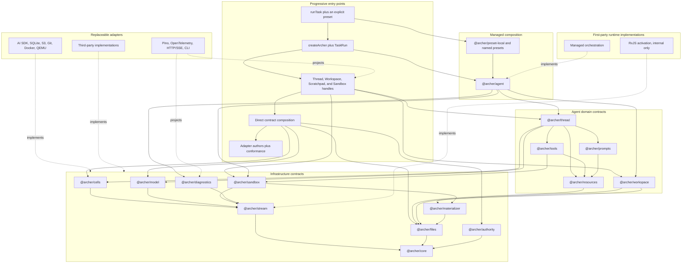
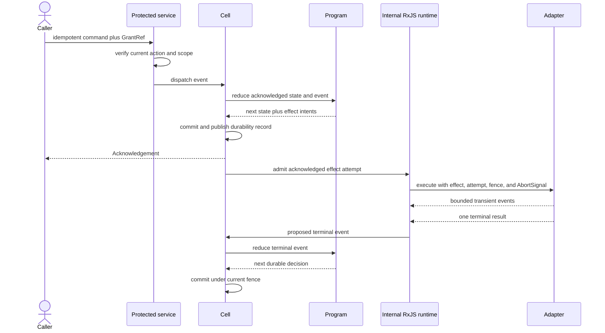

# Archer architecture

Status: v1 construction contract

This document defines the shape Archer is intended to build. It is normative
about ownership, dependency direction, and guarantees. Names in the conceptual
TypeScript examples may receive small ergonomic changes during implementation,
but those changes may not weaken the stated behavior.

## Purpose

Archer is a family of TypeScript libraries for running agent tasks without
making a model SDK, sandbox vendor, storage product, Git host, transport, or
logging framework the owner of the application.

It serves four users:

- a developer who wants to run one task with safe, visible defaults;
- an application author who retains tasks, Threads, Workspaces, or sandboxes;
- an infrastructure author who implements one replaceable boundary;
- an Archer maintainer who must preserve durability, authority, isolation,
  budget, and recovery guarantees.

The short path and the composed path use the same contracts. Convenience may
select declared defaults, create local control records, and own cleanup. It may
not begin unacknowledged work, invent permission, weaken an isolation request,
hide a retry, or publish a private change.

## Core hypothesis

An agent harness is easier to trust and compose when durable decisions and live
work have different owners:

1. A pure `Program` decides what an event means and describes external work as
   effect intents.
2. A Cell durably records accepted order, state, effect identity, attempts,
   fencing, wakes, and recovery before an effect begins.
3. Internal RxJS graphs perform acknowledged live work and manage cancellation,
   concurrency, timers, and fan-out.
4. Public contracts expose the resulting values, commands, bounded event
   delivery, and lifecycle without exposing RxJS or a product SDK.

The coding harness is one Program. A Thread contains Turns and ordered Items.
It performs one model step, records the terminal response, binds raw tool
proposals to the exact acknowledged catalogue, gives every proposal a terminal
result, and only then admits the next model step.

The remaining layers exist because their claims are independent. A model
response is not a durable acknowledgement. A sandbox handle is not execution
permission. A writable disk is not a Workspace. A Workspace snapshot is not a
canonical publication. A TypeScript value shaped like a grant, digest, or
attestation is not proof.

Archer's open-source premise follows from that separation. Each infrastructure
category has a small public protocol, public construction and validation paths,
and a conformance suite another implementation can run. Products compete at
the adapters instead of expanding one privileged harness package.

## Design rules

The following rules apply at every entry point:

1. **Acknowledge before acting.** External work begins only after the causing
   event, state, and effect intent satisfy the selected Cell durability
   contract.
2. **Keep durable meaning pure.** Reducers perform no I/O, read no clock, emit
   no diagnostic, and obtain no permission. Relevant external facts return as
   events.
3. **Preserve exact guarantees.** Broad labels such as `model`, `sandbox`, or
   `vm` enable shared behavior but never erase provider controls or backend
   facts.
4. **Verify authority at the action.** A Principal is attribution and a
   `GrantRef` is a lookup reference. The service about to act verifies current
   subject, action, scope, target, expiry, and revocation.
5. **Pin causality.** A model request and every tool call it causes retain the
   exact ResourceSet, resource revisions, request digest, effect, and attempt.
6. **Keep work private.** Tasks produce private Workspace snapshots and may
   produce ChangeSets. Promotion is a separate authorized compare-and-swap.
7. **Separate logical files from physical views.** Immutable trees own content
   identity, Workspaces and Scratchpads own mutable use, and Materializers own
   hydration and ingestion.
8. **Make live delivery bounded.** Every live queue has an item or byte bound.
   Loss, resume, detachment, abort, and terminal settlement are explicit.
9. **Observe without controlling.** Logs, metrics, traces, presentation deltas,
   and diagnostic subscribers cannot change durable outcomes.
10. **Make convenience honest.** Managed calls compile defaults into the same
    profiles, resources, grants, handles, and evidence used by direct
    composition.
11. **Ship proof with the port.** A replaceable contract is incomplete without
    codecs, required failure cases, and a versioned conformance suite.

## Public values, interfaces, and classes

Durable and transferable facts are readonly objects and discriminated unions.
This includes Thread Items, results, failures, resource revisions, grants,
sandbox requirements, attestations, file references, Workspace snapshots,
ChangeSets, cleanup evidence, and conformance reports. They are intended to be
serialized, validated, hashed, and restored without process identity.

Behavior is exposed as interfaces. Programs, stores, brokers, compilers,
adapters, services, and retained handles are replaceable contracts. Public
factories construct validated values and return those interfaces.

Implementations use proper classes where an object owns a database, lease,
process, queue, transport, physical view, or close sequence. Those classes are
implementation details. V1 does not require consumers to construct an
implementation class or extend a base class.

Expected operational outcomes are tagged values. Invalid restored input,
construction failure, or a broken adapter protocol may throw before a managed
operation exists. There is no public exception hierarchy for ordinary task,
provider, policy, or tool outcomes.

## Layers and opt-in use

Arrows in this diagram mean "depends on." Dashed arrows mean "implements" or
"projects." Consumers can stop at any entry point that meets their needs.



Contract packages never import adapters. Installing file or transcript types
does not install RxJS, a provider SDK, Pino, OpenTelemetry, SQLite, an S3
client, Git, Docker, or QEMU.

## Durable execution

### Programs and Cells

A `Program<State, Event, Effect>` is deterministic. Given the same state and
event, it returns the same next state and effect intents. Time, randomness,
policy decisions, adapter output, and extension output enter as explicit
events when they matter.

A Cell owns one ordered Program instance. Its acknowledgement means the event,
new state, effect intents, cancellation facts, sequence, fence, and recoverable
storage reference satisfied that Cell host's published durability contract.

The embedded host acknowledges after its SQLite transaction. The bucket-backed
reference host acknowledges after the transaction, immutable snapshot upload,
and fenced manifest compare-and-swap. Neither may acknowledge at an earlier
boundary merely because local work completed.

Effect identity is deterministic from the causing sequence and effect
position. An activation claims a new attempt under the current fence. A late,
cancelled, duplicate, or fenced completion cannot commit a terminal event.
External effects remain at least once unless the destination honors Archer's
effect or invocation identity.

Cell acquisition, renewal, restore, wake, fencing, and release also belong in a
focused pure lifecycle Program. Archer will extract the useful SQLite,
conditional-write, snapshot, fencing, outbox, and RxJS activation mechanisms
from the retained runtime without retaining its broad public classes.

### Thread, Turn, and Item

A Thread is durable agent history. V1 permits one active Turn per Thread. A
Turn is one user-directed unit of work. Items are ordered transcript facts,
including user input, acknowledged model request, terminal assistant response,
approval, tool result, repair, and compaction.

The Thread Program owns this loop:

1. Compile one request from the acknowledged transcript, exact ResourceSet,
   prompt contributions, context policy, and remaining budget.
2. Commit the request Item and provider effect intent.
3. Perform exactly one provider step with SDK retries disabled.
4. Commit ordered provider output and raw local tool proposals.
5. Bind each raw proposal to the catalogue recorded on the acknowledged
   request. The provider cannot assign Archer resource identity.
6. Record approval or denial, invoke admitted tools, and give every proposal a
   terminal result.
7. Compile the next request or finish the Turn.

Assistant text, reasoning, hosted tool activity, and raw local calls form one
ordered response union. Provider-neutral transcript values belong to Archer,
not the provider SDK. Compaction records its source digest, covered sequence,
pinned summarizer, request, summary, and usage. Repair records why a missing or
orphan tool result was synthesized.

Budgets are durable Thread state. They cover model steps, tool invocations,
input and output tokens, optional cost, deadlines, live output, and Workspace
or Scratchpad quotas. Metrics report those facts but do not enforce them.

### Acknowledgement sequence



If an owner dies after acknowledgement, a replacement may redrive the intent.
If it dies before acknowledgement, the unacknowledged transition is not
restored. Observers never participate in this commit path.

## Public asynchronous boundary

RxJS remains the reactive core for live activation, finite composition,
superseding lanes, cancellation, timers, and fan-out. It is not part of the
public programming model. No contract declaration may import or name an RxJS
type.

A bare `AsyncIterable` is too weak because it does not state buffer bounds,
fan-out, replay, loss, terminal behavior, or ownership. Archer therefore owns
a small standard-JavaScript bridge. The bridge separates observation from
finite live work:

```ts
export type DeliveryOptions = Readonly<{
  capacityItems: number;
  capacityBytes: number;
  overflow: 'resume' | 'gap' | 'detach';
  after?: string;
}>;

export type StreamClose =
  | Readonly<{ kind: 'completed'; lastCursor?: string }>
  | Readonly<{ kind: 'detached'; lastCursor?: string }>
  | Readonly<{ kind: 'resume-required'; after: string }>
  | Readonly<{ kind: 'failed'; failure: ProtocolFailure }>;

export interface EventSubscription<Event> extends AsyncIterable<Event>, AsyncDisposable {
  readonly closed: Promise<StreamClose>;
  close(): Promise<StreamClose>;
}

export interface EventStream<Event> {
  subscribe(options: DeliveryOptions): EventSubscription<Event>;
}

export interface LiveOperation<Event, Result, CloseEvidence> extends OwnedHandle<CloseEvidence> {
  readonly events: EventStream<Event | DeliveryGap>;
  readonly result: Promise<Result>;
  abort(reason: string): Promise<AttemptAbortEvidence>;
}
```

The semantics are deliberate:

- A subscription owns only its bounded queue and attachment. Closing it always
  detaches. It never cancels a Turn, provider step, process, or shared source.
- A `LiveOperation` owns one finite model or sandbox attempt. `abort()` actively
  tears down that attempt. Its `result` resolves once with a tagged terminal
  value after accepted live events have been closed.
- A `TaskRun` is not a `LiveOperation`. It represents durable work that may
  survive the current process. Its `cancel()` method is an authorized durable
  command. Closing the handle only releases the caller's attachment.
- Durable observations use cursors. They are not discarded. A lagging
  subscriber closes with `resume-required` and can reopen from its last safe
  cursor.
- Transient model and execution deltas may use `gap`. The next event identifies
  the source, effect, attempt, channel, offset, items, and bytes lost.
- `detach` ends only the slow subscription. `resume` is valid only for a source
  whose values are durably replayable.
- Backpressure is used only where the source can pause safely. Provider sockets
  and process pipes are drained into bounded queues; the bridge does not call a
  non-pausable source lossless.
- Expected failure is a tagged `Result`. Rejection is reserved for construction
  failure or an adapter protocol violation.

Prompt contribution is finite and returns a Promise of ordered contributions.
It does not need a public stream. Model steps and sandbox execution return
`LiveOperation`s. Cell, Thread, task, approval, and diagnostic observation use
`EventStream`s.

`@archer/stream` supplies the dependency-free queue implementation and public
conformance helpers. First-party runtime code adapts internal Observables at
that boundary. Declaration checks reject accidental `rxjs` imports, and stream
conformance covers byte and item limits, cursor resume, gap accounting,
iterator `return()`, abort propagation, idempotent close, single result, and no
post-close delivery.

## Files as a first-party domain

Archer does not begin with a sandbox filesystem. It begins with logical file
identity, then grants private mutable use, then creates a backend-specific
physical view. This is the same useful separation found in infrastructure that
distinguishes durable storage identity, a workload's claim, and the driver that
makes storage usable.

Archer does not copy Kubernetes APIs, and it does not expose a universal
mutable `VirtualFileSystem`. The analogy is about ownership:

| Concern                   | Archer owner                       |
| ------------------------- | ---------------------------------- |
| Content identity          | Blob and immutable tree references |
| Private mutable use       | Workspace or Scratchpad            |
| Physical execution view   | Materializer                       |
| Process containment       | Sandbox                            |
| Proposed canonical change | ChangeSet                          |
| Canonical publication     | Promotion service                  |

These distinctions let a QEMU disk overlay, Docker volume, temporary directory,
or remote upload realize the same logical content without becoming its
authority.

### Immutable trees

`@archer/files` owns logical paths, `BlobRef`, `TreeRef`, tree entries, blob and
tree stores, codecs, and canonical hashing. It has no dependency on Git,
sandboxing, Workspace policy, or host paths.

The first tree format is intentionally narrow:

- logical paths are relative, slash-separated, case-sensitive Unicode NFC;
- empty segments, `.`, `..`, backslashes, NUL, absolute paths, and reserved
  Archer roots are rejected;
- entries are regular files with portable readable or executable modes;
- directories are derived from paths;
- symlinks, hard links, devices, sockets, FIFOs, ownership, and platform-only
  mode bits are rejected;
- entries sort by the UTF-8 bytes of their normalized paths;
- a versioned canonical encoding and child blob digests determine the tree
  digest;
- a case-insensitive target rejects logical name collisions rather than
  merging or renaming them.

Blob reads are streaming and digest-verified. Tree publication and restoration
validate every path, mode, child reference, canonical order, and top-level
digest. A TypeScript brand only records that a validator ran in the current
process. It is not proof after deserialization.

Prompt, skill, tool, and code resources refer to a `TreeRef` and path rather
than embedding arbitrary mutable source in control records. Small inline text
may remain construction sugar, but the resource compiler publishes it into an
immutable tree before admission.

### Workspaces and Scratchpads

A Workspace owns private mutable lineage. It starts from one immutable tree,
accepts authorized and preconditioned edits or ingestion receipts, and may
produce new private snapshots. Its methods include read, list, apply, rename,
delete, snapshot, diff, and `createChangeSet`. Mutations carry an expected
entry digest or Workspace generation so stale writers are explicit failures.

A Workspace has no promotion method. `createChangeSet` compares an accepted
private result with the declared base and produces an immutable proposal. The
operation list may describe add, modify, delete, mode change, and rename, with
expected prior identities. The base tree and result tree remain authoritative;
the operation list is a review aid, not a sandbox's unverified claim.

A Scratchpad is another private mutable owner with different lifecycle rules.
V1 supports:

- `ephemeral`, deleted when its owning task or Turn closes;
- `checkpointed`, snapshotted at explicit boundaries;
- `thread-durable`, recoverable with the Thread under configured quotas.

Scratchpads materialize outside the Workspace ingestion root. They never enter
a ChangeSet by accident. An authorized import operation may copy named
immutable scratch content into a Workspace with normal preconditions. A
Scratchpad has no resource admission or promotion authority.

### Materializers

`@archer/materializer` owns the contract between logical files and one
physical execution view. A Materializer may manage a directory, volume,
overlay, block image, mount, or remote upload. It does not decide Workspace
lineage or sandbox policy.

Conceptually:

```ts
export interface Materializer<Target> {
  readonly adapterId: string;
  readonly protocolVersion: 1;

  materialize(input: {
    workspace: TreeRef;
    resources: readonly ReadonlyTreeMount[];
    scratchpads: readonly ScratchpadMount[];
    target: Target;
    idempotencyKey: IdempotencyKey;
    grant: GrantRef<'files-materialize'>;
    signal?: AbortSignal;
  }): Promise<MaterializedView>;
}

export interface MaterializedView extends OwnedHandle<MaterializationEvidence> {
  readonly viewId: MaterializedViewId;
  readonly base: TreeRef;
  readonly workspacePath: '/workspace';

  ingest(input: {
    quiescence: SandboxQuiescence;
    expectedBase: TreeRef;
    expectedGeneration: number;
    grant: GrantRef<'files-ingest'>;
    signal?: AbortSignal;
  }): Promise<IngestionReceipt>;
}
```

The exact `Target` correlates a Materializer with its sandbox adapter. Runtime
validation also checks adapter identity, protocol version, mount plan, and
deserialized configuration.

Resource trees are read-only. The Workspace tree is writable. Scratchpads use
separate roots and retention rules. Agent code and arbitrary subprocesses see
ordinary operating-system paths and do not import an Archer filesystem SDK.

Ingestion begins only after the sandbox supplies quiescence evidence that
admitted processes can no longer mutate the view. It walks the complete
Workspace root, rejects unsupported entries and path escapes, enforces quotas,
hashes all bytes, and publishes a new verified tree. A partial, stale,
cancelled, or ambiguous ingestion cannot advance Workspace lineage.

The same view generation may be ingested repeatedly. It must return the same
receipt or a protocol violation. A receipt records the exact base and result
trees, view and generation, Materializer identity, mapping version, excluded
roots, byte counts, completion status, and evidence digest.

### File sequence

```mermaid
sequenceDiagram
  actor Task
  participant Source as Source adapter
  participant Trees as Blob and tree store
  participant Work as Private Workspace
  participant Mat as Materializer
  participant Box as Verified sandbox
  participant Promote as Promotion service

  Task->>Source: resolve local directory, Git ref, or TreeRef
  Source->>Trees: publish and verify immutable base
  Trees-->>Work: open private lineage at base TreeRef
  Work->>Mat: materialize Workspace, resources, and Scratchpads
  Mat-->>Box: physical view plus mapping evidence
  Box->>Box: execute against ordinary paths
  Box-->>Mat: quiescence evidence
  Mat->>Trees: ingest and verify complete result tree
  Trees-->>Mat: result TreeRef
  Mat-->>Work: IngestionReceipt for expected generation
  Work->>Work: acknowledge private snapshot and create ChangeSet
  Work-->>Task: private evidence, never automatic publication
  Task->>Promote: optional ChangeSet, reviews, checks, expected head, GrantRef
  Promote->>Promote: revalidate policy and compare-and-swap
```

The sandbox disk is never authoritative merely because a process wrote it.
Materializer close preserves the last recoverable physical view or logical tree
locator when possible. It does not silently accept that result into a
Workspace.

### Promotion

Promotion is outside task execution. A promotion service:

1. verifies current promotion authority;
2. loads the exact ChangeSet and current canonical head;
3. composes the candidate against that expected head;
4. revalidates independent reviews and named check revisions against the exact
   candidate;
5. rejects structural or policy conflicts with recovery evidence;
6. advances the canonical reference through compare-and-swap.

A successful task has `promotion: null`. Direct canonical bind mounts and
automatic commits are not managed shortcuts.

## Resources, prompts, and tools

Models, prompts, skills, and tools are Resources. Their usable identity is an
immutable revision. Secret bindings are separate control records and never
resource payloads.

The lifecycle is:

```text
draft -> immutable revision -> proposal -> independent review -> admission
      -> profile -> compiled ResourceSet -> next-Turn activation -> invocation
```

Revocation is a new durable fact. It does not rewrite history. It blocks future
activation or invocation according to policy. The request already acknowledged
for a Turn and every tool call it caused remain pinned to their ResourceSet.

The compiler validates Workspace binding, active admission, dependency closure,
model membership, exact tree identity, unique model-facing names, skill
dependencies, secret ambiguity, sandbox compatibility, and deterministic
catalogue order. Restored ResourceSets pass the same codec and validation as
newly compiled sets.

Progressive disclosure changes prompt size, not identity. A profile can contain
many admitted skills and tools while a request initially includes short skill
descriptions and a small active catalogue. Loading a skill or tool compiles a
new ResourceSet for the next Turn boundary. No catalogue changes in the middle
of one model and tool causal chain.

`@archer/prompts` supplies finite, ordered prompt contributions and a default
compiler. Contributions return Promises, carry source and revision identity,
and are recorded with the request they influenced. There is no public
Observable for prompt compilation.

`@archer/tools` owns raw-call binding, approval requests, invocation identity,
secret leasing, sandbox execution, and terminal tool outcomes. A friendly tool
name is never authority or replay identity. A pinned invocation carries the
resource revision, artifact tree, ResourceSet, request digest, effect, attempt,
Workspace, sandbox, and applicable grant references.

Agent-authored TypeScript follows the same build, revision, review, admission,
activation, and sandbox invocation path as human-authored code. It does not
become a trusted host extension. V1 tool builds run no package-manager lifecycle
scripts, install no ambient packages, and admit no native executable dependency.

## Models

`@archer/model` owns provider-neutral request, ordered response, usage, delta,
terminal result, and failure values. Its discriminated target types retain
provider-specific controls. An OpenAI target accepts OpenAI controls, an
Anthropic target accepts Anthropic controls, and an allowlisted compatible
installation retains its installation identity and endpoint.

A model adapter performs one provider step. It neither loops over tools nor
chooses the next request. The first-party AI SDK adapter disables SDK retries,
normalizes provider values at the boundary, and excludes credential values and
raw provider loggers from the request. Retry classification is advice. A new
attempt is admitted and recorded by the Cell-owned runtime.

Transient text, reasoning, and tool-input deltas are attempt-addressed and
byte-offset. The terminal response contains the complete normalized output and
usage. Presentation can survive a delta gap by rendering the terminal Item.

## Sandbox guarantees

A public `Sandbox` has common execution and lifecycle behavior, but its `type`
and complete configuration determine what a caller may rely on.

V1 first-party configurations are:

| Configuration                                      | V1 status                              | Exact claim                                                                                            |
| -------------------------------------------------- | -------------------------------------- | ------------------------------------------------------------------------------------------------------ |
| QEMU with HVF on the verified x86_64 macOS profile | Production-shaped reference            | Hardware VM with the named VMM, accelerator, image, network, architecture, runner, and no jailer claim |
| Docker with an explicit image and limits           | Development and CI                     | Shared host kernel, no hardware-VM claim                                                               |
| Local process                                      | Explicit trusted development and tests | Process lifecycle only, no hostile-code boundary                                                       |
| Firecracker with KVM and jailer                    | Planned                                | No v1 implementation or production claim                                                               |

There is no automatic fallback. A failed QEMU request remains failed. Docker
and process configurations require an explicit development discriminator and
acceptance record.

Acquisition has separate owners:

1. policy constructs an exact `SandboxRequirement`;
2. a provider returns a non-executable `SandboxCandidate` and raw observation;
3. an independent verifier compares every requirement over an authenticated
   transport;
4. the manager exposes `SandboxHandle<Config>` only after verification.

The verified value retains backend, VMM, accelerator, architecture, image,
network, jailer, runner identity, config digest, and applicable passing
conformance evidence. Runtime attestation records what Archer checked. It is
not remote hardware attestation and cannot prove a compromised host truthful.

Each spawn verifies current invocation authority. Requests use argv arrays,
contained guest paths, explicit environment names, deadlines, output limits,
and an AbortSignal. Secret values are resolved for one invocation after
authorization, injected at the execution edge, and revoked at settlement. A
retained sandbox never receives a sandbox-wide secret environment.

Sandbox execution returns a `LiveOperation`. Active abort waits for
process-tree termination or produces cleanup evidence saying termination could
not be proved. The durable Thread outcome exists only after its corresponding
terminal event is acknowledged.

## Authority and multi-agent work

Every protected service verifies a `GrantRef<Action>` immediately before it
acts. Scope includes the complete target needed by the action. Sandbox
execution, for example, binds subject, Workspace, sandbox, invocation,
resource revision, artifact tree, argv digest, allowed environment names, and
time. A retained handle does not cache permission.

Managed local setup may create a local authority ledger, Principal, and scoped
grants because the caller explicitly selected that policy. `runTask` does not
infer permission from a caller-supplied Principal ID.

Multiple agents do not require a second state model. A coordinator starts
ordinary TaskRuns with:

- a distinct Principal and attenuated, expiring grants;
- an exact ResourceSet and budget;
- a private Workspace or explicit read-only shared tree;
- a retained Thread and its own ordered Items;
- a declared parent task, delegation record, and result channel.

Delegation is an authority action. A parent can request narrower grants but
cannot mint authority by constructing an object or hand its full handle to a
child. Agent results return as durable Items, immutable trees, artifacts, or
ChangeSets. Concurrent children never share one unguarded mutable directory.
Canonical publication still passes through review, checks, and expected-head
promotion.

V1 supplies these boundaries and lets an application implement serial,
parallel, reviewer, or specialist coordination as an ordinary Program. It does
not ship an automatic swarm policy, consensus system, semantic merge oracle,
or special multi-agent authority shortcut.

## Extension model

Archer does not publish one application-wide plugin object with model, UI,
shell, persistence, secret, and policy access. Extension points follow the
boundary they extend:

| Extension form        | Contract                                                                                           | Failure and authority rule                                                                                                 |
| --------------------- | -------------------------------------------------------------------------------------------------- | -------------------------------------------------------------------------------------------------------------------------- |
| Decision contribution | Prompt source, context policy, approval policy, resource compiler rule, or promotion policy        | Input revision and relevant output are acknowledged before caused work begins. I/O runs as an effect and returns an event. |
| Resource              | Immutable model, prompt, skill, or tool revision                                                   | Review, admission, activation, revocation, and invocation rules apply. Agent-authored code belongs here.                   |
| Capability adapter    | One Cell, model, store, Materializer, Workspace, sandbox, authority, diagnostic, or transport port | Product types stay inside the adapter and its conformance suite must pass.                                                 |
| Lifecycle participant | Named phase with timeout, AbortSignal, narrow capability, and explicit failure policy              | A result that changes durable work travels through the owning domain service.                                              |
| Passive observer      | Diagnostic sink or presentation subscription                                                       | Failure and slowness cannot change durable state or task outcome.                                                          |

Named lifecycle phases are:

- `runtime-starting` and `runtime-ready`;
- `workspace-prepared`;
- `materialization-prepared`;
- `sandbox-verified`;
- `before-ingest` and `after-ingest`;
- `task-closing` and `runtime-closing`.

Participants have a stable ID, deterministic priority order, deadline, and
either `fail-operation` or `diagnostic-only` failure policy. A decision
participant cannot choose `diagnostic-only`. A participant receives only the
Workspace, verified sandbox, physical view, check runner, diagnostic publisher,
or close evidence appropriate to its phase. No phase grants a host shell,
`sudo`, arbitrary mount, ambient environment, secret store, or promotion
service.

A one-file TypeScript extension remains possible. `defineExtension` can bundle
related resource contributions, adapter factories, lifecycle participants, and
passive observers. The loader expands that bundle into the separate contracts,
records source provenance, rejects duplicate stable IDs, and applies the trust
and admission policy for each category. The bundle is packaging convenience,
not a universal runtime capability.

Callbacks therefore have narrow homes:

- `EventStream.subscribe` is the callback or async-iteration bridge for
  observation;
- `DiagnosticSink.write` is a best-effort transport callback;
- lifecycle participants run only at named phases with declared policy;
- provider, tool, approval, cancellation, and promotion behavior use typed
  commands, Programs, and terminal values rather than `onX` callbacks.

## Managed composition and ergonomics

The managed layer offers three progressively deeper surfaces.

### One call

The shortest path owns construction, one task attachment, and cleanup:

```ts
import { runTask } from '@archer/agent';
import { localCoding } from '@archer/preset-local';
import { openAI } from '@archer/model-ai-sdk';
import { dockerDevelopment } from '@archer/sandbox-docker';

const result = await runTask({
  task: 'Fix the failing tests',
  workspace: '.',
  using: localCoding({
    model: openAI({ model: 'gpt-5.6', credential: 'personal' }),
    sandbox: dockerDevelopment({
      image: 'archer-node26',
      network: 'none',
    }),
  }),
});

if (result.status === 'completed') {
  console.log(result.changeSet?.digest ?? 'no changes');
}

if (result.status === 'paused') {
  console.log(result.approvals, result.resume);
}
```

The explicit `dockerDevelopment` discriminator states the shared-kernel claim.
A supported caller may select `qemuHvf` instead. Trusted process execution is
available only through `trustedProcess({ acknowledgeNoIsolation: true })`.
No preset probes for one backend and silently falls back to another.

The construction-time model option is not a second task-time source of truth.
The preset creates or restores model and default resource revisions, records
their admission under the selected local policy, creates a named profile, and
compiles a ResourceSet. Each task runs against that compiled profile.
Credential values remain inside the provider adapter.

The input directory is imported into an immutable tree and private Workspace.
It is not bound as the canonical writable directory. A successful result may
contain a private ChangeSet but never promotes it.

### Retained tasks

Applications that need live UI, human approval, or repeated work retain an
Archer instance and a `TaskRun`:

```ts
export interface TaskRun extends OwnedHandle<TaskRunCloseEvidence> {
  readonly taskId: TaskId;
  readonly threadId: ThreadId;
  readonly events: EventStream<TaskObservation>;
  readonly approvals: EventStream<ApprovalRequest>;
  readonly result: Promise<TaskResult>;

  decideApproval(decision: ApprovalDecision, grant: GrantRef<'tool-approval'>): Promise<ApprovalReceipt>;

  cancel(reason: string, grant: GrantRef<'turn-cancel'>): Promise<TurnOutcome>;
}
```

`Archer.startTask()` returns this handle. Closing it detaches the application
and returns recovery evidence. It does not cancel acknowledged work.
`Archer.runTask()` uses the same method, waits while its configured policy can
make progress, and closes the attachment before returning.

Approval has two parts. An `ApprovalPolicy` evaluates a pinned call and returns
`approve`, `deny`, or `needs-human`. That recommendation is not permission.
`TaskRun.decideApproval()` verifies current approval authority and records the
decision as a durable Item before an invocation effect exists.

The standard local policy automatically approves only admitted first-party
operations confined to the private Workspace, without network, secret, host
access, or a new capability. It can deny a prohibited action. If it returns
`needs-human`, one-call `runTask()` returns `status: "paused"` with durable
approval requests, the last acknowledgement, private Workspace snapshot, and a
resume locator. It does not wait forever on an in-process callback.

CLI, HTTP, or application responders use retained `TaskRun` commands. A UI
callback may gather a human answer, but its return value alone is not
authority. Disconnect, timeout, and cancellation remain explicit outcomes.

### Direct composition

Infrastructure applications can assemble the same pieces directly:

```ts
import { borrowed, owned } from '@archer/core';
import { composeArcher } from '@archer/agent';

await using archer = await composeArcher({
  cells: owned(await bucketSqliteCells(cellOptions)),
  models: borrowed(modelRouter),
  files: owned(await fileTreeStore(fileOptions)),
  materializers: borrowed(materializerRegistry),
  workspaces: owned(await gitWorkspaces(gitOptions)),
  resources: borrowed(resourceControl),
  authority: borrowed(authorityBroker),
  sandboxes: borrowed(sandboxManager),
  diagnostics: owned(await diagnosticHub(diagnosticOptions)),
});

await using workspace = await archer.workspaces.openPrivate({
  source: gitSource(repository, 'main'),
  subject,
  grant: workspaceReadGrant,
});

await using thread = await archer.threads.create(
  {
    threadId,
    workspaceId: workspace.workspaceId,
    subject,
    resourceSet: await resources.compile(profileId, resourceReadGrant),
  },
  threadCreateGrant,
);

const receipt = await thread.startTurn(turnInput, turnStartGrant);
await using events = thread.events.subscribe({
  after: receipt.cursor,
  capacityItems: 128,
  capacityBytes: 1_048_576,
  overflow: 'resume',
});

for await (const event of events) render(event);
```

Direct users can also use Cells for a non-agent Program, immutable files
without a sandbox, a sandbox without a model, or Workspace promotion without
installing the managed package.

### Standard coding defaults

The default coding profile is a versioned resource bundle, not hard-coded
prompt text hidden in the runner. It provides:

- a base prompt that requires inspection before edits, private work, factual
  reporting, and verification before completion;
- acknowledged project instructions loaded from the Workspace tree;
- progressively disclosed skills for inspection, change construction, and
  verification;
- admitted `list_files`, `search_text`, `read_file`, `apply_patch`, `run`,
  `git_status`, `git_diff`, and `load_skill` tools;
- no network or secret delivery unless the profile explicitly adds them;
- a default model-step, tool-invocation, token, cost, output, file, and time
  budget that applications can narrow or replace;
- durable context compaction at a configured fraction of usable context with a
  pinned summarizer revision;
- visible retry attempts with provider SDK retries disabled;
- private Workspace ingestion and cleanup, with no promotion.

The model and exact sandbox remain required configuration. A universal default
for either would be dishonest. Everything else is a named, inspectable value or
factory that an application can replace individually.

Ergonomics should be excellent for one task, repeated managed tasks, and normal
retained Threads. Direct sandbox verification, resource admission, custom
authority, promotion, and adapter construction remain deliberately explicit
because those paths configure guarantees rather than ordinary task input.

## Lifecycle and ownership

Every retained owner follows:

```ts
export interface OwnedHandle<Evidence> extends AsyncDisposable {
  close(): Promise<Evidence>;
}

export type ComponentRef<T> =
  Readonly<{ ownership: 'borrowed'; value: T }> | Readonly<{ ownership: 'owned'; value: T }>;
```

`close()` is idempotent. Concurrent calls share one close operation. Repeated
calls return the same terminal facts with `alreadyClosed: true` where relevant.
`Symbol.asyncDispose` delegates to `close()`.

Factories never infer dependency ownership from the presence of a `close`
method. `composeArcher` requires `owned()` or `borrowed()` around every Cell
host, router, store, manager, broker, and diagnostic hub. Presets own the
components they create. Archer never closes a borrowed dependency.

The ownership ladder is:

| Owner              | Owns                                                 | Does not imply                              |
| ------------------ | ---------------------------------------------------- | ------------------------------------------- |
| Event subscription | One bounded queue and attachment                     | Cancellation of its source                  |
| Live operation     | One provider or sandbox attempt                      | Acceptance of its result into durable state |
| TaskRun            | Application attachment and operation-scoped children | Authority or automatic cancellation         |
| Thread handle      | Client attachment to a durable Thread                | Ownership of the durable Thread record      |
| Cell handle        | Current activation lease                             | Permanent ownership of Cell state           |
| MaterializedView   | One physical view and ingestion recovery data        | Workspace lineage or publication            |
| Sandbox handle     | Processes, runtime lease, and teardown               | Execution authority or file ownership       |
| Workspace handle   | Private lineage and snapshots                        | Canonical promotion                         |
| Archer             | Components explicitly marked owned                   | Application-supplied borrowed services      |

Managed cleanup proceeds from child work to parent services:

1. stop admitting new operation-scoped work;
2. settle or explicitly abort live attempts;
3. quiesce the sandbox process tree;
4. ingest the physical Workspace view;
5. apply a current ingestion receipt and create a ChangeSet when requested;
6. checkpoint or remove Scratchpads according to policy;
7. close MaterializedView, sandbox, Workspace, Thread, and Cell attachments;
8. close owned adapters in reverse construction order;
9. flush diagnostics and telemetry within a shutdown deadline.

Cleanup continues after an individual failure. It does not replace the primary
task outcome. `CleanupReport` records every attempted phase, success or failure,
the last acknowledgement and fence, Workspace and Scratchpad trees, ingestion
status, ChangeSet, process-tree termination, lease release, and recovery
locators.

Close, detach, live abort, and durable cancel remain distinct. No
`AsyncDisposable` shortcut is allowed to blur them.

## Observability

Archer has three observable planes with different authority:

1. **Durable observations** expose acknowledged Thread and Cell facts by
   cursor. They are replayable and may support audit.
2. **Presentation events** expose attempt-addressed model and execution deltas,
   approval notices, and explicit gaps. They improve interaction but are not
   transcript truth.
3. **Diagnostics** explain operation, performance, lifecycle, and adapter
   failure. They are bounded, redacted, and non-authoritative.

`@archer/diagnostics` defines a versioned product-neutral record:

```ts
export type DiagnosticRecord = Readonly<{
  schema: 1;
  name: string;
  severity: 'debug' | 'info' | 'warn' | 'error';
  at: Timestamp;
  component: string;
  phase: 'start' | 'finish' | 'point';
  outcome?: string;
  durationMs?: number;
  correlation: DiagnosticCorrelation;
  attributes: JsonObject;
  error?: PublicError;
}>;

export interface DiagnosticSink extends AsyncDisposable {
  write(records: readonly DiagnosticRecord[]): Promise<void>;
  flush(): Promise<void>;
}

export interface Diagnostics {
  readonly events: EventStream<DiagnosticRecord | DiagnosticGap>;
  attach(sink: ComponentRef<DiagnosticSink>, options?: DiagnosticFilter): OwnedHandle<DiagnosticSinkCloseEvidence>;
}
```

Correlation may include task, Thread, Turn, Cell, effect, attempt, model
request, invocation, sandbox, materialized view, Workspace, ResourceSet, and
ChangeSet identity. Prompt content, tool input and output, file bytes, provider
headers, credentials, raw environment values, and secrets are excluded by
default. Adapter errors become bounded, redacted public error data before they
enter the diagnostic queue.

Runtime packages enqueue records into a bounded dispatcher. Domain work never
awaits a diagnostic sink. Slow or failing sinks are isolated. Overflow counts
drops by component and severity and later emits one `diagnostics.gap` record.
A sink failure is reported to other healthy sinks and close evidence without
recursively writing through the failed sink. It cannot change acknowledgement,
retry, cancellation, budget, task status, checks, or promotion.

### Logs

Pino is the first-party Node logging adapter. `@archer/diagnostics-pino` maps
normalized records to structured JSON, child correlation bindings, and
redaction. Pino-specific transports and formatters remain in that package.
Pino's own documentation recommends moving log transformation and transmission
to a worker thread or separate process, which matches Archer's isolated sink
model: [Pino transports](https://github.com/pinojs/pino/blob/main/docs/transports.md).

`tslog` is not a v1 dependency. It may implement `DiagnosticSink`, but Archer
does not need a second logger abstraction inside its contracts. Logs are a
projection of diagnostics, not the source of diagnostic or durable meaning.

### Metrics and traces

`@archer/telemetry-opentelemetry` translates named lifecycle and diagnostic
events into metrics and spans. It never exports OpenTelemetry SDK types through
an Archer contract. The JavaScript implementation currently treats traces and
metrics as stable while its log signal remains less mature, which reinforces
the split between Pino logs and OpenTelemetry traces and metrics:
[OpenTelemetry JavaScript](https://opentelemetry.io/docs/languages/js/).

Metrics cover acknowledgements, activation queue time, attempts, fences,
provider latency and usage, approval wait, tool duration, sandbox acquisition,
materialization, ingestion, output gaps, and cleanup. Labels are bounded.
Backend class, adapter ID, result code, phase, model family, and resource kind
are permitted. Thread, effect, invocation, sandbox, Workspace, file path,
prompt, and grant IDs are not metric labels.

Traces cover managed tasks, Turns, effect attempts, provider steps, tool
invocations, sandbox execution, and materialization. A recovered attempt starts
a new process span linked to the durable effect and prior trace context when
available. Archer does not pretend that an in-memory parent span survived
process replacement. Trace context is excluded from request digests, resource
identity, reducer decisions, and replay comparison.

Datadog may receive OTLP data directly or through an OpenTelemetry Collector.
Prometheus receives the bounded metrics projection through an OpenTelemetry
exporter or Collector. ELK receives Pino JSON through stdout, a worker
transport, or an explicit diagnostic sink. These are deployment choices, not
new core interfaces.

### Transports and subscriptions

In-process handles are canonical. CLI, HTTP/SSE, and future ACP adapters decode
public values, authenticate a Principal, obtain or forward grant references,
call handle methods, and encode streams and results. They do not implement
another agent loop.

Durable SSE streams accept a cursor and terminate a slow client with a resume
cursor. Transient streams report gaps. Connection loss detaches observation and
does not cancel a Turn. Cancellation requires an authenticated command.

Diagnostic subscribers use the same public EventStream boundary. Extension
sinks attach through `Diagnostics.attach`. Transport teardown and diagnostic
flush follow explicit owned or borrowed lifecycle rules.

## Package map

The contract graph points inward. Common resource references live in `core` so
model requests can identify offered tool revisions without importing the
resource control plane.

| Package                | Public responsibility                                                                                                              | Intentional dependencies                                                         |
| ---------------------- | ---------------------------------------------------------------------------------------------------------------------------------- | -------------------------------------------------------------------------------- |
| `@archer/core`         | JSON values, IDs, digests, codecs, `Program`, effect intents, tagged failures, `OwnedHandle`, `ComponentRef`, common resource refs | Standard JavaScript only                                                         |
| `@archer/stream`       | `EventStream`, subscriptions, bounded delivery, gaps, `LiveOperation`, and conformance helpers                                     | `core`                                                                           |
| `@archer/diagnostics`  | Diagnostic schema, correlation, filters, hub, sink, redaction, and subscriptions                                                   | `core`, `stream`                                                                 |
| `@archer/authority`    | Principals, action-correlated grant references, generic scope values, verification decisions, and broker                           | `core`                                                                           |
| `@archer/files`        | Logical paths, blobs, immutable trees, stores, canonical codecs                                                                    | `core`                                                                           |
| `@archer/materializer` | Mount plans, physical views, quiescence, ingestion receipts, and recovery evidence                                                 | `core`, `files`, `authority`                                                     |
| `@archer/workspace`    | Private Workspace and Scratchpad lineage, edits, snapshots, ChangeSets, reviews, checks, and promotion ports                       | `core`, `files`, `materializer`, `authority`                                     |
| `@archer/cells`        | Acknowledgements, attempts, fences, wakes, lifecycle Program, Cell host and handle                                                 | `core`, `stream`                                                                 |
| `@archer/model`        | Provider-neutral targets, requests, ordered parts, deltas, one-step operations, usage, and routing                                 | `core`, `stream`                                                                 |
| `@archer/resources`    | Drafts, revisions, build evidence, review, admission, profiles, ResourceSets, activation, revocation, and secret bindings          | `core`, `files`, `model`, `authority`                                            |
| `@archer/prompts`      | Finite prompt contributions, compiler, context policy, and default prompt sources                                                  | `core`, `files`, `resources`                                                     |
| `@archer/sandbox`      | Exact requirements, candidates, verifier, acquisition, execution, leases, and close evidence                                       | `core`, `stream`, `materializer`, `authority`                                    |
| `@archer/tools`        | Raw-call binding, approval, invocation identity, secret leasing, execution, and outcomes                                           | `core`, `model`, `resources`, `sandbox`, `workspace`, `authority`                |
| `@archer/thread`       | Thread, Turn, Item, transcript, coding Program, repair, compaction, budgets, and retained handle                                   | `core`, `stream`, `cells`, `model`, `resources`, `prompts`, `tools`, `authority` |
| `@archer/agent`        | `runTask`, `createArcher`, `composeArcher`, TaskRun, managed coordination, lifecycle, and policy composition                       | Contract packages above                                                          |
| `@archer/conformance`  | Versioned required cases, fault models, reports, and passing evidence                                                              | Contract packages only                                                           |
| `@archer/testing`      | Deterministic clocks, stores, adapters, schedules, and scenario fixtures                                                           | Contract packages only                                                           |

Contract packages may depend on `diagnostics` in implementation modules without
making a diagnostic sink a constructor requirement for pure values. Diagnostic
emission remains an injected, non-blocking runtime concern.

First-party implementation and adapter packages are independently installable:

- `@archer/cells-embedded-sqlite`;
- `@archer/cells-bucket-sqlite`;
- `@archer/object-store-s3`;
- `@archer/files-fs`;
- `@archer/materializer-directory`;
- `@archer/materializer-docker`;
- `@archer/materializer-qemu`;
- `@archer/workspace-git`;
- `@archer/model-ai-sdk`;
- `@archer/sandbox-process`;
- `@archer/sandbox-docker`;
- `@archer/sandbox-qemu-hvf`;
- `@archer/diagnostics-pino`;
- `@archer/telemetry-opentelemetry`;
- `@archer/transport-http`;
- `@archer/cli`;
- `@archer/preset-local`.

There is no aggregate export that installs every adapter. The local preset
selects embedded state, local tree storage, Git Workspace support, managed
diagnostics, default coding Resources, and lifecycle policy. It still requires
the caller to supply a model and exact sandbox choice.

## Technology choices

| Concern                        | V1 choice                                                                                                   |
| ------------------------------ | ----------------------------------------------------------------------------------------------------------- |
| Runtime                        | Node 26, ESM, TypeScript 5.9, pnpm 11                                                                       |
| Internal reactive work         | RxJS 7.8 in implementation modules only                                                                     |
| Public temporal API            | Archer-owned bounded streams and live-operation handles                                                     |
| Provider integration           | AI SDK at the adapter edge, SDK retries disabled                                                            |
| Tool schemas                   | JSON Schema 2020-12, including boolean schemas, with Ajv 8 behind validation ports                          |
| Embedded durability            | `node:sqlite`, with no ORM in the journal or outbox path                                                    |
| Distributed reference host     | SQLite snapshots plus conditional object-store operations and a mandatory live semantics probe              |
| S3-compatible storage          | AWS SDK v3 inside the S3 adapter                                                                            |
| File identity                  | SHA-256 blobs and a versioned canonical tree encoding                                                       |
| Workspace source and promotion | Git CLI inside the Git adapter; no Git value in ChangeSet contracts                                         |
| Sandbox control                | Existing `sandboxd` and QEMU runner mechanisms behind rebuilt exact contracts; Docker CLI for development   |
| Structured logging             | Pino adapter over Archer diagnostics                                                                        |
| Metrics and traces             | OpenTelemetry adapter over named Archer signals                                                             |
| Test harness                   | TypeScript negative type cases, deterministic unit scenarios, fault injection, and live adapter conformance |

Archer does not add Effect, another actor runtime, or a workflow framework on
top of its Program and RxJS split. Zod does not become the public tool schema
language. Product SDKs remain adapters so their release cadence does not define
the durable protocol.

## TypeScript, runtime validation, and proof

TypeScript should reject useful local category errors:

- provider controls or adapters paired with the wrong model target;
- a rejected review used as positive evidence;
- a revoked admission used as active;
- a ResourceSet or attestation constructed without its public validating path;
- an authority action paired with the wrong scope category;
- a development sandbox supplied where an exact QEMU requirement is required;
- a Firecracker observation used for a QEMU requirement;
- a Workspace used as a promotion service;
- a failed check or stale ChangeSet used as passing promotion evidence;
- an owned dependency confused with a borrowed one.

TypeScript cannot prove a fact obtained from storage, a network, disk, process,
or hostile adapter. Runtime codecs, verifiers, Programs, and services validate:

- IDs, timestamps, numeric bounds, URLs, JSON values and schemas;
- canonical hashes, tree bytes, logical paths, modes, generations, and lineage;
- transcript order, request and ResourceSet pinning, tool pairing, complete
  settlement, repair origin, and compaction coverage;
- grant existence, issuer chain, subject, target, attenuation, expiry, and
  revocation at action time;
- provider correlation, monotonic offsets, cancellation, one result, and no
  hidden retry;
- runner identity, authenticated transport, exact sandbox observation, image,
  mounts, network policy, process-tree termination, lease, and ingestion;
- review independence, check identity, candidate composition, and canonical
  compare-and-swap.

Each replaceable boundary publishes a versioned conformance suite. The initial
suites cover:

- Cell acknowledgement, ownership races, fencing, redrive, wakes, cancellation,
  ambiguous publication, and late completion;
- object-store conditional create and update, immutable reads, retired token
  rejection, and the live startup probe;
- stream item and byte bounds, slow consumers, gap accounting, cursor resume,
  abort, detachment, idempotent close, one result, and no post-close delivery;
- model ordering, correlation, offsets, cancellation, provider normalization,
  and zero hidden retries;
- resource Workspace binding, build identity, independent review, deterministic
  compilation, activation timing, pinning, and revocation;
- file normalization, traversal, collision rejection, mode preservation, tree
  round trips, stale preconditions, quotas, and Scratchpad exclusion;
- Materializer idempotency, read-only mounts, quiescence, full ingestion,
  partial failure, stale generations, and recovery evidence;
- authority expiry, revocation, attenuation, action mismatch, and cross-target
  replay;
- sandbox exact attestation, output limits, contained paths, process-tree
  cancellation, reacquisition, expiry, egress, and idempotent close;
- Workspace privacy, verified diff, review and check binding, candidate
  composition, stale-head rejection, and promotion compare-and-swap;
- diagnostic redaction, queue bounds, gap accounting, sink isolation, metric
  cardinality, and non-interference with task outcomes;
- transport authentication, codecs, cursor resume, gaps, detach versus cancel,
  and bounded clients.

Passing evidence names the suite and protocol versions, implementation, exact
configuration digest, required cases, results, time, and evidence digest. Every
required case must pass. Failed, skipped, stale, or differently configured
evidence is diagnostic data, not proof. Protocol conformance and security
assurance remain separate. A Docker adapter can pass lifecycle conformance
without becoming a hardware VM.

Public brands always have a public codec, factory, or verifier. Third-party
adapter authors do not cast private symbols to participate.

## V1 scope and intended use

V1 supports:

- one managed coding task with a terminal or paused result;
- retained TaskRuns and multi-Turn Threads with one active Turn per Thread;
- application-coordinated multiple agents with distinct Principals, attenuated
  grants, budgets, ResourceSets, and private Workspaces;
- an Archer-owned ordered transcript, typed repair, durable compaction, and
  cursor-addressed observation;
- OpenAI, Anthropic, and named allowlisted OpenAI-compatible targets through
  the AI SDK adapter;
- exact model, prompt, skill, and TypeScript or JavaScript tool revisions,
  progressive disclosure, and between-Turn activation;
- embedded SQLite Cells and the bucket snapshot reference host;
- immutable regular-file trees, filesystem stores, private Workspaces,
  Scratchpads, first-party Materializers, ingestion, and ChangeSets;
- QEMU/HVF on the verified x86_64 macOS profile;
- Docker and process adapters under explicit development policies;
- invocation-scoped secrets and current authority at every protected action;
- private Git Workspace import, named checks, independent review, and
  expected-head promotion;
- product-neutral diagnostics, Pino logs, OpenTelemetry metrics and traces,
  CLI, HTTP/SSE, and public conformance suites.

The intended applications are local coding tools, durable background agents,
interactive developer products, explicit multi-agent coordinators, adapter
experiments, and infrastructure services that adopt only the Cell, file,
Workspace, sandbox, or authority layers they need.

Planned features have named homes:

- Firecracker/KVM with its jailer belongs in a sandbox adapter after live Linux
  conformance;
- gVisor, Kata, and Apple Silicon QEMU require distinct exact configurations
  and evidence;
- LTX belongs in a Cell host after its epoch-tail fencing proof exists;
- S3-backed trees belong in a file-store adapter;
- ACP and WebSocket belong in transport adapters;
- richer POSIX metadata and safe symlinks require a new tree format and
  Materializer conformance version;
- collaborative Thread editing, branches, rewind, and CRDT semantics belong in
  future Thread and Workspace protocols;
- hosted control planes implement existing ports rather than redefining them.

## Construction roadmap

Construction follows dependency direction rather than starting with the
managed demo:

1. **Core, streams, and diagnostics.** Publish common codecs, Program,
   lifecycle and ownership values, the public stream bridge, DiagnosticRecord,
   deterministic fixtures, declaration-leak checks, and conformance.
2. **Immutable files.** Build path codecs, blob and tree formats, filesystem
   stores, canonical hashing, and file fault cases before resources, Git, and
   sandboxes can invent separate formats.
3. **Materialization and private work.** Build Materializer, physical view,
   Scratchpad, Workspace lineage, ingestion, ChangeSet, and Git adapter
   contracts. Keep promotion separate.
4. **Authority.** Publish action-specific scopes, ledger and broker ports,
   expiry, revocation, attenuation, and cross-target tests before protected
   mutation handles ship.
5. **Cells.** Extract the pure lifecycle Program and retained SQLite, outbox,
   snapshot, fencing, wake, and RxJS activation mechanisms into embedded and
   bucket hosts. Add the live storage semantics probe.
6. **Models, prompts, and resources.** Replace SDK-shaped durable values,
   implement one-step AI SDK adapters, finite prompt compilation, resource
   build and admission, profiles, progressive disclosure, and between-Turn
   activation.
7. **Sandboxes and tools.** Rebuild candidate acquisition, independent exact
   verification, invocation-scoped secrets, Materializer pairing, live exec,
   and close evidence. Extract process, Docker, sandboxd, and QEMU/HVF
   mechanisms only behind the new suites.
8. **Thread.** Build the coding Program, ordered transcript, raw-call binding,
   complete tool settlement, approval, budgets, cancellation, repair,
   compaction, and Cell-backed retained handle.
9. **Managed composition.** Add TaskRun, paused approval results, explicit
   dependency ownership, default coding Resources, named presets, and the
   one-call facade. The managed package should contain little new correctness
   logic.
10. **Operations and presentation.** Add Pino, OpenTelemetry, CLI, and HTTP/SSE
    adapters. Prove that sink and transport failures cannot affect durable
    outcomes.
11. **End-to-end proof.** Publish recovery, fencing, budget, exact-sandbox,
    ingestion, authority, multi-agent privacy, and promotion scenarios for each
    advertised preset and adapter configuration.

Every phase publishes its codecs and conformance cases with its port. An
adapter is not advertised until its required suite passes on its exact
configuration.

## Explicit non-goals

V1 does not provide or claim:

- public RxJS types or a requirement that users understand RxJS operators;
- a second actor, workflow, or provider-owned tool-loop framework;
- exactly-once external effects or exactly-once token delivery;
- automatic fallback to a weaker sandbox or equivalence between isolation
  classes;
- production Firecracker, gVisor, Kata, Apple Silicon QEMU, or hardware remote
  attestation;
- a universal mutable filesystem or full POSIX equivalence across adapters;
- direct canonical bind mounts, implicit commits, or automatic promotion;
- hidden provider retries, provider-owned tool recursion, or provider SDK
  transcript values;
- sandbox-wide secrets, ambient host hooks, package lifecycle scripts, or
  agent self-admission;
- one universal extension registry or one global reducer for every concern;
- telemetry that affects acknowledgement, retry, task result, authority,
  checks, or promotion;
- reconstruction of durable history from deltas, logs, metrics, or traces;
- an automatic swarm strategy, semantic merge oracle, or claim that path
  scopes detect semantic conflict;
- compatibility with the retained pre-009 package APIs.

## Decisions left to implementation

The architecture fixes the boundaries while leaving measured constants and
wire details to focused construction work:

- the exact canonical tree byte encoding, while SHA-256, normalization,
  ordering, entry kinds, and collision policy are settled;
- default queue sizes and slow-consumer thresholds for each adapter, while
  bounded delivery and explicit loss are settled;
- exact diagnostic event names and OpenTelemetry span links, while the
  product-neutral schema, Pino choice, signal split, and non-interference are
  settled;
- default context compaction thresholds and Scratchpad quotas, while their
  durable ownership and evidence are settled;
- the first remote approval presentation, while paused one-call results and
  retained authorized decisions are settled.

These choices require prototypes or production traces. They do not require a
new architectural layer.

## Summary

Archer's v1 is a durable state-machine kernel surrounded by exact, replaceable
contracts. RxJS stays inside the runtime. Public code sees readonly values,
behavioral interfaces, owned handles, Promises, AbortSignals, bounded event
streams, and tagged results. Files exist before sandboxes, diagnostics exist at
every runtime boundary, and convenience compiles into the same authority,
resource, Cell, Workspace, and sandbox facts used by direct composition.

The result should be easy at the top and honest at the bottom: run the task,
enforce the budget, contain the process according to a named guarantee,
preserve recoverable evidence, and never confuse private work with permission
to publish it.
