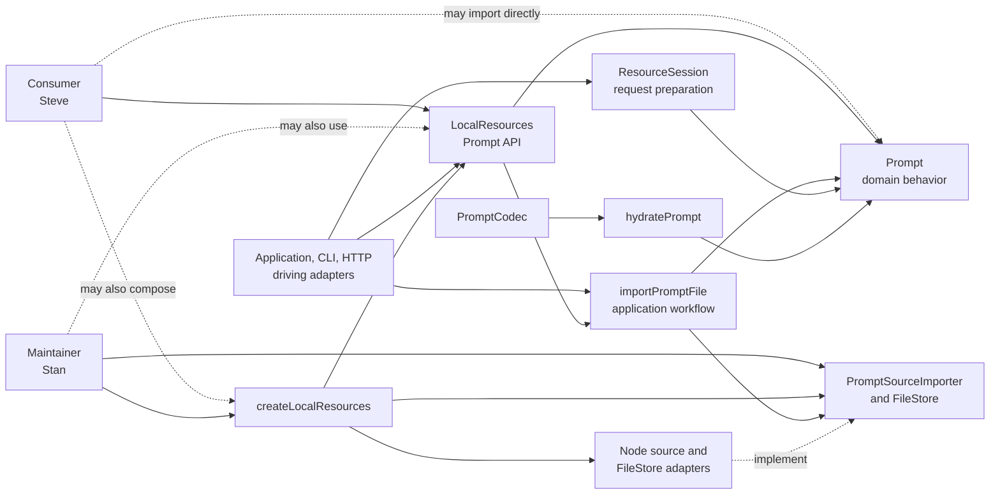

# Archer ownership model and composition philosophy

Archer should be easy to use because its pieces compose well, not because their
boundaries have been hidden or collapsed.

This document is a guide for deciding where policy belongs, what a domain object
owns, how effects remain separate from decisions, and how the public API serves
both people who use Archer and people who maintain or extend it.

The examples follow one Archer `Prompt` through definition, file import,
rendering, request preparation, transport, and hydration. The names are real
parts of Archer's Resource layer.

## The interested parties

Archer has two interested parties.

### Consumers: Steve

Steve wants to perform useful work. He should be able to identify the package,
construct the application object, call an operation, observe what happens, and
handle a documented result without first learning Archer's internal structure.

Steve still has the right to inspect, replace, and compose lower parts. Consumer
is a role, not a limit on skill or permission.

### Maintainers: Stan

Stan needs to understand why every part exists, replace one implementation
without changing unrelated behavior, and add a capability without growing a
large class that already has several reasons to change.

Stan should also be able to use the convenient API. Maintainer is a role, not an
obligation to assemble every dependency by hand.

Stan and Steve may be the same developer in the same application. Archer must
not produce one simplified product for Consumers and a separate real product
for Maintainers.

## The governing idea

The smallest contract that behaves owns the decision. A larger object or
workflow may compose that behavior, but composition does not transfer
ownership.

Convenience belongs in factories, builders, application services, composition
roots, and presets. Those entry points may coordinate several owners while
leaving each owner independently available.

This gives Archer one implementation with several useful entry depths:

1. A Consumer calls a prepared application API with honest defaults.
2. A Consumer or Maintainer supplies selected implementations to a composition
   API.
3. A Maintainer or library author imports the domain, port, adapter, transport,
   and hydration contracts directly.

The shallow entry point is assembled from the deeper contracts. It is not a
replacement for them, and the deeper contracts are not internal leftovers.

## Hexagonal architecture is the system

These are not isolated patterns that Archer happens to use together. Archer
uses hexagonal architecture to organize policy, effects, construction, and its
public API.

The domain and application own decisions. Driven ports describe the effects
the application needs. Product adapters implement those ports. Driving
adapters translate HTTP requests, CLI commands, queue messages, and other
outside input into application operations. Composition roots connect the
object graph. Presets select named construction policy. Facades present a
focused job to a Consumer.

The convenient API and the lower contracts are therefore one product at
different depths. The convenient API is constructed from the same domain,
application, ports, and adapters that a Consumer or Maintainer can import and
compose directly. Defaulting some of those parts does not create a second
architecture, and exposing the lower parts does not make the convenient API a
toy.

## What policy means

Policy is a rule that selects or refuses an outcome under declared facts. A
configuration object may carry facts used by policy, but data alone does not
make a decision.

Before assigning policy to a type, ask:

- What decision is being made?
- Which facts make the decision legal or illegal?
- Which state changes when the decision succeeds?
- Which consequences are forced by that success?
- Which owner would become incorrect if the rule changed?

The answer determines ownership. The nearest familiar noun does not.

### Kinds of policy

Several policies participate when an application imports and uses a Prompt.
They do not belong to one object.

| Policy             | Example decision                                                                 | Owner                        |
| ------------------ | -------------------------------------------------------------------------------- | ---------------------------- |
| Domain policy      | Render only when values exactly match the Prompt's declared variables.           | `Prompt`                     |
| Application policy | Render selected Prompts in profile order while preparing one model-step request. | `ResourceSession`            |
| Composition policy | Bind a FileStore, source importer, UUID source, clock, and naming policy.        | `createLocalResources`       |
| Adapter policy     | Refuse a link, non-regular file, or file that changes while being read.          | `nodeResourceSourceImporter` |
| Transport policy   | Decode a detached Prompt DTO without installing behavior.                        | `PromptCodec`                |

These decisions may all occur before one model call. They still change for
different reasons and belong to different owners.

## The Prompt domain

`Prompt` is the smallest owner of an admitted template, its placement, its
declared variables, and its rendering behavior. One immutable instance is one
exact Resource revision.

```ts
/** One immutable Prompt revision with admitted rendering behavior. */
export class Prompt {
  /** Stable identity shared by every revision of this Prompt. */
  readonly id: PromptId;

  /** Exact immutable revision used as rendering provenance. */
  readonly revisionId: PromptRevisionId;

  /** Human-readable name used in application output and diagnostics. */
  readonly name: string;

  /** Request location that every contribution from this Prompt inherits. */
  readonly placement: PromptPlacement;

  /** Exact variable names accepted by rendering, in deterministic order. */
  readonly variables: readonly string[];

  /**
   * Renders only when the supplied values exactly match this revision's contract.
   * Successful output carries provenance that callers cannot manufacture.
   */
  render(values: Readonly<Record<string, string>>): Result<PromptContribution, ResourcesError>;

  /** Earns one immutable child revision from explicit identity and time facts. */
  revise(input: RevisePromptInput, context: PromptRevisionContext): Result<Prompt, ResourcesError>;
}
```

`Prompt` admits Archer's finite `{{identifier}}` grammar, rejects missing or
extra render values, and mints a `PromptContribution` tied to its exact
revision. A child revision preserves logical identity and names its exact
parent. `Prompt` does not know:

- how a source file was located or read;
- which FileStore retains imported source bytes;
- which Prompts an AgentProfile selects or in what order;
- which model provider receives the rendered contribution;
- which clock or UUID generator the application selected;
- how a Prompt DTO is encoded; or
- how rendering is logged or traced.

Archer also exports standalone functions for callers who prefer functional
composition. They delegate to the same behavior owner.

```ts
/** Renders through the exact behavior installed on one Prompt revision. */
export function renderPrompt(
  prompt: Prompt,
  values: Readonly<Record<string, string>>,
): Result<PromptContribution, ResourcesError>;

/** Revises through the exact behavior installed on the parent Prompt. */
export function revisePrompt(
  parent: Prompt,
  input: RevisePromptInput,
  context: PromptRevisionContext,
): Result<Prompt, ResourcesError>;
```

Moving a call into a function, factory, or facade does not transfer ownership
of the grammar or revision rules. Those entry points provide another depth into
the same implementation.

## Application workflows coordinate owners

Importing a Prompt spans source acquisition, immutable file publication, UTF-8
decoding, and Prompt admission. The import workflow coordinates those owners.
It does not move their policies into `Prompt`.

```ts
/** Source acquisition required by the Prompt import application workflow. */
export interface PromptSourceImporter {
  /** Reads one stable regular file without deciding Prompt grammar. */
  readFile(source: string): Promise<Result<PromptSourceFile, ResourcesError>>;
}

/** Borrowed capabilities used while importing one Prompt source. */
export type PromptImportDependencies = Readonly<{
  /** Retains the acquired source as immutable Archer file content. */
  files: FileStore;

  /** Acquires detached bytes from an application-selected source. */
  source: PromptSourceImporter;

  /** Supplies identity and time owned by the application composition boundary. */
  context: PromptCreationContext;
}>;

/** Imports source, snapshots it, and constructs behavior only after every effect succeeds. */
export function importPromptFile(
  input: ImportPromptFileInput,
  dependencies: PromptImportDependencies,
): Promise<Result<Prompt, ResourcesError>>;
```

`PromptSourceImporter` and `FileStore` are driven ports. The application owns
the capabilities it needs. `importPromptFile` coordinates them, then hands
already-acquired text to Prompt admission. It does not duplicate the template
grammar, and `Prompt` does not perform file I/O.

`ResourceSession` is another application owner. It renders the Prompts selected
by one AgentProfile, preserves profile order, combines their contributions with
Skills and Budget allocation, and prepares one provider-neutral
`ModelStepRequest`. Calling `Prompt.render()` does not make Prompt responsible
for that larger request.

## Adapters connect products without redefining policy

An adapter translates between an external product and a port owned by the
application.

```ts
/** Creates the Node filesystem adapter used by local Prompt imports. */
export function nodeResourceSourceImporter(): PromptSourceImporter;
```

The Node adapter owns no-follow descriptor handling, regular-file checks,
stable pre-read and post-read identity checks, byte acquisition, and bounded
filesystem error mapping. It does not decide whether `{{customer}}` is a legal
placeholder or whether a caller supplied the exact variables.

An HTTP route, CLI command, or queue consumer is a driving adapter. It translates
outside input into an application command and maps the result back out.

A factory is not automatically a driving adapter. A composition root is not a
driving adapter either. Their job is construction.

## Defaulting is not collapsing

Defaulting selects an implementation for a policy owner. Collapsing assigns
several independently changing policies to one owner. They are different
acts.

A named composition root may honestly select a system clock, UUID generator,
naming policy, or host-specific source adapter. Those defaults remain separate
implementations behind their contracts. The composition root connects them and
states the resulting guarantees.

```ts
/** Local Resource API using the caller's explicit file-retention policy. */
const resources = createLocalResources({ files });
```

`createLocalResources()` may default to the Node regular-file source adapter,
cryptographic UUIDv4 generation, a local system clock, and Archer's petname
policy because its name and documentation declare local application policy.
It still requires a FileStore. Memory, disk, S3, and another implementation do
not make equivalent retention or concurrency promises, so the application
chooses that dependency.

A zero-argument factory is not evidence of collapsed ownership. Judge it by
whether its defaults are honest, whether the selected parts remain separately
available, and whether callers can choose a deeper composition path. Argument
count is not an architecture test.

When no honest default exists, the convenient factory keeps that choice in its
input:

```ts
/** Source-retention implementation selected explicitly by the application. */
const resources = createLocalResources({ files: applicationFileStore });
```

Requiring one meaningful product decision is not failed ergonomics. Making
that decision silently would be a false guarantee. Requiring every choice when
honest defaults exist is unnecessary ceremony.

## Composition is construction policy

A composition root selects concrete implementations and builds the object
graph. Its dependencies are real port implementations, not string keys into a
closed registry. `createLocalResources()` is the convenient root for local
application policy.

```ts
/** Application adapter that acquires Prompt source from the company's Git service. */
const source: PromptSourceImporter = companyGitPromptImporter(gitClient);

/** Local Resource API composed with real caller-owned implementations. */
const resources = createLocalResources({
  files,
  source,
  createId,
  now,
});
```

This lets a Maintainer, Consumer, or third-party package supply a new source
adapter without editing an Archer registry. The lower `importPromptFile()`
workflow accepts the same `PromptSourceImporter` and `FileStore` contracts
directly when an application wants to own identity and time facts itself.

This rule applies to a library composition contract. A teaching page may use a
closed registry so a person can select among a few demonstrations. That UI
selector is allowed to know its finite menu because it is not the package's
extension boundary. It must be named and presented as a demonstration, not as
the API third parties use to compose the product.

## The Consumer API is a facade

The Consumer API presents the application job in application language.

```ts
import { memoryFileStore } from '@archer/files';
import { createLocalResources } from '@archer/resources';

/** File plane borrowed by the local Resource graph and closed by this application. */
const files = memoryFileStore();

try {
  /** Ready-to-use Resource API with local identity, time, naming, and source defaults. */
  const resources = createLocalResources({ files });

  /** Behavior-bearing Prompt admitted from already-available application text. */
  const prompt = resources.prompts.define({
    placement: 'system',
    template: 'Answer {{company}} customers using confirmed facts.',
  });

  /** Rendered contribution tied to this exact Prompt revision. */
  const rendered = prompt.render({ company: 'Northstar Outfitters' });
  if (!rendered.ok) throw rendered.error;

  console.log(rendered.value.content);
} finally {
  await files.close();
}
```

The returned object exposes what the Consumer needs to do and observe. It does
not return its FileStore, source importer, identity source, clock, or internal
application services as bonus fields.

Those capabilities remain available through their own public imports:

```ts
import { createLocalResources } from '@archer/resources';
import {
  Prompt,
  definePrompt,
  importPromptFile,
  renderPrompt,
  type PromptSourceImporter,
} from '@archer/resources/prompts';
import { hydratePrompt } from '@archer/resources/hydration';
import { PromptCodec } from '@archer/resources/transport';
```

The facade and the parts are both public. The facade does not conceal a second
implementation, and the lower contracts do not require Consumers to abandon
the convenient path everywhere else in their application.

Keeping ports off the returned facade does not mean Steve must never see or
compose ports. It means `resources.source` and `resources.files` are not trap
doors through an object that claims to expose Resource jobs. Steve can import
`PromptSourceImporter`, `importPromptFile()`, or any other public lower contract
whenever his application needs that depth.

## Construction does not have to live on the domain object

TypeScript does not require every way to obtain an object to be a constructor
or static method on that object.

Choose the owner that knows the required facts:

| Construction need                                     | Appropriate owner                                        |
| ----------------------------------------------------- | -------------------------------------------------------- |
| Admit a Prompt from application text                  | `resources.prompts.define()` or `definePrompt()`         |
| Acquire and snapshot a Prompt file                    | `resources.prompts.importFile()` or `importPromptFile()` |
| Earn one immutable child revision                     | `Prompt.revise()` or `revisePrompt()`                    |
| Restore transported behavior and prove exact ancestry | `hydratePrompt()`                                        |
| Select exact Prompt revisions for later requests      | AgentProfile construction                                |
| Build the ready local Resource API                    | `createLocalResources()`                                 |

A convenient factory can perform one call on behalf of a Consumer without
moving file acquisition, identity generation, selection, or hydration into
`Prompt`. AgentProfile can select related Resources without making each
selected Resource own profile policy.

## Transport and hydration are separate boundaries

The domain owns valid state and behavior. Transport owns a versioned
representation of that state.

```ts
/** Detached JSON-safe representation of one Prompt revision. */
export type PromptDto = ResourceRevision<'prompt', PromptId, PromptRevisionId> &
  Readonly<{
    /** Narrows the Resource family without installing Prompt behavior. */
    resource: 'prompt';

    /** Request placement carried by the transported revision. */
    placement: PromptPlacement;

    /** Exact source text carried at the transport boundary. */
    template: string;

    /** Exact accepted variable names in deterministic order. */
    variables: readonly string[];

    /** Immutable source evidence retained only for an imported Prompt. */
    source?: PromptSourceRef;
  }>;

/** Maps admitted behavior to the transport-owned wire representation. */
export function encodePrompt(prompt: Prompt): PromptDto;

/** Restores behavior only after DTO, ancestry, and source evidence pass. */
export function hydratePrompt(input: HydratePromptInput): Promise<Result<Prompt, ResourcesError>>;
```

Decoding proves that data has the transport shape. It does not prove that a
Prompt revision was legally earned, that imported source still matches its
immutable snapshot, or that detached data may mint a `PromptContribution`.

The rule applies equally to authority in either direction. Decoded admission
data cannot authorize a Resource, and decoded revocation data cannot deny one.
Restoration binds each fact to the exact behavior or verified admission it
names, then requires the application that owns durable provenance to
authenticate it. `BudgetAllocation` follows the same rule: its DTO preserves a
receipt, while exact Policy, Model, optional parent, and application evidence
must re-earn its ability to act as delegated parent authority.

Hydration is an adapter-facing capability. It combines validated detached data
with whatever ancestry, authenticity, or storage facts the domain requires.
Ordinary application code defines, imports, renders, and revises Prompt through
behavior.

The dependency direction is explicit:

```text
transport -> domain projection
storage adapter -> PromptCodec + hydratePrompt
Prompt -/-> transport, storage, filesystem, HTTP, or provider SDK
```

Putting DTO methods on `Prompt` and then re-exporting them from a `transport`
folder would not create this separation. `encodePrompt()` belongs to transport
and consumes an intrinsic package projection; `Prompt` has no `toJSON()` method
and no dependency on its wire representation. The owner is revealed by the
dependency and by which file must change when the wire version changes.

## Observability observes ownership

Logs, metrics, traces, and live updates report what an owner decided or what an
adapter observed. They do not become domain facts, persistence receipts, or
authority merely because the same event bus carries them.

In the Prompt path:

- `PromptContribution` is behavior evidence minted by one exact Prompt
  revision.
- `prompt_parameter_missing` is an exact Prompt refusal, not a log message.
- `prompt_source_changed` reports a source-adapter observation during import.
- a retained TreeRef is source-storage evidence owned by the FileStore
  boundary.
- a trace or structured log reports the operation without replacing any of
  those values.

Each can be correlated. They must not be collapsed into one generic event type
whose subscribers decide what was authoritative after the fact.

## The hexagonal dependency map



Dependencies point toward policy. Construction code may depend on both sides
because its sole job is to connect them.

## How to find the owner

For each proposed method, type, or rule, complete this sentence:

> This must change when ______ changes.

Then apply these tests.

### The decision test

Which object has the state or invariant being decided? That object owns the
behavior. A caller may provide external facts, but it should not restate the
rule.

### The reason-to-change test

If two members change for independent reasons, they probably need separate
owners. A template parser and a JSON transport version do not change together.

### The effect test

If an operation reads files, calls a provider, queries a database, emits on a
network, or owns a retained lifecycle, it belongs at an effect boundary. Pure
domain behavior receives the already-acquired facts it needs.

### The guarantee test

An interface may unify common behavior without erasing differences in
guarantees. The Node source adapter and a Git-backed adapter can both satisfy
`PromptSourceImporter` while making different consistency and source-identity
claims. Memory and S3 FileStores can satisfy one narrow FileStore contract
while declaring different durability, concurrency, and lifecycle guarantees.

### The substitution test

Can a third party supply a new implementation without editing a central switch
statement? Apply this test to the library's port and composition API. If it
fails there, the API exposes a closed product selector rather than a composable
port. A teaching selector with a deliberately finite menu is not the extension
contract and does not need to pass this test.

### The Consumer test

Can Steve perform the useful job without constructing unrelated machinery? If
not, add a factory, builder, facade, preset, or natural aggregate. Do not erase
the lower contracts.

### The Maintainer test

Can Stan replace or test one owner without importing unrelated products or
changing a large module? If not, the implementation has collapsed boundaries
even if the package tree looks separated.

## Common failures

### The god object

One `Prompt` class owns template behavior, file loading, immutable publication,
profile selection, request assembly, transport, hydration, model calls, and
diagnostics because every operation mentions a prompt. Its methods work, but
the noun has become a directory.

### The anemic object

A Prompt schema describes `template`, `variables`, and `placement` while
callers parse placeholders, compare keys, substitute values, and invent source
provenance. The type has a domain name but owns no domain behavior.

### The closed composer

A library `compose()` function accepts string keys and selects from an internal
switch. It demonstrates built-in variants but prevents third-party
composition. A true library composition API accepts implementations of public
ports. A teaching page may use string keys to select its own finite examples,
provided that selector is not presented or exported as the package's
composition contract.

### The leaking facade

A convenient object returns `ports`, `internals`, or the underlying service so
that advanced use remains possible. This gives Consumers accidental authority
and makes maintainers depend on a convenience wrapper. Export the lower owners
separately instead. A teaching bench may expose internal state to explain a
running system, but that instrumentation is a property of the demonstration,
not the package facade.

For the local Resource API, `resources.prompts` should expose Prompt jobs. It
should not also expose the borrowed FileStore, source importer, context
factories, or private application workflow.

### Folder-only separation

The repository has `prompts`, `transport`, and `hydration` directories, but
`Prompt` chooses DTO fields, imports a FileStore, or parses provider request
types. Folder names cannot reverse dependencies.

### Expertise tiers

Documentation says Consumers never compose and Maintainers always do. That
turns API depth into a social hierarchy. Both parties may use any public depth;
the library only makes the common job shorter.

## Applying this model across Archer

Archer uses hexagonal architecture to apply the same ownership and composition
discipline to every concept.

- A behavior owner implements the smallest coherent decision or lifecycle.
- A Resource wrapper may compose behavior with Archer identity, revision, and
  control-plane facts without making those facts part of the behavior kernel.
- A loader or adapter acquires external files, provider clients, credentials,
  clocks, and other effects.
- A binding or natural aggregate selects how independent behavior participates
  in a larger operation.
- An application service coordinates several owners into one useful job.
- Transport owns versioned DTOs and mappings.
- Hydration restores behavior after external facts are checked.
- A preset or factory selects honest defaults and returns a focused Consumer
  API.
- Every lower owner remains available through a deliberate public import.

A named local composition root may default a clock, UUID source, naming policy,
or host adapter when it states those guarantees. It must keep a FileStore or
another materially different policy explicit. The resulting facade remains the
shallow path into the same implementation. Consumers can import lower ports and
compose replacements without reaching through that facade for hidden
internals.

Prompt demonstrates the complete rule. The local facade can define or import a
ready behavior-bearing `Prompt`. The Prompt renders. The standalone functions
call that same behavior. Public source and file ports let either interested
party replace acquisition. AgentProfile selects exact Prompt revisions, and
ResourceSession consumes them without taking ownership of rendering.
`PromptCodec` and `hydratePrompt()` own their separate boundaries.

For retained Archer operations, the same rule applies over time. A reactive
runtime owns scheduling and event flow. A domain owner supplies state changes
and facts. An adapter owns provider effects. A public handle composes those
capabilities into one observable operation without making the handle the owner
of every decision it exposes.

## Review checklist

Before accepting a public Archer concept, answer all of these questions.

- What useful job can Steve perform?
- What exact behavior does the smallest domain owner perform?
- Which policies participate, and who owns each decision?
- Which facts are acquired before domain behavior runs?
- Which effects occur afterward, and which adapter owns them?
- Does the domain import transport, storage, filesystem, provider, or UI types?
- Can Stan replace one adapter through a public port?
- Can Steve use that same port when his application needs it?
- Does the convenient factory return only the application API it promises?
- Are defaults named and honest about their guarantees?
- Is a zero-argument factory being judged by its guarantees rather than its
  argument count?
- Is a closed selector a teaching control or the library's composition
  contract?
- Can a third party compose an implementation without editing Archer?
- Does transport own its DTO version and mapping?
- Can decoded positive or negative authority affect behavior before explicit
  verification?
- Does hydration restore state without pretending to earn a transition?
- Do tests prove behavior through the owner rather than through an orchestration
  object that happens to call it?
- Does every class or module have one coherent answer to "why would this
  change?"

If the Consumer path is awkward, add composition. If the Maintainer boundaries
are unavailable, restore separation. Never solve one problem by sacrificing the
other interested party.
